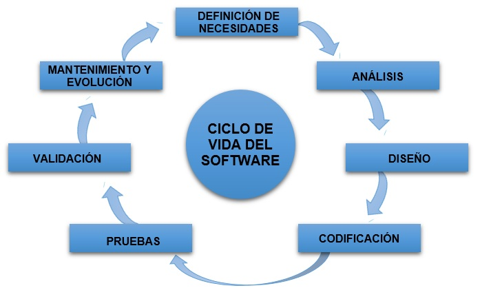

# METODOLOGÍAS CLÁSICAS

- [METODOLOGÍAS CLÁSICAS](#metodologías-clásicas)
  - [Conceptos de Metodologías de desarrollo](#conceptos-de-metodologías-de-desarrollo)
    - [Ciclo de vida](#ciclo-de-vida)
  - [Tipos de metodologías clásicas de desarrollo](#tipos-de-metodologías-clásicas-de-desarrollo)
    - [Modelo de cascada](#modelo-de-cascada)
    - [Modelo Iterativo](#modelo-iterativo)
    - [Modelo V](#modelo-v)
    - [Modelo de desarrollo evolutivo (espiral)](#modelo-de-desarrollo-evolutivo-espiral)
    - [Modelo Big Bang](#modelo-big-bang)
  - [Desventajas de las metodologías clásicas - METODOLOGÍAS CLÁSICAS](#desventajas-de-las-metodologías-clásicas---metodologías-clásicas)

---

La _década de los 60_ supone un antes y un después en las `metodologías de desarrollo`. Comienzan a parecer los sistemas tradicionales de ciclo de vida en los cuales se basan todos los métodos que vendrían a posteriori. En un periodo de tiempo donde el desarrollo industrial seguía al alza y el conglomerado empresarial iba en aumento, se empiezan a desarrollar entornos y marcos de trabajos basados en sistemas de información muy estructurados, metódicos y reiterativos, con el fin de tener siempre identificado el progreso, cuánto se ha avanzado y cuánto queda para la finalización del proyecto.

## Conceptos de Metodologías de desarrollo 
### Ciclo de vida 
Cuando se habla de `metodologías de desarrollo` es inevitable no asociarlo a su pieza mas transcendente y fundamental, el _“ciclo de vida”_. El concepto de ciclo de vida ha ocasionado siempre bastante confusión debido a que existen numerosas definiciones e interpretaciones de éste, y son muchos los autores que lo han particularizado y nombrado bajo su criterio y punto de vista. 

> Para generalizar, se puede definir como ciclo de vida al conjunto de fases por las que pasa el sistema que se está desarrollando desde que nace la idea hasta que se finaliza el software.

Las distintas etapas por las que pasa una idea durante su ciclo de vida son las siguientes:

* **Definición de necesidades o requisitos**. Fase en la que se identifican las necesidades de negocio y se definen las características del software a desarrollar. Generalmente el cliente no tiene una idea clara y concisa de lo que realmente necesita, es por ello, que esta fase se encarga de ayudarle y concretar los requisitos que está buscando.  
El equipo se reúne con varios depositarios de `dominio del problema`, e intentan conseguir la máxima cantidad de información possible sobre lo que requieren. Los requisitos se contemplan y agrupan en `requisitos del usuario`, `requisitos funcionales` y `requisitos del sistema`. La recolección de todos los requisitos se lleva a cabo como se especifica a continación -

    * Estudiando el software y el sistema actual o obsoleto,  
    * Entrevistando a usuarios y a desarrolladores de Software,  
    * Consultando la base de datos o  
    * Recogiendo respuestas a través de cuestionarios.

* **Análisis**. Durante este paso, y a partir de la información recogida en la etapa anterior, se procede y al **Estudio de viabilidad** donde el equipo idea un plan para procesar el software. En esta fase, el equipo analiza si el software puede hacerse para cubrir todos los requisitos del usuario y si hay alguna posibilidad de que el software ya no sea necesario. Se investiga si el proyecto es viable a nivel financiero, práctico, y a nivel tecnológico para que la organización acepte la oferta. Hay varios algoritmos disponibles, los cuales ayudan a los desarrolladores a concluir si el proyecto software es factible o no.  
Todo esto incluye saber las `limitaciones del producto`, aprendizaje para la `solventación de los problemas` que puedan suceder en el sistema, conocer con `antelación los cambios` que puede requerir el proyecto durante su desarrollo, etc. Una vez estudiadas las posibilidades de efectuar correctamente el proyecto, se procede a la `planificación temporal` y los `recursos` correspondientes del mismo.   
* **Diseño**. En esta etapa se realiza el diseño del producto a partir de la información recogida en las fases precedentes. Se `detallan los principios técnicos` a partir de los modelos anteriores. Se procede al diseño de los componentes indicando las infraestructuras técnicas, arquitectura de software y estándares de desarrollo. Se implanta y corre el modelo.   
* **Codificación o Implementación**. `Desarrollo del producto`, y una vez finalizado el producto, se presenta al cliente. Se le muestra su funcionamiento y rendimiento y se debate si se ha llegado a conseguir la idea y requisitos que se estaban buscando, consiguiendo de esta forma la satisfacción por ambas partes.   
* **Pruebas o Verificación**. Se ejecutan `planes de pruebas` definidos con anterioridad y se comprueba que el funcionamiento del producto es adecuado y que cumple con las especificaciones y requerimientos definidos en la etapa de diseño. 
En esta fase también se realizan pruebas de **Integración** ya que el Software puede necesitar estar integrado con las bibliotecas, Bases de datos o con otro u otros programas. Esta fase del SDLC se focaliza en la integración del software con las entidades del mundo exterior. 
* **Validación**. Cuando las pruebas se cumplen con satisfactoriedad, se da el `visto bueno y se valida el funcionamiento del producto por parte del cliente`.   
* **Mantenimiento y funcionamiento**. Se optima el funcionamiento del producto en términos de mayor eficiencia y menor número de errores. Se corrigen problemas y defectos, si procede, y se dota al producto de continuas actualizaciones para garantizar el mejor funcionamiento del mismo.

## Tipos de metodologías clásicas de desarrollo 

Una vez definido el término `ciclo de vida` y las distintas `fases` que lo componen, es necesario aclarar que existen una gran cantidad de interpretaciones de ellas, así como distintas formas de organizarlas y ejecutarlas. De acuerdo con cómo se lleve a cabo su implementación, existen distintos modelos de desarrollos, los cuales se detallan a continación. 

### Modelo de cascada 
El modelo de cascada es una de las metodologías más antiguas en lo que a ciclo de vida se refiere. Se trata de `un proceso que se desarrolla de manera secuencial`. Es su principal característica, de la cual viene su nombre, y consiste en un método donde las etapas se van realizando una detrás de otra, es decir, no se puede avanzar de etapa sin antes haber concluido con la anterior

Este modelo apareció para llevar a cabo proyectos en las industrias y en la construcción, donde modificar o hacer cambios en lo ya construido suponía grandes pérdidas de dinero y tiempo, por lo que se optaba por este modelo secuencial que aseguraba que los procesos que se iban realizando no llevaban consigo errores que habría que solventar a posteriori. `Es un modelo ideal para proyectos que están bien definidos y que se sabe a priori que sus requisitos se van a mantener estables a lo largo de su desarrollo`.  
Como se trata de un modelo fluenciado por el ciclo de vida, basa sus etapas de desarrollo en una recogida de requisitos, un diseño, una implementación, verificación y un mantenimiento, los cuales se realizan siguiendo este orden y sin saltarse ninguna fase. Sin embargo, `esta metodología no es tan eficiente en los tiempos actuales y presenta numerosos inconvenientes`. Los clientes normalmente no tienen claro los requisitos iniciales e introducirán modificaciones y añadirán otros nuevos una vez empezado el desarrollo del proyecto, lo que provocará volver a realizar etapas ya superadas y supondría un importante aumento de los costes.   
También cabe destacar que `el producto no se presenta al cliente hasta su total finalización, lo cual crea incertidumbre e inseguridad`, puesto que no se tiene un seguimiento que garantice el correcto funcionamiento durante su desarrollo.

### Modelo Iterativo
Harlan Mills en el año 1980. Se basa en el desarrollo a partir del incremento de la funcionabilidad del programa, se puede considerar un `precursor de las modernas metodologías iterativas`. El primer incremento es a menudo un desarrollo esencial, apenas con los requisitos básicos, cada incremento representa una entrega escalable. Los primeros incrementos son versiones incompletas del producto final, pero `proporcionan al usuario alguna funcionalidad`. 

El software primero se desarrolla en menor escala y se siguen y tienen en consideración todos los pasos. Entonces, por cada repetición, más módulos y características son diseñados, codificados, evaluados y añadidos al software. `Cada ciclo produce un sotware completo, con más características y capacidad que los previos`.

Después de cada repetición, el equipo directivo puede concentrarse en la `gestión de riesgos` y prepararse para la `siguiente repetición`. Como el ciclo incluye pequeñas porciones de la totalidad del proceso software, es más fácil gestionar el proceso de desarrollo, pero a la vez se consumen más recursos.

### Modelo V
Modelo también conocido como` modelo de validación y verificación`.
Propuesto por Alan Davis a principios de los 90. Se base en el modelo en cascada con la innovación de procurar `actividades de pruebas más efectivas y productivas mediante la introducción de validaciones en la medida en que se avanza en el proyecto`; dado que en el modelo tradicional las pruebas se introducían al final los defectos aparecían en forma tardía. Las pruebas necesitan empezarse lo más pronto posible en el ciclo de vida y estas actividades deberían ser llevadas a cabo en paralelo con las actividades de desarrollo.

No obstante, el modelo sigue presentado la `rigidez y poca flexibilidad que caracteriza al modelo en cascada`, por lo que siguen existiendo importantes riesgos ante cambios fortutios e imprecidibles del cliente.

### Modelo de desarrollo evolutivo (espiral)
Para hacer frente a los inconvenientes que presentaba el modelo de cascada, surge como alternativa el modelo de espiral. Este modelo, de `desarrollo incremental`, hace uso de un sistema iterativo basado en espirales, de modo que el producto se está trabajando y mejorando continuamente hasta que el resultado sea el deseado.

Al contrario que el modelo de cascada, el modelo de espiral permite la vuelta atrás en sus fases y se pueden hacer el número de iteraciones o ciclos que se consideren oportunas, de este modo se consigue disminuir los riesgos a la vez que avanzan el desarrollo del proyecto. Debido a esto, el enfoque de este proceso es muy distinto al del método anterior, teniendo éste una **dirección orientada al análisis de riesgos**. Pero todo esto tiene un precio y es que el **método se vuelve muy costoso** y exige un equipo bastante competente y con un alto nivel de formación para poder hacer frente a cualquier problema o contratiempo que se puedan encontrar.También existe el riesgo de que se produzcan bucles en el desarrollo y e`l proyecto se alargue más de lo previsto` si se toman decisiones erróneas.

### Modelo Big Bang

Este modelo es el modelo con la forma más simple. Requiere poca planificación, mucha programación y también muchos fondos. Este modelo se conceptualiza alrededor de la teoría de creación del universo `'Big Bang'`. Tal como cuentan los científicos, después del big bang muchas galaxias, planetas y estrellas evolucionaron. De la misma manera, si reunimos muchos fondos y programación, quizá podemos conseguir el mejor producto de software.

Para este modelo, se requiere poca planificación. No sigue ningún proceso concreto, y a veces el cliente no está seguro de las futuras necesidades y requisitos. Por tanto la entrada o input respecto a los requisitos es arbitraria.

`Este modelo no es recomendable para grandes proyectos de software, pero es bueno para aprender y experimentar.`

## Desventajas de las metodologías clásicas - [METODOLOGÍAS CLÁSICAS](#metodologías-clásicas)
  - [Conceptos de Metodologías de desarrollo](#conceptos-de-metodologías-de-desarrollo)
    - [Ciclo de vida](#ciclo-de-vida)
  - [Tipos de metodologías clásicas de desarrollo](#tipos-de-metodologías-clásicas-de-desarrollo)
    - [Modelo de cascada](#modelo-de-cascada)
    - [Modelo Iterativo](#modelo-iterativo)
    - [Modelo V](#modelo-v)
    - [Modelo de desarrollo evolutivo (espiral)](#modelo-de-desarrollo-evolutivo-espiral)
    - [Modelo Big Bang](#modelo-big-bang)
  - [Desventajas de las metodologías clásicas de desarrollo](#desventajas-de-las-metodologías-clásicas-de-desarrollo)de desarrollo
Cómo se ha podido ver, las metodologías tradicionales presentan numerosos inconvenientes que limitan su funcionamiento en el actual marco laboral. 

El **modelo de cascada** se caracteriza por ser un modelo **muy rígido**, que no permite retroceder ni avanzar etapas a conveniencias del dasarrollador. Al ser un método secuencial, obliga a finalizar una fase para poder pasar a la siguiente. Además, el producto no es presentando al cliente hasta su completo desarrollo, sin dar posibilidad de testeo ni evaluación durante su desarrollo. Todo esto se traduce en un continuo estado de incertidumbre e inseguridad, que en un mercado como el actual, donde el cliente se muestra indeciso y exigente, supone a las empresas correr un riesgo innecesario y con un alto precio a pagar. 

El **modelo en V** tiene como objetivo solventar ese **estado de inseguridad** a través de continuas evaluaciones y pruebas que se realizan a la par que el desarrollo del producto, pero sigue siendo un método que no puede hacer frente a decisiones impredecibles y fortuitas del cliente, puesto que sigue tratándose de un proceso secuencial sin posibilidad de cambio hasta su finalización. 

Por su parte, el **modelo de espiral** mejora las desventajas anteriores al tratarse de un proceso iterativo y que permite la repetición de las etapas hasta que ambas partes, clientes y desarrolladores, estén conformes con el producto final. No obstante, se corre el riesgo de entrar en **bucles demasiado largos y costosos** por no llegar a un acuerdo que contente a las dos partes. Además, este método reclama un equipo de trabajo muy competente y cualificado que sea capaz de responder a las necesidades y cambios que exijan los clientes. Todo esto conlleva unos procesos de formación que añaden más gastos aún a la gestión del desarrollo. 

Debido a la poca competitividad que estos métodos ofrecen a las actuales empresas, éstas se han visto obligadas a reinvertarse y buscar otras alternativas que les ofrezcan más oportunidades de subsistir y progresar en su desarrollo industrial. De ésta forma, se da lugar a la aparición de nuevos métodos más competentes en los años posteriores.

El **modelo iterativo** con fases más claras y no tan rigidas, será la opción evolucionada hacia metodoligías ágiles.

El **modelo Big Band** desde el punto de vista de este profesor todavía no ha tenido ningún éxito en grupos de trabajo, no obstante es una metodología vaída para un sólo programador con experiencia en el desarrollo y para una aplicación no demasiado grande

La clave de la aparición de los métodos ágiles se fundamenta en la naturaleza de los proyectos tecnológicos y en mayor medida en los proyectos IT de desarrollo de software.  
Todos estos tipos de proyectos se basan en que son muy dinámicos, en muchos casos el `time to market` necesita ser muy corto y, ante todo, hay grandes posibilidades de que se produzca un cambio de requerimientos en cualquier punto del proyecto, lo cual puede hacer fracasar el proyecto si no sabe manejarse.  
Los métodos tradicionalmente se protegen de los cambios de requisitos mediante algunas prácticas:

* **Bloqueo de los requerimientos**. Se documentan los requisitos del proyecto y son aprobados por el patrocinador del proyecto o cliente.

* **Control de cambios**. En el caso de que se produzcan cambio de requisitos, éstos tomarán como referencia el documento inicial aceptado por el patrocinador para evaluar el impacto que tienen en tiempo y presupuesto. En base a dicho impacto, se valora si se aceptan o no dichos cambios y se actualiza el documento de requisitos.

Sin embargo, estas técnicas no consiguen minimizar el impacto del cambio.

  
