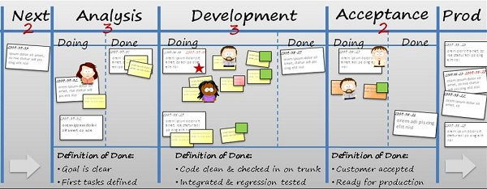

# KANBAN

- [Descripción](#descripción)

## Descripción
Kanban es una metodología de desarrollo que tiene sus inicios en la industria manufactura. Taiichi Ohno (1912-1990) fue un ingeniero industrial japonés conocido por implementar por primera vez este sistema en las fábricas automovilísticas de **Toyota**, cuyas ideas de producción industrial se recogen en su libro: _Toyota Production System: Beyond Large-Scale Production_. Toyota llegó a convertirse en un referente de la industria automovilística gracias a este sistema, el cual se sigue usando hoy en dia por muchas empresas actuales. 
No obstante, fue David J Anderson, el que en su obra: _Kanban: Cambio evolutivo exitoso para su negocio de tecnología_, formula definitivamente este sistema dentro de las metodologías de desarrollo de software. En él se define el método Kanban como _“un enfoque incremental y evolutivo de cambios en sistemas y procesos para organizaciones”_. 

David J. Anderson expone tres principios fundamentales que se deben cumplir en Kanban: 
1. Empieza con lo que estás haciendo 
2. Decide que vas a seguir cambios incrementales y evolucionarios 
3. Respeta el proceso en curso, sus roles, responsabilidades y títulos

Con este sistema se pretende la división del proceso de desarrollo del producto en tareas bien definidas y delimitadas, que se deben realizar con la mayor calidad posible y en el orden prescrito para poder avanzar a la siguiente y de este modo garantizar un proceso de fabricación de calidad. El objetivo es obtener un proceso lo más eficiente posible a través de la organización y el trabajo equipo. El hecho de trabajar en tareas más concretas y sencillas permite obtener un producto más fiable y de calidad, y unos tiempos de desarrollos más cortos. 

Como bien indica su nombre en japonés (“Kan”significa visual y “ban” tarjeta), Kanban es una metodología caracterizada por lo visual y que usa un tablero o pizarra donde se exponen las tareas definidas en tarjetas, las cuales se irán organizando según la fase de desarrollo en la que se encuentre en ese momento.

Partiendo de las tareas básicas: **“To Do”**, **“In Progress”**, "Testing" y **“Done”**, el tablero se puede complementar con más estados que se consideren oportunos para el proyecto en cuestión. Algunos de los más usados son **“Backlog/Stories”** o “**En producción”** entre otros.

WIP: El número de tareas en cada fase del proceso (Work In Process, **WIP**) es **limitado**, de modo que en una fase no puede haber más tarjetas de las permitidas. En caso de que el WIP sea máximo en una fase, se tendrá que finalizar una de las tareas para poder introducir otra. Esta restricción sirve al equipo como método de autocontrol e indica si el desarrollo del producto lleva un flujo adecuado y sin atascos debido a una mala organización. 
También es usual organizar las tareas en prioridades u orden de desarrollo colocándolas en **diferentes filas o utilizando tarjetas de distintos colores**, de este modo, no se podrá continuar con el resto de tareas hasta que las más prioritarias no estén realizadas. 
Las tareas que se encuentren en la fila “Urgente” tendrán más prioridad y deberán realizarse antes que el resto de tares. De igual modo ocurre con la fila “Importante” respecto a la fila “Normal”. En este caso, las tareas irán escritas en tarjetas de diferentes colores: rojo, amarillo y verde, siendo las rojas las más prioritarias y las verdes las menos importantes.

Se puede dividir cada columna con un área en la que se indica las _stories_ que se han finalizado y así el siguiente equipo puede acceder a ellas.

**Done**: La definición de Done debe quedar muy calara para el equipo de desarrollo.

La visualización en tiempo real del flujo de trabajo y su progreso, junto con un límite de WIP establecido, permite la supervisión en todo momento del proyecto, lo cuál permite su análisis y la posibilidad de introducir cambios en el sistema de producción que tengan efectos positivos en el resultado final. Es importante aclarar que la pizarra o tablero Kanban se puede implementar en otras metodologías de desarrollo de software sin la necesidad de que las ideas y características de este método se lleguen a aplicar. Scrumban (Kanban + Scrum) es un ejemplo de integración de la pizarra Kanban. Las ventajas e incovenientes que presenta el método Kanban:

Ventajas e incovenientes del método Kanban 

| VENTAJAS                                                               | INCONVENIENTES                                                  |
|------------------------------------------------------------------------|-----------------------------------------------------------------|
| Sistema de producción flexible frente a la demanda.                    | Sólo recomendable para procesos de producción repetitivos.      |
| Optimización de los tiempos de producción y de entrega.                | No permite plazos de abastecimientos grandes.                   |
| Se evitan procesos innecesarios que aumenten el tiempo del desarrollo. | El almacenamiento y manejo de stock puede resultar muy costoso. |
| Control y supervisión del proyecto en todo momento.                    | Productos fiables y de calidad.                                 |
| Garantía de un flujo de trabajo adecuado y sin atascos.                | Fácil integración con otras metodologías de desarrollo.         |
