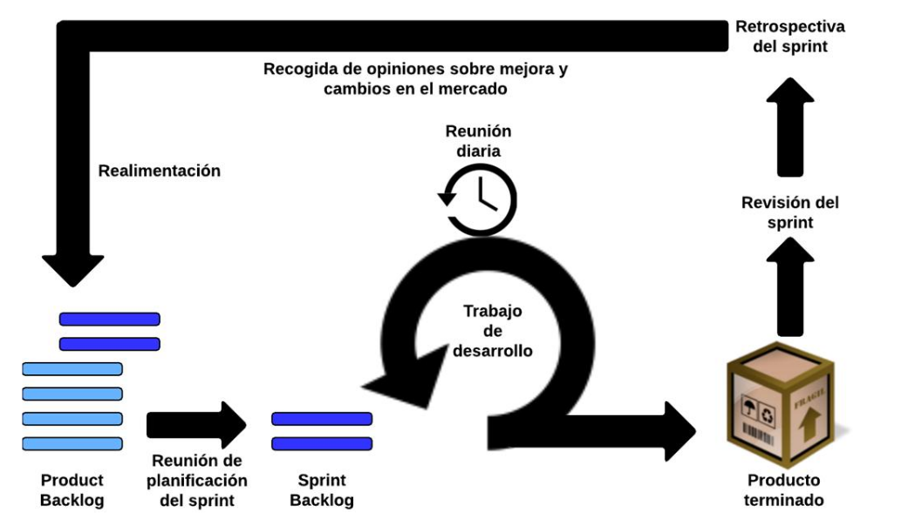
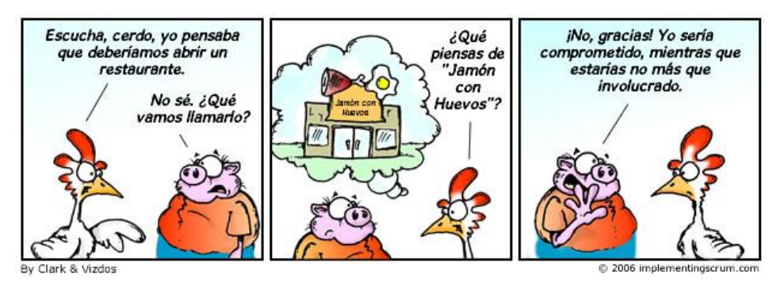
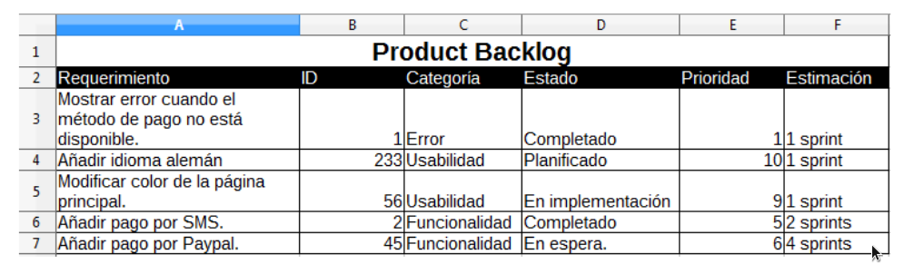
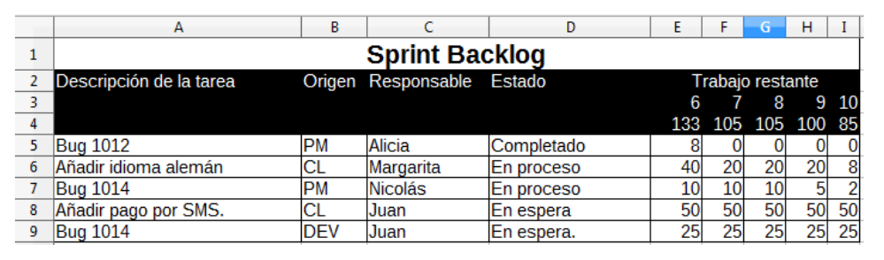
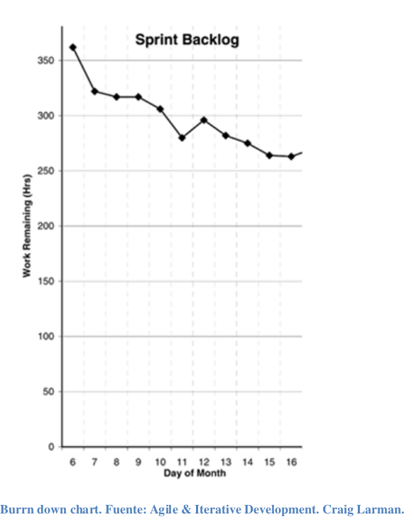

# SCRUM

- [Descripción](#descripción)
- [Fundamentos](#fundamentos)
- [Visión a alto nivel](#visión-a-alto-nivel)
- [Quienes y Qué](#quienes-y-qué)
  - [El Product owner](#el-product-owner)
  - [El equipo de desarrollo](#el-equipo-de-desarrollo)
  - [Scrum Master](#scrum-master)
- [Artefactos](#artefactos)
  - [Product Backlog](#product-backlog)
  - [Sprint Backlog](#sprint-backlog)
  - [Incremento](#incremento)
  - [Ciclo de vida](#ciclo-de-vida)
  - [Sprint](#sprint)
  - [Planificación del sprint](#planificación-del-sprint)
  - [Stand-Up meeting diario o reunión diaria](#stand-up-meeting-diario-o-reunión-diaria)
  - [Revisión del sprint](#revisión-del-sprint)
  - [Retrospectiva del sprint](#retrospectiva-del-sprint)
- [Scrums para proyecto de gran envergadura](#scrums-para-proyecto-de-gran-envergadura)
- [Conclusiones sobre Scrum](#conclusiones-sobre-scrum)
  
---

## Descripción
Tiene su origen en los años 80 cuando Ikujiro Nonaka e Hirotaka Takeuchi publican el artículo _The New New Product Development Game_. En él analizan los procesos de producción de exitosas empresas tecnológicas japonesas y norteamericanas describiendo un método llevado a cabo por un equipo multidisciplinario a través de fases que se solapan. Éstas empresas conseguían realizar sus productos en menor tiempo, con mejor
calidad y a un coste considerablemente reducido. Es en la propia descripción de éstos autores donde se identifica el método de trabajo con las estrategias seguidas por los jugadores de rugby. El término **Scrum** es la traducción al inglés del concepto de **melé** donde un conjunto de jugadores avanzan apoyándose en los hombros de sus compañeros.

A principios de los años 90 Ken Schwaber comienza a usar en su propia empresa, Advanced Development Methods, lo que se convertirá en Scrum. Por otro lado, Jeff Sutherland desarrolla un método similar en la compañía Easel Corporation. A mediados de la década ambos presentan un artículo sobre Scrum y finalmente a principio del siglo XXI Shwaber, junto con Mike Beedle, escribe el libro _Agile software development with Scrum_.

Scrum es un marco de trabajo para el desarrollo y mantenimiento de productos complejos. No define técnicas o procesos de producción o desarrollo, sino que define un marco donde pueden usarse las técnicas o procesos más adecuados para la consecución de los objetivos. La incertidumbre es la base del objetivo a conseguir sin que exista una definición muy exacta del producto a conseguir. Con ello se busca sumergir al equipo en
un reto que motive al equipo a cuotas muy altas.

## Fundamentos
El método se fundamenta en el empirismo, es decir, en la experiencia como base del conocimiento y la toma de decisiones. Scrum adopta un enfoque iterativo e incremental para eliminar incertidumbre y minimizar los riesgos. Como método empírico se fundamenta en tres pilares: 

* Transparencia. Los puntos más importantes del proyecto deben ser perfectamente visibles para aquellas personas responsables del resultado.
* Inspección. El equipo Scrum debe inspeccionar frecuentemente los artefactos y resultados del proyecto para evaluar la correcta evolución hacia el objetivo. Sin embargo, es importante controlar la frecuencia para que no interfiera en la consecución del resultado.
* Adaptación. Si la inspección determina que se están siguiendo procesos que perjudiquen al objetivo, deben realizarse ajustes lo antes posible para minimizar el impacto.

La transparencia debe entenderse como la herramienta que facilita la inspección; y la adaptación como la consecuencia de la inspección.

## Visión a alto nivel

Todos los conceptos de Scrum están interrelacionados y no pueden explicarse unos sin hacer referencia a otros, por ese motivo se listarán a continuación y durante el resto del capítulo se detallarán:

**Equipo**: define los roles en el proyecto. Estos deben ser:
*     Autónomos. 
*     Multidisciplinarios.

**Ciclo de vida**. Define las fases y acciones a conseguir. Al tratarse de un método iterativo e incremental, define ciclos breves de trabajo que de forma general se llaman iteraciones pero que en Scrum adopta el nombre propio de sprint y cuya duración está en torno a 30 días. Es notable destacar las reuniones o eventos
48dentro de un sprint como forma de control del mismo. Los cuatro eventos fundamentales que se detallarán más adelante son:
*     Reunión de planificación del sprint donde se priorizan y seleccionan las tareas a implementar en la iteración.
*     Sprint es el bloque de tiempo en el cual el equipo de desarrollo evolucionará el producto.
*     Scrum diario o reunión diaria donde se pondrá en común el trabajo que se va realizando en el sprint.
*     Revisión del sprint al final del mismo para valorar los logros obtenidos.
*     Retrospectiva del sprint como elemento de mejora continua.

**Artefactos**: representan trabajo y valor para el control y transparencia en diferentes fases del proyecto. Los más importantes son:

* Product backlog. Necesidades del producto a entregar
* Sprint backlog. Lista de tareas a realizar en el sprint obtenidas del product backlog.
* Incremento. Lista con los elementos del product backlog completados en un sprint, en cada uno de ellos debería coincidir con los elementos dentro del sprint backlog.

## Quienes y Qué
**Equipo**: Roles en el proceso
Un equipo Scrum está compuesto por un product owner, un Scrum master y un equipo de desarrollo que se encargará de la ejecución técnica en la creación del producto. Este modelo de equipo está diseñado para optimizar la flexibilidad, creatividad y productividad.
Al actuar bajo el paraguas de una metodología iterativa e incremental se favorece el enriquecimiento del producto con la recogida de retroalimentación en cada entrega. El hecho de que las entregas consistan en productos funcionalmente útiles aseguran que existe siempre una versión del producto en funcionamiento. Tal y como se ha indicado en la introducción, los equipos que trabajen bajo la metodología Scrum deben autónomos y
ser multidisciplinarios:

* Autónomos. Lo equipos deben organizarse por sí solos para superar las dificultades. Deben enriquecer el producto final con mejoras que ellos mismos propongan y acuerden. El control del seguimiento también se realiza siempre dentro del equipo de de trabajo y no por gente externa al mismo.  
* Multidisciplinarios. La inclusión de perfiles diferentes que busquen un objetivo común enrique no sólo al producto final sino a la auto-formación de ellos mismos al tener diferentes puntos de vista de una misma cosa. Es fundamental que todas las áreas necesarias para la consecución del objetivo trabajen bajo una misma unidad organizativa.

**Cerdos y gallinas**
Michael Vizdos realizó una definición muy extendida y divertida de los roles en una empresa desde la percepción de la ejecución de un proyecto siguiendo las directivas de la filosofía Scrum. A finales del 2006 publicó en la web www.implementingScrum.com lo que se llegó a llamar la fábula del cerdo y el pollo.

Traducción al español de la fábula del cerdo y el pollo. 

El autor refleja de esta manera muy divertida los dos tipos de roles que va a tener un
proyecto Scrum:

* **Cerdos**. Aquellas personas que están íntegramente comprometidas con el proyecto y que tienen un aporte directo a la consecución del objetivo. Aquí estarían integrados el **product owne**r, el **Scrum master** y los **desarrolladores**.  
* **Gallinas**. Serían todas aquellas interesadas en la consecución del objetivo pero que no tienen un aporte directo en el mismo. Suele integrarse en este grupo a las personas que dirigen la empresa o incluso los propios clientes si el producto final tiene como destino un tercero externo a la empresa.

### El Product owner

En cierta manera podría considerarse como el cliente para el cual se desarrolla el producto, aunque no sea en realidad una persona o empresa que paga por la elaboración de algo. Es el responsable del valor del producto y del trabajo del equipo de desarrollo. La herramienta principal con la que cuenta para la realización de estas tareas es el product backlog. Debe gestionar los elementos contenidos dentro del mismo y que estos se
muestren claros hacia todo el equipo Scrum para que conozcan cual será la siguiente evolución del producto.

El trabajo del product owner es especialmente importante para el propio equipo de desarrollo por lo que debe focalizar todo su esfuerzo en alinearse con ellos en el entendimiento de todos los elementos contenidos en el product backlog.

El product owner es una única persona, no debe ser un comité aunque puede representar los intereses de varias personas o áreas de la empresa. Esto deben canalizar toda propuesta a través de él dándole a él la última palabra en la elección de los cambios a introducir y la priorización de los mismos en la planificación. Es importante que este rol sea especialmente respetado evitando que cualquier otra persona intente establecer al
equipo de desarrollo nuevas prioridades. Del mismo modo, el equipo de desarrollo debe hacer caso omiso a cualquier iniciativa que no venga a través de product owner. Al final de cada sprint debería revisar estado del producto con el resto de personas interesadas.

### El equipo de desarrollo

Anteriormente se ha comentado que el equipo Scrum es autónomo y es importante destacar que el equipo de desarrollo es autónomo dentro del propio Scrum. Utilizando como base el product backlog, ellos mismos deciden el modo de trabajo en cada iteración incremental para producir al final de cada sprint una versión terminada del producto.

Aunque se trata de un equipo multidisciplinario para conseguir que todas las áreas técnicas necesarias para la consecución del producto final están recogidas dentro del producto, es un equipo de iguales y no se rigen por una jerarquía. Este es un punto muy importante dentro de la elaboración del equipo y no se permite excepción a esta regla.
Con ello se busca que cada perfil del equipo aporte su experiencia, visión y valor al proyecto sin que la opiniones de unos sean más válidas que las de otros, promoviendo un debate entre iguales que redundará en una gran aportación de creatividad e innovación al ciclo de creación.

Tampoco se reconocen áreas dentro del equipo Scrum a pesar de su carácter multidisciplinario con el fin de garantizar que todas las responsabilidades asumidas por el equipo recaen sobre el propio equipo y no sobre piezas individuales del mismo.

El tamaño del equipo de desarrollo es otro de los puntos más importantes a la hora de la elaboración del equipo. Los autores de Scrum dan especial importancia a este punto.
Consideran que este debe ser variable dependiendo del proyecto a abordar, sin embargo se muestran tajantes a la hora de definir el máximo de componentes del equipo en nueve miembros pero no establecen un mínimo. Defienden que cuanto más reducido sea el número mejor ya que requerirá menos tiempo de coordinación y por lo tanto son más ágiles, sin embargo es probable que no contengan todas las áreas técnicas necesarias
para aportar el valor necesario al producto final. Es en la búsqueda de ese equilibrio lo que definirá un buen equipo Scrum.

### Scrum Master

Es el responsable de que la metodología Scrum es perfectamente entendida y adoptada por todos los miembros del equipo. Los autores de Scrum definen a este rol como _“un líder al servicio del equipo”_. La relación que tienen con el resto de la empresa depende del rol que desempeñen estos:

Con aquellas personas fuera del equipo Scrum

Va a ejecutar dos tareas muy diferentes:
1. Evangelizador de la metodología Scrum.
    * Formando al resto de la empresa en la filosofía de trabajo.
    * Planificando la implementación de Scrum.
    * Controlando dicha implementación en la empresa.

2. Controlar las relaciones con su equipo Scrum.
    * Ayudando a entender a aquellas personas que no estén enmarcados dentro de su equipo Scrum con su propio equipo cuál debe ser la interrelación. Muy importante en su relación de enlace entre la dirección de la empresa y su equipo Scrum.
    * Creando procesos de colaboración.
    * Modificando y mejorando los ya existes.
    * Eliminando aquellos que se consideren nocivos.

Con el producto owner:

Ya que la principal tarea del product owner es el manejo del **product backlog**, el Scrum master debe ayudarle a gestionar dicho artefacto. Debe estar a su lado para encontrar la mejor manera de plasmar en el product backlog las características del producto a conseguir de manera clara y concisa para que el mensaje llegue sin distorsión a todo el equipo. Esto es fundamental para la perfecta planificación y ejecución de los sprints.
Además, de la misma manera con la que el Scrum master es un evangelizador y formador del método de puertas hacia fuera del equipo, también debe serlo de puertas hacia dentro y mucho más para un rol tan clave para la consecución del éxito como el Scrum master.

Con el equipo de desarrollo:

Debe ser una pieza de apoyo fundamental para todo el equipo de creación del producto pero sin llegar a considerarse ni ostentar el liderazgo del mismo, debe respetar e incluso ayudar a reforzar y defender la autonomía del mismo. La ayuda a este equipo pasa por eliminar cualquier impedimento para el progreso del equipo e incluso aportando valor al producto final. Algunos autores, como Craig Larman, considera que es un perfil mixto de desarrollador y gestor por lo que su aportación al producto final debería ser muy
relevante.

Al igual que con el resto de roles, debe seguir formando en la filosofía Scrum dentro del equipo, ahora con los roles más numerosos dentro del mismo.

## Artefactos 
Representan trabajo y valor para el control y transparencia en diferentes fases del proyecto. Todos los integrantes del equipo deben tener un mismo entendimiento sobre todos y cada uno de los artefactos sobre los que se generan en el proyecto. Es decir, Scrum vuelve a remarcar un especial énfasis la transparencia de la información en todas las fases y con todos los miembros del equipo.

Será el Scrum master quien debe controlar la transparencia en todo el proceso observando los artefactos creados, controlando las reuniones de seguimiento o detectando diferencias que puedan surgir entre los esperado y lo conseguido. Es decir, tiene que poner todos los medios para que todos los elementos dentro de los artefactos sean perfectamente entendidos por todos como base para la consecución del objetivo
final y como control de calidad en el proceso.

### Product Backlog
Es responsabilidad de product owner. El principal objetivo del product backlog es especificar y numerar las necesidades del producto. Sin embargo su ámbito no debe quedarse ahí, sino que debe listar cualquier tipo de mejora o modificación que deba aplicarse al producto en sus próximas versiones. Por lo tanto, es la principal fuente de información para el equipo de desarrollo ya que a partir de él podrán planificar el ámbito de cada sprint. Es importante destacar que los elementos de los que se compone el product backlog deben ser funcionalidades entregables y nunca tareas intermedias para conseguir un objetivo superior.

Mientras el producto esté en el mercado, tendrá asociado un product backlog en constante cambio que se retroalimentará de cualquier fuente, tanto interna como externa a la empresa productora, que pueda aportar una mejora al mismo con el fin de mantener o mejorar tanto la competitividad técnica como económica. Aunque la mejora continua del product backlog es responsabilidad del product owner y sólo el debería decidir qué nuevos requerimientos o mejoras pasan a formar parte del documento, en este proceso la colaboración con el equipo de desarrollo es un requisito fundamental. Es importante que esta tarea de refinamiento (refinement en inglés) no ocupe demasiado tiempo del equipo de desarrollo, los autores de Scrum estiman que debería estar alrededor del 10%, por lo
que el product owner tiene por delante la responsabilidad de exponer clara y concisamente el ámbito y estado del producto para ayudar al equipo de desarrollo a colaborar.

Los elementos expuestos en el product backlog deben pasar por diferentes estados. Si el product owner está el proceso de definición de un elemento, así debe constar con el fin de indicar que aún no puede ser seleccionado para ser desarrollado en un sprint. Sin embargo, si dicho elemento está perfectamente descrito y está listo para desarrollarse, así debe indicarse también al equipo de desarrollo. Obviamente, es importante también especificar aquellos elementos cuya tarea de implementación se dé por terminada.

El estado terminado (done en inglés) para los elementos de un product backlog tiene un tratamiento especial dentro de la filosofía Scrum. De hecho, los creadores de Scrum no le confieren una definición exacta más de que todos los roles del equipo consideren que la funcionalidad definida en el product backlog se ha dado por conseguida y no debe iterarse más para implementarla hasta que pudiera refinarse, redefinirse o mejorarse en el futuro. 
Éstos dejan que la definición de done se adapte dentro de la propia empresa. Especifican que si dentro de la empresa ya existe un concepto para ello, todos los roles del equipo deben seguirla. En caso contrario, es algo que debe ser detallado por el equipo de desarrollo. Con esto se quiere indicar que quizá para que un elemento del product backlog se dé por terminado también hagan falta una serie de tareas auxiliares, por ejemplo: documentación, procesos de pruebas o calidad a cumplir, etc.

### Sprint Backlog
Tal y como se ha ido introduciendo en este documento, el sprint backlog es un conjunto de tareas definidas para implementar funcionalidades del product backlog con el fin de establecer los objetivos en términos de implementación de un sprint. Además de este objetivo, debe contener la estrategia para conseguirlo.

El propietario de este documento es únicamente el equipo de desarrollo. Los elementos del sprint backlog son seleccionados por este estimando el esfuerzo que les llevará cada uno de ellos. Aunque pudiera entenderse que el sprint backlog se define durante la planificación del sprint y se revisa al final del mismo, no es así. Es un documento vivo durante toda la ejecución del sprint y tiene una retroalimentación muy relevante en cada reunión diaria. Según el equipo de desarrollo entiende los pasos a seguir para conseguir implementar un de los elementos, se actualiza el documento con esta información bien añadiendo nuevas tareas o actualizando las estimaciones de esfuerzo para la consecución de las mismas.

La estimación del esfuerzo y la actualización de los mismos para la consecución de los objetivos del sprint es para muchos autores la información más relevante de este artefacto. Craig Larman en su libro Agile & Iterative Development recomienda crear una gráfica tipo burn down chart representando la estimación de horas pendientes dentro del sprint y que su actualización sea diaria.

En definitiva, el sprint backlog es el elemento mediante el cual el equipo de desarrollo hace transparente su trabajo y con el que consigue organizarse dentro del sprint. 

### Incremento

El incremento es el producto que se ha creado a la finalización de un sprint. Para ello se seleccionaron una serie de elementos del product backlog para planificar un sprint y se añadieron dichas funcionalidades al producto. El resultado de un sprint siempre debe ser un producto funcional y usable.

### Ciclo de vida
Scrum define cuándo y cómo deben realizarse una serie de eventos dentro del ciclo de vida. Con esto intenta evitar que se produzca una sobrecarga de tiempo en tareas organizativas que provoquen que el equipo no esté enfocado en sacar adelante el incremento. Todos los eventos tienen una duración máxima que no puede ser sobrepasada y, en el caso del propio sprint, no puede ser acortada. Todos los eventos son supervisados por el Scrum Master con el fin de conseguir los objetivos en ellos que marca el método.

### Sprint

Muchos autores se refieren al sprint como al período de tiempo inmediatamente posterior a la planificación del sprint y anterior a la entrega del producto, es decir, al propio trabajo de desarrollo del producto. Esto no coincide con la nomenclatura aportada por los creadores que se refieren al sprint como todo el proceso de ciclo de vida de Scrum, incluyendo la planificación, las reuniones diarias, el trabajo de desarrollo, y la revisión y retrospectiva del sprint.
Para los creadores el sprint es el corazón de la metodología Scrum y especifican una duración máxima de un mes para la ejecución del mismo. El objetivo de establecer una duración fija de cada iteración
es la limitación en los riesgos a asumir. Si un sprint fracasa, sabemos que podemos ceñirnos a los costes de un mes de trabajo de un equipo de personas determinado. Si se hicieran iteraciones más largas, obviamente el costo y la
incertidumbre aumentarían.

### Planificación del sprint
Todas las tareas que van a llevarse a cabo en un sprint son planificadas en esta reunión. A ella asiste el equipo Scrum al completo. Su duración depende de la longitud del sprint, los autores establecen como referencia que para un sprint de un mes esta reunión no debe sobrepasar las 8 horas. El objetivo de esta reunión es doble. Por una lado debe seleccionarse lo que será entregado al finalizar el siguiente sprint y por otro debe planificar el trabajo para conseguir ese objetivo. 

El product backlog es el elemento central de información para esta reunión ya que de él se seleccionará la lista de funcionalidades a implementar en este sprint. El product owner utilizará su documento para defender delante de todo el equipo Scrum cuál debería ser el objetivo del sprint. Sin embargo, sólo el equipo de desarrollo puede saber si ese objetivo que se discute puede ser alcanzado en el siguiente sprint. Para ello debe apoyarse en la información obtenida en anteriores incrementos en cuanto a los esfuerzos necesitados para alcanzar los objetivos.
La lista de elementos del product backlog a ser abordados durante el siguiente sprint es responsabilidad única del equipo de desarrollo. Sólo él puede calcular sus propios esfuerzos y por lo tanto son los únicos capacitados para elaborar esta lista. A esto se le considera la creación del objetivo del sprint y el equipo de desarrollo debe comunicar al resto del equipo Scrum su decisión a este respecto.

Una vez que se ha conseguido el hito de establecer un objetivo para el sprint, el equipo de desarrollo deben indicar para cada tarea a realizar el plan para conseguirla junto con el esfuerzo que le llevará ejecutarlo. Toda esta información conforma el artefacto sprint backlog. El equipo de desarrollo puede apoyarse en el product owner para mejorar su entendimiento de las funcionalidades a implementar en el sprint.

El objetivo de este evento, además de conseguir el sprint backlog, es que el equipo de desarrollo puede explicar al resto del equipo Scrum cómo va a organizarse para conseguir el objetivo del sprint y entregar a tiempo el incremento esperado.

### Stand-Up meeting diario o reunión diaria

Tiene una duración de 15 minutos y tiene como objetivo la organización interna del equipo del desarrollo en tres puntos:
* Qué se hizo ayer para alcanzar el objetivo del sprint.
* Qué se hará hoy.
* Identificación de impedimentos para conseguir el objetivo del sprint. El Scrum Master debe ayudar a eliminarlos.

Ya que la duración es muy limitada, no se debe entrar en detalle durante la misma. Los creadores de Scrum tampoco limitan a que esta sea la única reunión a tener durante el trabajo de desarrollo pero sí consideran que estas reuniones debería evitar gran parte de ella. Aún así, es probable que inmediatamente después del Scrum diario puedan surgir nuevas reuniones para aclarar algunos puntos surgidos a los que no se haya podido dedicar el tiempo necesario.

Aunque es una reunión orientada casi en su totalidad al equipo de desarrollo, debe ser el Scrum Master el encargado de que se desarrollen siguiendo las recomendaciones del método controlando la periodicidad de las mismas, la duración y, muy especialmente, los intervinientes que deben ceñirse a los miembros del equipo de desarrollo. Sin embargo, a éstas reuniones pueden asistir otros interesados pero el Scrum Master debe controlar la intervención en las mismas.

### Revisión del sprint
En esta reunión se realiza la revisión del incremento del producto con el fin de actualizar el product backlog e identificar qué nuevas funcionalidades pueden añadirse al producto para añadir su valor. Como puede imaginarse, se trata de una reunión con un claro objetivo de retroalimentación a través de la colaboración de diferentes personas.

El Scrum Master es el encargado de controlar la periodicidad de esta reunión, que no debería excederse de cuatro horas para sprints de un mes. Sin embargo, los roles que tienen más que aportar en esta reunión son el product owner y el propio equipo de desarrollo. El primero explicando qué nuevas funcionalidades se han implementado y cuáles no dando una visión actual del product backlog y su posible evolución en el futuro.

Por otro lado, el equipo de desarrollo se centrará en presentar el producto terminado exponiendo las dificultades a las que se han enfrentado para llegar al objetivo del sprint. 
Curiosamente, esta reunión puede no restringirse al equipo Scrum si el product owner así lo considera. Él puede invitar a cualquier interesado que considere que puede aportar algo positivo a la realimentación del proceso. Todos juntos, equipo Scrum y los posibles invitados, deben colaborar para la mejora continua del valor del producto.
60En definitiva, el resultado de este evento debería ser una primera estimación de lo que se añadirá en el próximo sprint, aunque debería iterarse sobre esto de nuevo en la próxima reunión de planificación del sprint.

### Retrospectiva del sprint
Muchas veces tiende a confundirse las finalidad de ésta reunión con la de la revisión del sprint. Si el evento anteriormente explicado se enfocaba en la mejora del producto en sí mismo. Ésta reunión tiene como objetivo mejorar los procedimientos a ejecutar en cada sprint para conseguir los objetivos. Es una iteración sobre las prácticas ejecutadas en lugar de serlo sobre el producto buscando la mejora continua en los procesos creativos y de ejecución del equipo al completo.

De nuevo tiene una duración máxima, en este caso de 3 horas y el Scrum Master se debe preocupar de que el equipo Scrum asista en su totalidad. En esta reunión deberían identificarse una serie de mejorar a implementar en los próximos sprints, teniendo un especial enfoque a la definición de “done” dentro del equipo como punto clave en la
mejora de la calidad del producto. 

## Scrums para proyecto de gran envergadura
Si los creadores definen que los equipos no pueden superar nueve miembros (siempre sin contar con el Scrum master y el product owner), ¿cómo pueden acometerse proyectos de gran envergadura con Scrum? La respuesta a esta pregunta fue abordada por el propio Jeff Sutherland en el año 2001 cuando publicó el artículo *“Agile Can Scale: Inventing and Reinventing SCRUM in Five Companies”*. En este artículo el autor cuando su experiencia en cuanto al uso de Scrum en grandes proyectos con cientos de personas trabajando a la vez. El fundamento de su propuesta radica en el hecho de aumentar el número de equipos en lugar de aumentar el número de integrantes en los equipos. 

Jeff Sutherland propone la existencia de diferentes equipos Scrum. Cada equipo funcionará de manera corriente, pero al final de cada reunión diaria eligen a un embajador que se reunirá con los embajadores de los demás equipos Scrum. Esta acción se puede hacer en cuantas capas se considere necesario, tal y como representa la figura siguiente de la Scrum Alliance:
En cuanto a cómo manejar el resto de elementos de Scrum, aún existe a día de hoy un debate sobre cuál es la mejor aproximación. Algunas personas coinciden en que aunque existan diferentes equipos Scrum, el product backlog debe alimentarlos a todos ellos y este debe ser manejado por un equipo de product owners trasversal a todos los equipos.
Otros personas, sin embargo, abogan que cada equipo tenga su propio backlog manejado por un product owner que se coordine con el resto de los equipos. Sin duda, la capacidad para abordar grandes proyecto es uno de los retos a los que se enfrenta la metodología Scrum dado que el aumento de la complejidad en el desarrollo de productos está siendo
exponencial.

## Conclusiones sobre Scrum
Scrum es, como se mostró anteriormente, el método ágil referente en la industria de las tecnologías de la información. Scrum funciona siempre y cuando la transparencia en el proceso se respete, realizando procesos de inspección y adaptación en todo momento.  
Prácticas como las reuniones diarias, la simplicidad en la documentación como el Product Backlog son referencia en muchas otras metodologías. Incluso son prácticas aceptadas y adaptadas en empresas que siguen metodologías tradicionales. Hoy en día es imposible que alguien relacionado con las tecnologías de la información no conozca, aunque sea de manera superficial, parte del método Scrum.
Sin lugar a duda, gran parte del éxito de aceptación que están teniendo todas las metodologías ágiles, se deben en gran parte de la proliferación de Scrum. Aunque nació fuera del mundo software, hoy en día es en este tipo de proyectos donde más se está aplicando. Sin embargo, cada vez más se extiende dentro de las empresas de ingeniería
fuera de éste ámbito, reforzando así el éxito que está teniendo. A lo largo de este capítulo se han repasado los puntos más importantes de la metodología. Pero si en esta conclusión se debe subrayar algo por encima de lo demás,
se puede destacar que Scrum es una metodología que busca la mejora continua por medio de la aplicación de la experiencia adquirida tanto en ese proyecto como en los anteriores. La experiencia es un eje fundamental en la articulación del proceso, de ahí que se potencie la colaboración multidisciplinaria entre miembros en una comunicación de igual a igual. Lo que se busca con esto es crear conocimiento, que unos aprendan de
otros y añadan dichos conocimientos a su mochila de experiencia. Todo ese conocimiento repercutirá en el resultado final.

Dicho resultado o producto final es lo realmente importante. Esto no es algo exclusivo de Scrum sino que tiene una mención especial en el propio manifiesto ágil y es un pilar para otras muchas metodologías. Sin embargo, Scrum sí ha mostrado un camino para conseguir que el proceso no sea un obstáculo para el objetivo. Durante el repaso de las características del método hemos visto como se evita cualquier tarea que pueda restar tiempo efectivo en la propia creación o mejora del producto final: poca documentación, reuniones cortas, sin tareas pesadas de control del propio proceso, etc.

Con todas estas herramientas y buenas prácticas, Scrum ya se ha ganado un puesto más que relevante en la gestión de proyectos. Es posible que no todas las empresas implementen Scrum, pero seguro que sus principios han influido, influyen o influirán en gran parte de los métodos y procesos existentes o que queden por definir.
