# REQUISITOS DE ALTO NIVEL
- [REQUISITOS DE ALTO NIVEL](#requisitos-de-alto-nivel)
      - [Palabras clave](#palabras-clave)
      - [Conceptos en este Documento](#conceptos-en-este-documento)
  - [3.1 Introducción a los requisitos de alto nivel](#31-introducción-a-los-requisitos-de-alto-nivel)
  - [3.2 Actores del sistema](#32-actores-del-sistema)
  - [3.3 Casos de uso del Sistema](#33-casos-de-uso-del-sistema)
    - [3.3.1 Una sesión sencilla](#331-una-sesión-sencilla)
    - [3.3.2 Interactivo](#332-interactivo)
    - [3.3.3 Resultado consistente](#333-resultado-consistente)
    - [3.3.4 Esencial](#334-esencial)
    - [3.3.5 Breve](#335-breve)
    - [3.3.6 Límites del sistema](#336-límites-del-sistema)
  - [3.4 Cómo encontrar casos de uso del sistema en el modelo de negocio.](#34-cómo-encontrar-casos-de-uso-del-sistema-en-el-modelo-de-negocio)
  - [3.5 Requisitos](#35-requisitos)
    - [3.5.1 Elección de requisitos](#351-elección-de-requisitos)
    - [3.5.2 ¡Elegir requisitos no es diseño!](#352-elegir-requisitos-no-es-diseño)
    - [3.5.3 Retos de Requisitos](#353-retos-de-requisitos)
    - [3.5.4 Requisitos funcionales evidentes y ocultos.](#354-requisitos-funcionales-evidentes-y-ocultos)
    - [3.5.5 Requerimientos no funcionales](#355-requerimientos-no-funcionales)
    - [3.5.6 Permanencia y transitoriedad de los requisitos no funcionales.](#356-permanencia-y-transitoriedad-de-los-requisitos-no-funcionales)
    - [3.5.7 Requisitos obligatorios y deseados.](#357-requisitos-obligatorios-y-deseados)
    - [3.5.8 Requisitos suplementarios](#358-requisitos-suplementarios)
  - [3.6 Modelo conceptual preliminar](#36-modelo-conceptual-preliminar)
  - [3.7 El proceso visto hasta ahora](#37-el-proceso-visto-hasta-ahora)
    - [MI](#mi)
    - [RI](#ri)
    - [ADI](#adi)
  - [3.8 Preguntas](#38-preguntas)

---

En este documento presenta diagramas de `caso de uso del sistema` y `especificaciones suplementarias`. Explica cómo se conectan `los casos de uso del sistema` con los `casos de uso del negocio` y qué `actores del negocio` se convierten en `actores del sistema`. 
Se explica cómo los casos de uso de alto nivel representan los requisitos de más alto nivel de un sistema (funcional y no funcional), y cómo se pueden obtener las especificaciones suplementarias basadas en el recientemente consolidado modelo de calidad del ISO 25010 SQuaRE Model. 
También se explica cómo elegir la `granularidad de un caso de uso` para evitar diagramas tan detallados que el número de elementos dificulta la comprensión, y cómo evitar diagramas que pasan por alto casos de uso importantes para que el análisis pueda ser engañado por la aparente simplicidad de un sistema realmente más complejo. 

Al final, presentamos el **modelo conceptual preliminar**, que es un **diagrama de clase** utilizado para representar los conceptos que son relevantes para el sistema. Este modelo se detalla más adelante, pero aquí se introduce brevemente sólo para resaltar su importancia a fin de encontrar el conjunto correcto y completo de requisitos que un sistema debe implementar.


#### Palabras clave  
`Casos de uso`; `actores`; `requirimientos`; `ISO 25010`; `SQuaRE`; `especificaciones suplementarias`; `modelo conceptual preliminar`
```diff
-CLASES/TIPOS/MODOS DE USO
```

#### Conceptos en este Documento

- Actores del sistema
- Casos de uso del sistema
- Cómo encontrar casos de uso del sistema en el modelo de negocio
- Requisitos
- Modelo conceptual preliminar


## 3.1 Introducción a los requisitos de alto nivel


Una vez que el negocio ha sido razonablemente entendido y modelado, el **análisis de requerimientos** puede comenzar. Aunque existen varios enfoques para representar los requisitos, este libro presenta una **técnica basada en casos de uso**.

El **caso de uso del sistema** es un proceso individual que se identifica a partir de las actividades de negocio. Los **casos de uso de sistemas de alto nivel** (o breves) representan los requisitos funcionales más generales de un sistema. Las **anotaciones** en estos casos de uso representan los requisitos no funcionales, es decir, las limitaciones y cualidades relacionadas con esas funciones. Los requisitos suplementarios son requisitos no funcionales que se aplican al sistema en su conjunto, no sólo a funciones individuales. Podrán figurar en el **documento complementario de especificación** (punto 3.5.8).

Los **casos de uso de sistemas** son útiles para muchas actividades relacionadas con el desarrollo de sistemas, tales como:

- **Definición y validación de la arquitectura del sistema**: En general, las clases, asociaciones y atributos que forman parte de la arquitectura del sistema se obtienen a partir de los textos de los caso de uso.
- **Creación de casos de prueba**: Los casos de uso pueden ser vistos como una base para las pruebas de sistema y aceptación, donde la funcionalidad es probada desde el punto de vista del usuario.
- **Planificación de iteraciones**: Cada caso de uso recibe una prioridad, y se estima el esfuerzo para desarrollarlo, de modo que el equipo pueda decidir qué casos de uso desarrollar en cada iteración.
- **Base para la documentación del usuario**: Los casos de uso son descripciones de los flujos de operación normales del sistema, así como de los movimientos alternativos que representan cómo tratar con eventuales condiciones excepcionales. Estas descripciones son una base excelente para iniciar el manual de usuario, ya que allí se describen todas las funcionalidades posibles de forma estructurada y completa.

Cada caso de uso representa un **conjunto coherente de requisitos funcionales del sistema**. Por lo general, más de una función está relacionada con un solo caso de uso, especialmente si es compleja. Algunas funciones, por otro lado, pueden estar asociadas a más de un caso de uso.

En algunas situaciones también puede ocurrir que una función corresponda a un caso de uso único y viceversa. Esto suele ocurrir con casos de uso muy sencillos, como los **informes** `<<reports>>` y la **gestión de entidades** `<<crud>>>`.

Existen al menos tres enfoques para los requisitos y los casos de uso:
- Cree una lista de requisitos funcionales y, a continuación, identifique los casos de uso asociados a ellos.
- Cree un conjunto de casos de uso y, a continuación, extraiga los requisitos funcionales de los mismos.
- Considere que **los casos de uso son requisitos**. La versión breve de los casos de uso corresponde a los requisitos de alto nivel y los casos de uso ampliado corresponden al conjunto completo de requisitos.
En este documento se adopta el tercer enfoque, porque es más simple, más directo y evita la generación de documentos diferentes con el mismo objetivo. La obtención y análisis de requisitos corresponde, por tanto, al descubrimiento de casos de uso del sistema y sus propiedades.


## 3.2 Actores del sistema

Un actor del sistema es **una entidad del mundo real** que interactúa con el sistema a través del caso de uso. Los actores pueden ser papeles desempeñados por personas como **clientes, editores, vendedores, operadores**, etc. Los actores también pueden ser **sistemas externos**, es decir, sistemas que están fuera del alcance del proyecto que se está desarrollando.

Los actores humanos o los sistemas externos interactúan con el sistema destino enviando y recibiendo información a través de una interfaz. En el caso de los actores humanos, la información se intercambia generalmente a través de dispositivos de entrada de datos como teclados, ratones u otros dispositivos especiales. Estos actores reciben información del sistema a través de interfaces como pantallas, impresoras u otros dispositivos especiales.

La comunicación con actores que son sistemas externos suele realizarse a través de una red informática. En este caso, la interfaz de comunicación está formada por la red y sus protocolos.

La idea de los sistemas externos como actores no debe confundirse con los internos que son componentes del sistema en desarrollo. Por ejemplo, un sistema de gestión de bases de datos (DBMS), utilizado para implementar la persistencia de datos para el sistema en desarrollo, no es un actor sino un componente de la arquitectura interna del sistema. Las siguientes reglas pueden ayudar a identificar apropiadamente los sistemas externos que podrían ser actores:

- Los actores del sistema son **sistemas de información completos**, y no sólo bibliotecas de clases o componentes. Estos sistemas almacenan su propia información, que puede ser intercambiada con el sistema que se está desarrollando. Esa información puede cambiar independientemente del sistema que se esté implementando.
  
- Los actores del sistema están **fuera del alcance del desarrollo**, es decir, el equipo no necesariamente tendrá acceso al diseño interno de estos sistemas, o a la capacidad de cambiarlos. El equipo debe comunicarse con un actor del sistema utilizando las propias definiciones del actor del sistema, porque no pueden ser modificadas.
  
Algunos enfoques consideran que hay dos tipos de actores: **primarios y secundarios**. Los actores primarios son aquellos cuya meta el caso de uso está tratando de satisfacer, mientras que los actores secundarios son actores que sólo proporcionan algún servicio al proceso en discusión. Ejemplos de actores secundarios son impresoras, servicios web o personas que deben proporcionar información o confirmación, como por ejemplo, un empleado que confirma que el cliente ha pagado en efectivo. En este libro no seguimos esa distinción: distinguimos entre actores de caso y actores humanos o del sistema solamente.


## 3.3 Casos de uso del Sistema

PLURAL -> SINGULAR

Los casos de uso del sistema difieren de los casos de uso de negocio en algunos aspectos. Por ejemplo, los actores del negocio pueden pasar días o incluso semanas realizando un caso de uso empresarial, mientras que **los casos de uso del sistema a menudo se ejecutan en un corto período de tiempo, generalmente en minutos, con uno o unos pocos actores interactuando con un sistema y obteniendo un resultado consistente y completo** para al menos uno de sus objetivos. Los casos de uso del sistema también deben realizarse **sin interrupciones**, mientras que los casos de uso de negocio no están restringidos en ese sentido.

Otra diferencia fundamental entre un caso de uso de negocio y un caso de uso de sistema es que el caso de uso de negocio es usualmente realizado por muchos actores humanos, mientras que **el caso de uso de sistema es normalmente realizado por unos pocos (a veces sólo uno) actores humanos**. El hecho es que si un caso de uso de un sistema va a ser realizado por más de un actor humano, entonces deberían estar interactuando al mismo tiempo con el sistema, y esa no es una situación común. Por lo general, cada actor humano accede al sistema en el momento que le resulta conveniente, accediendo a los datos necesarios y realizando las acciones necesarias.

Esto conduce a una **secuencia de casos de uso del sistema** y no a un solo caso de uso, como se explica más adelante. Sin embargo, a veces puede haber más de un actor humano disponible online; por ejemplo, en un supermercado cuando un cliente compra bienes, un supervisor puede ser convocado para realizar acciones que el cajero no está autorizado a realizar (por ejemplo, cancelar una venta). El hecho es que la supervisora debe estar disponible online y los demás actores deben esperar a que ella se presente antes de proceder.

Por otro lado, los sistemas computacionales externos pueden ser considerados **actores en línea**, ya que están disponibles de forma continua. Por ejemplo, se puede suponer que un Operador de tarjetas de crédito está disponible en línea de forma continua. En el momento en que un cliente decide hacer un pago con su tarjeta de crédito, el actor del sistema Operador de tarjetas de crédito estará disponible.

Un caso de uso de sistema de alto nivel está **representado sólo por un nombre dentro de una elipse**. Normalmente se asocia a uno o más actores, como se muestra en la Figura 3.1.


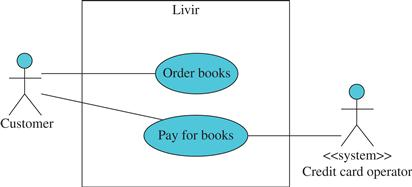  
`Figura 3.1 Diagrama de casos de uso del sistema.`


En el diagrama de la Figura 3.1, las elipses representan casos de uso del sistema. Por defecto, un actor es un papel interpretado por un humano. Otros tipos de actores pueden ser representados por el uso de estereotipos, como se muestra en la Figura 3.1, donde el sistema de estereotipos indica que el operador de la tarjeta de crédito es un sistema externo, no un ser humano.

```diff
- El diagrama de caso de uso es un diagrama UML muy popular, pero también es frecuentemente malinterpretado. Es habitual ver estos diagramas con docenas de casos de uso y también algunos de sus fragmentos añadidos. Sin embargo, durante el Inicio, lo importante es saber cuáles son los principales procesos del sistema, y no detallarlos. Por lo tanto, la presencia de fragmentos en el diagrama y el uso de las relaciones de inclusión y extensión entre casos de uso (que a veces revelan parte de su estructura interna) no es aconsejable. Las preocupaciones sobre fragmentos y casos de uso que incluyan o amplíen otros pueden dejarse para el momento en que esos procesos de alto nivel se detallen en los diagramas de secuencia del sistema.
```

Por lo general, no hay suficiente información para descubrir todos los fragmentos en este momento. ¿Por qué sólo se deben mostrar algunos de los fragmentos de casos de uso y otros no?  Simplemente no muestre ninguna en absoluto en el diagrama durante el inicio! Esto evita que el diagrama tenga un gran número de elipses, lo que puede dificultar su comprensión. Por lo tanto, se necesitan criterios sólidos para decidir qué casos de uso deben mantenerse en el diagrama a fin de evitar, por una parte, un gran número de procesos excesivamente detallados y, por otra, un número demasiado reducido de procesos que podrían carecer de características importantes del sistema.

La regla es considerar como caso de uso **sólo aquellos procesos que pueden ser realizados en forma aislada**. Los procesos parciales que necesariamente deben realizarse durante otros procesos no deben representarse en el diagrama de casos de uso del sistema.

Sin embargo, incluso siguiendo esta guía, el número de casos de uso en un sistema del mundo real puede ser demasiado alto, por lo que puede resultar difícil tratarlos. Para reducir el número sin perder información y precisión se puede utilizar una segunda regla. Consiste en agrupar los casos de uso que están algo relacionados, especialmente si se puede hacer más de una vez, como un patrón. Por ejemplo, podría haber cuatro casos de uso como `Crear libro`, `Recuperar libro`, `Actualizar libro` y `Eliminar libro`, o sólo un caso de uso llamado `Administrar libro` que incluya los cuatro procesos individuales. Esto es un patrón, porque puede repetirse para otros conceptos: Se puede utilizar Administrar editor en lugar de Crear editor, Recuperar editor, Actualizar editor y Eliminar editor. Este patrón se conoce como CRUD, que es un acrónimo de Create, Retrieve, Update, and Delete.

Las siguientes subsecciones detallan esas reglas y presentan otros criterios para lograr la granularidad del caso de mejor uso.


### 3.3.1 Una sesión sencilla
**Un buen caso de uso del sistema debe realizarse en una sola sesión**. Esto significa que debe comenzar y terminar sin interrupción. Por ejemplo, el `registro de un pedido` se realiza durante una única sesión del sistema, que incluye la identificación del cliente, la selección del libro, la visualización del precio, el pago, la selección de la dirección, etc. Cada uno de estos aspectos es un requisito funcional del sistema.

Los casos de uso deben realizarse como procesos individuales. Los procesos que sólo pueden ocurrir en el contexto de otros procesos son sólo fragmentos, no casos de uso.

En el caso del sistema **`Livir`**, el cálculo de los impuestos es algo que sólo ocurrirá durante el proceso de pedido de libros. Supongamos que los requerimientos del sistema no determinan que deba ser considerado un proceso independiente (aunque podría serlo, si los requerimientos fueran diferentes). En este caso, el Cálculo de impuestos no es un caso de uso, y debido a ello, no debe incluirse en el diagrama. La figura 3.2 ilustra la situación que debe evitarse, utilizando fragmentos del diagrama.

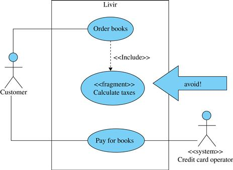   
`Figura 3.2 Ejemplo de un fragmento de caso de uso.`


Por otro lado, `Order Books` puede considerarse un caso de uso porque se trata de un proceso con un inicio y un final bien definidos, que se produce en un intervalo de tiempo contiguo (sin interrupciones), y que produce un buen resultado (el pedido se registra).

En el ejemplo representado en la Figura 3.1, hay dos escenarios posibles que podrían ser investigados:

- El sistema sólo confirmará el pedido si el pago se realiza en línea (**no es posible guardar el carro de la compra**). En este caso, el proceso de pedir libros y pagar son sólo fragmentos de un caso de uso único que podría llamarse Comprar Libros. Si este es el requisito real, entonces el diagrama debe ser cambiado y los dos casos de uso reemplazados por **un caso de uso único** llamado Comprar libros.
  
- El sistema registrará el pedido, pero no necesariamente procederá a realizar el pago, es decir, el carro de la compra podrá ser **almacenado hasta que el cliente decida finalizar el pedido** (lo que puede hacerse inmediatamente o en otro momento). Este es el caso representado en la figura 3.1. En este caso, **Order books** es un caso de uso y el **Pay for Books** es otro caso de uso. Pueden realizarse inmediatamente uno tras otro, o con un intervalo de algunos días, por lo que deben considerarse casos de uso independientes.
  
Por otra parte, los libros no se entregan automáticamente cuando se paga el pedido: alguien es responsable de verificar, de vez en cuando, qué pedidos se han emitido; esa persona recoge los libros en stock y envía el paquete. El proceso de entrega puede ocurrir justo después de pagar el pedido, pero también puede ocurrir al día siguiente (o incluso de seis a ocho semanas después). Este hecho caracteriza a *Delivery* como un caso de uso diferente. El caso de uso de *Delivery* tiene como condición previa la compra de libros, pero la compra no forma parte de la entrega: la entrega sólo se produce después de ella. Por lo tanto, la compra y la entrega, aunque sean secuenciales e incluso parte del mismo caso de uso empresarial, deben considerarse como casos de uso del sistema diferentes, como se muestra en la Figura 3.3, donde se presenta el caso de uso de *Send books*.

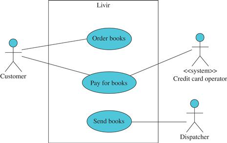   
`Figura 3.3 Casos de uso relacionados con el proceso de negocio de la venta de libros.`


### 3.3.2 Interactivo
Un caso de uso también debe ser **interactivo**, lo que significa que debe existir un actor para interactuar con el sistema. Los procesos internos del sistema no son casos de uso por complejos que sean. Por otro lado, una simple consulta sobre alguna información puede ser un caso de uso si hay un actor que la inicia.

Los procesos internos mencionados anteriormente forman parte de un caso de uso (como, por ejemplo, Calcular impuestos forma parte de Comprar Libros) o de necesidades suplementarias (como, por ejemplo, Almacenar datos en una base de datos relacional). En el caso de los requisitos suplementarios, suelen ser implementados por mecanismos internos que no dependen de la interacción del usuario. Durante la fase Inicial se registran como especificaciones suplementarias  o como requisitos no funcionales (anotaciones en los casos de uso), para que no se subestimen el riesgo y el esfuerzo que implican.


### 3.3.3 Resultado consistente
**Un caso de uso debe producir un resultado consistente**, ya sea una entrada o transformación completa de una información, o simplemente una consulta en la que la información relevante se pasa a un usuario. Un caso de uso no puede dejar la información en un estado inconsistente al final. Por ejemplo, el registro de un pedido no puede concluirse sin la identificación del cliente y de los libros que está pidiendo, o bien la información sobre el pedido sería incompleta en relación con las reglas del negocio; la librería no podría reanudar el pedido ni cobrarlo sin saber quién es el cliente y qué libros se piden.

Para decidir si un caso de uso tiene un resultado consistente, uno podría pensar así: sólo un proceso completo es un caso de uso del sistema, en el sentido de que un usuario puede ir a la computadora, encenderla, realizar el proceso, y al final, apagar la computadora, porque el proceso está completo, y se obtuvo alguna meta de negocio (alguna información relevante fue recibida o actualizada por el usuario).

Esto excluye de la definición de caso de uso fragmentos como Calcular impuestos, en el caso del ejemplo de la librería, porque esos impuestos se calculan sólo dentro del proceso de pedido, y no como un proceso aislado. Esto también excluye operaciones como **Login**, ya que realizar un login y luego apagar el ordenador no puede ser visto como un proceso completo. Puede ser sólo parte de uno o más casos de uso (Figura 3.4).

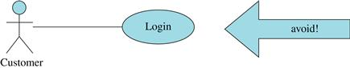   
`Figura 3.4  El inicio de sesión no debe considerarse un caso de uso completo.`

Para evitar representar el **Login** como un caso de uso o incluso como parte de uno, simplemente se puede asumir que cada operación del sistema sólo puede ser realizada por un usuario que esté regularmente identificado y autorizado para realizarla. Este mecanismo forma parte del diseño tecnológico del sistema y no necesita ser considerado en el modelo de caso de uso de alto nivel.

Por otro lado, es posible que los casos de uso completos ocurran dentro de otros casos de uso. Por ejemplo, el proceso de registro de un cliente puede considerarse un caso de uso completo. Pero ese proceso también puede ocurrir durante el pedido de libros, especialmente si es la primera vez que el cliente utiliza el sistema, o cuando necesita actualizar los datos (Figura 3.5).

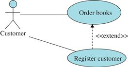   
`Figura 3.5 Casos de uso independientes que puedan estar relacionados.`


La asociación de dependencia entre los casos de uso es estereotipada y extendida para indicar que el proceso de **Pedir libros** puede ser ocasionalmente `extendido` por el proceso de **Registro del cliente**. Ambos procesos pueden ocurrir independientemente uno del otro, pero el registro del cliente también puede ocurrir durante el pedido de libros.

Para evitar abusar de la `<<extend>>` en el diagrama de casos de uso, es importante tener en cuenta que sólo los casos de uso completos deben mantenerse en el diagrama. Se deben evitar fragmentos como los que se muestran en las figuras 3.2 y 3.4, incluso si son puntos de extensión de un caso de uso. Estos fragmentos se abordarán adecuadamente más adelante, cuando se detallen los casos de uso de alto nivel. En la práctica, en este punto, cualquier asociación entre casos de uso como extender o incluir debe evitarse en el diagrama, ya que normalmente no añaden información útil para la fase de inicio.


### 3.3.4 Esencial
Se pueden identificar dos estilos para escribir casos de uso:
- Casos de uso esenciales, que **no mencionan la tecnología de interfaz**.
- Casos de uso concretos (o reales), que se escriben específicamente para una determinada tecnología de interfaz.

Durante la obtención y el análisis de requisitos, los casos de uso del sistema se consideran requisitos, no diseño. Es un error común incluir entre estas acciones de caso de uso que están puramente relacionadas con una tecnología de interfaz (como Abrir ventana principal, Imprimir informe e Iniciar sesión). Las personas preparadas para manejar esa faceta del diseño decidirán sobre esas acciones más adelante, después de que se descubran los requisitos.

> Los modelos esenciales son más robustos que las representaciones concretas porque es más probable que sigan siendo válidos frente a los cambios en la tecnología de implementación.

Por lo tanto, los casos de uso esencial deben ser considerados como la opción correcta durante la obtención de requisitos, aunque los detalles u opciones de la tecnología pueden ser anotados para permitir la gestión del riesgo y el cálculo del esfuerzo. Más adelante, se explicará con más detalle la diferencia entre casos de uso esenciales y concretos.


### 3.3.5 Breve
Durante Inicio los casos de uso suelen ser breves, lo que significa que **se describen sólo por su nombre** o, en algunos casos, por una o dos frases. Sin embargo, esta no es la única manera de describir un caso de uso. Más adelante se ampliarán y contendrán más detalles sobre los requisitos. 

Tipos de casos de uso con respecto al nivel de detalle:

- Breve: Una sinopsis de un párrafo del caso de uso.
- Casual: Escrito en estilo simple, párrafo, prosa. Es probable que falte información del proyecto asociada con el caso de uso, y es probable que su descripción sea menos rigurosa que la de un caso de uso completamente vestido.
- Completo: Ampliado para incluir un flujo principal y flujos alternativos, así como otras secciones tales como condiciones posteriores, condiciones previas, partes interesadas y variaciones tecnológicas.
  
Esperamos que los casos de uso considerados durante la fase Inicial sean breves. Esto significa que normalmente su nombre es suficiente para explicar su significado. Sin embargo, se permite una explicación adicional en aras de la comprensión de los requisitos. Además, si es necesario ampliar algunos casos de uso clave para identificar los riesgos relacionados con su complejidad inherente, esto también es aceptable. Por lo general, **los casos de uso completos o expandidos serán útiles sólo después del Inicio, cuando los requisitos deben ser detallados adecuadamente.**


### 3.3.6 Límites del sistema
**Una de las decisiones que un equipo debe tomar al diseñar casos de uso del sistema es dónde colocar el límite del sistema**. Gráficamente, el límite es sólo un rectángulo que se coloca en el diagrama. Dentro están los casos de uso y fuera los actores. En los diagramas de casos de uso de negocio, el límite del sistema representa los límites de la organización (empresa, departamento, etc.). Aquí, representa los límites de un sistema computacional.

Anteriormente se tomó la decisión de qué trabajadores incluir en la frontera de la automatización. Un ejemplo es el empleado que ayuda al cliente a comprar libros. En ese caso, cuando se modelan casos de uso del sistema, el dependiente desaparece, y el caso de uso es realizado por el propio cliente.

Sin embargo, si no se trataba de una librería virtual, sino de una librería regular en la que los clientes compran en una tienda, ¿debería mantenerse al empleado en el diagrama del caso de uso? Para que un caso de uso sea lo más esencial posible, se recomienda que sólo los actores que estén realmente interesados en el caso de uso se mantengan en el diagrama. El empleado del ejemplo es sólo un representante del cliente; el empleado no tiene metas personales en el proceso de compra de libros. Actúa simplemente como una interfaz de sistema. Ya sea que la librería sea virtual o no, el caso de uso esencial debe ser el mismo, porque la misma información se intercambiaría entre el cliente y el sistema; el empleado sólo transmitiría la información a medida que la recibiera. En este caso, el único actor sería el cliente y el empleado ni siquiera debería aparecer en el diagrama. De esta manera, el análisis producirá casos de uso que son independientes de la tecnología.

Alguien podría preguntar lo siguiente: ¿Qué pasa si el dependiente tiene que indicar que él ayudó en la venta para que se le abone un porcentaje? En ese caso, lo que tenemos es un caso de uso que es diferente del mencionado en el último párrafo. Aquí, tanto el cliente como el empleado deben ser actores: el cliente está interesado en los libros y el dependiente está interesado en el porcentaje. Además, si el dependiente puede realizar acciones que no están permitidas para el cliente (por ejemplo, anular el precio de un producto), debe ser considerado un actor y no puede ser eliminado del diagrama.


## 3.4 Cómo encontrar casos de uso del sistema en el modelo de negocio.
Para descubrir los casos de uso del sistema y los actores, el equipo puede examinar el diagrama del caso de uso del negocio dentro del límite de automatización definido (alcance de la automatización).

En primer lugar, se deben **identificar los actores** que están realmente interesados en el proceso que se va a automatizar. Estos son los actores de negocio que interactúan con los casos de uso del negocio dentro del ámbito de la automatización, y los trabajadores de negocio que interactúan con tales casos de uso pero que no están dentro del ámbito de la automatización. En el caso de la Figura 2.11, se podrían identificar los siguientes actores del sistema:

- Cliente, editor y operador de tarjetas de crédito, porque son actores de negocio que interactúan con casos de uso que serán automatizados.
- Gestor de adquisiciones, porque es un trabajador de negocios que no estará automatizado, sino que interactuará con un caso de uso que lo estará.
- Por otra parte, los siguientes no serán considerados actores del sistema:
- Empleado, porque es un trabajador de negocios que será automatizado.
- Departamento de Marketing, ya que es un trabajador de negocios que no interactúa con ningún caso de uso dentro del ámbito de la automatización.
  
>Los trabajadores del negocio cuyas funciones serán parcial o totalmente apoyadas por el sistema pueden ser fuentes importantes de información, porque saber cómo realizan sus tareas actualmente puede ser crucial para entender cómo debe funcionar el sistema. Además, saber cómo se realizan realmente las tareas puede ser valioso porque a veces lo que sucede en la práctica no es lo que está escrito en los libros de procedimientos.

Otra fuente de requisitos son los actores del negocio que se convertirán en actores del sistema. Sin embargo, no siempre estarán disponibles para la obtención de requisitos y, en ese caso, deberían ser sustituidos por especialistas del dominio. Por ejemplo, puede que no sea posible entrevistar al cliente de una librería que aún no existe. Así, alguien que conozca el negocio y pueda explicar cómo se supone que debe funcionar será una persona clave para obtener los requisitos adecuados. Si los editores y los operadores de tarjetas de crédito tampoco están disponibles, debería ser posible examinar la documentación existente sobre los protocolos de comunicación y los servicios ofrecidos, de modo que se puedan conocer los requisitos de interfaz con ellos. En el caso del cliente, sin embargo, tal posibilidad no sería factible.

Una vez que los actores del sistema han sido identificados a partir de los diagramas de casos de uso de negocio, será posible observar los diagramas de actividad y de estado que se produjeron durante el análisis de negocio para verificar qué **actividades realizadas** por los actores del sistema pueden ser consideradas casos de uso del sistema.

Analizando las actividades de la Figura 2.10, podemos ver que las actividades realizadas por el Cliente son:

- **`Pedidos de libros`**.
- **`Pagar por los libros`**.
 
La única actividad del **`Editor`** es **`Enviar libros`**, y la única actividad del **`operador de la tarjeta de crédito`** es **`Confirmar el pago`**.

No todas las actividades del empleado original se convierten en un caso de uso del sistema. Como se puede ver en la Figura 2.7, el empleado se dividió en dos actores: **`Gestor de adquisiciones`**, que no será automatizado, y el dependiente, que será automatizado. Las actividades realizadas por el rol **`Gestor de adquisiciones`** pueden convertirse en casos de uso del sistema. Sin embargo, las actividades realizadas por el dependiente como trabajador del negocio, que será automatizando, se convierten en acciones internas del sistema. Por ejemplo, las actividades Registrar pedido e Informar disponibilidad y total en la Figura 2.10 no se convierten en casos de uso del sistema; son sólo parte de los casos de uso Pedir Libros iniciados por el cliente. Sin embargo, los Pedidos a proveedor es un caso de uso del sistema cuyo actor es el gestor de adquisiciones.

En cuanto a los procesos que se identificarán como casos de uso, hay que tener en cuenta dos cuestiones:

- ¿Las actividades conectadas por un flujo ocurren necesariamente de forma inmediata o pueden ocurrir en diferentes momentos? En el ejemplo, ¿se trata de actividades de **`Order books`** y **`Pay for books`** que deben ocurrir en una sola sesión de uso del sistema, o pueden ser realizadas en diferentes momentos? La respuesta dependerá de la forma en que esté organizado el negocio, es decir, dependerá de las reglas del negocio. Si la empresa decide que el pedido se recibe sólo después de que se haya realizado el pago, entonces esas dos actividades forman un único caso de uso. Sin embargo, si la empresa decide que es posible registrar un pedido (guardar un carro de la compra) y pagarlo otro día, entonces son dos casos de uso diferentes.
  
- ¿Las actividades seleccionadas son completas y sólidas? Por ejemplo, ¿es **`Send books`** una buena descripción de la actividad realizada por el Editor? Por la similitud con el proceso realizado por el cliente, se puede inferir que el editor recibirá primero un pedido, y luego enviará los libros que tiene en stock. Sin embargo, el pago en el caso de negocio a negocio normalmente no se realiza de forma inmediata: la librería genera una factura y la paga en un plazo predefinido (por ejemplo, cuatro semanas después de la compra).
  
En este punto, el diagrama de la Figura 2.10 debe ser revisado. El editor no se limita a enviar libros. Va a recibir el pedido, enviar una factura de pago, y finalmente enviar los libros que están disponibles. Los libros deben ser recibidos y registrados por algún trabajador en la librería. Este empleado será un nuevo actor del sistema y podría llamarse gestor de depósitos.

Una cuestión recurrente es si los actores corresponden a los perfiles de seguridad. Este no es necesariamente el caso. La meta detrás de la identificación y el modelado de los actores está más relacionada con el proceso de encontrar y organizar los requisitos que con el proceso de otorgar acceso al sistema. Un buen diseño de software tratará los permisos de acceso de forma dinámica, permitiendo crear perfiles de usuario y asociar permisos a los diferentes perfiles de los usuarios individuales.

Como ese aspecto del sistema no depende del dominio, no es adecuado modelarlo dentro del dominio. En otras palabras, los actores del caso de uso no deben ser considerados como perfiles de seguridad. Estos perfiles se crearán dinámicamente con el uso de un mecanismo genérico independiente del dominio.

El diagrama de máquina de estado presentado en la Figura 2.15 también es particularmente útil en términos de los casos de uso del sistema que deben ser analizados. Cada cambio de estado de un libro (objeto principal de negocio), debe ser hecho por alguien, y ese "alguien" es un actor que realiza un caso de uso. Por lo tanto, las transiciones en ese diagrama descubrieron un nuevo conjunto de casos de uso del sistema, como se muestra en la Figura 3.6.

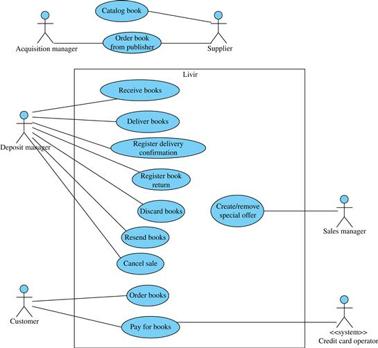   
`Figura 3.6 El modelo de caso de uso del sistema se completó con información descubierta en el diagrama de estados de la Figura 2.15.`


En la Figura 3.6, los casos de uso Catálogar Libros y Pedir Libros al editor, se mantienen fuera del alcance del sistema **Livir**. Esto se descubrió en un momento en que tales casos de uso se realizarían dentro del sistema del editor, no dentro del sistema en desarrollo. Como no están incluidos en el sistema de la librería, pueden ser mantenidos en el diagrama, pero fuera de los límites del sistema, porque están fuera del alcance y no serán implementados.

Después de asegurarse de que se entiende que no se implementarán, se pueden eliminar del diagrama, para simplificarlo y evitar confusiones posteriores con personas que no comprenden que lo que está fuera de los límites no se implementará. En ese caso, sus denominaciones podrán figurar en una lista fuera del ámbito de aplicación, a efectos de documentación.

Los casos de uso asociados al nuevo actor Gestor de depósitos son necesarios para cubrir la mayoría de las transiciones indicadas en el diagrama de máquina de estados de la Figura 2.15. Es interesante notar que algunas transiciones se realizan fuera del ámbito de la empresa. Por ejemplo, cuando un cliente decide devolver un libro, esto no se hace a través del sistema de la librería; simplemente devuelve el libro, generalmente por correo. La información sobre la devolución sólo llega a la librería cuando recibe el libro. Por lo tanto, el caso de uso al que se hace referencia aquí es Registro de devolución de libros y no Devolución de libros, ya que el registro es realizado por el gestor de depósitos, y no por el cliente. Esto es similar al registro de la llegada de libros, representado por el caso de uso Recibir libros, porque cuando el editor envía los libros no puede ser registrado directamente en el sistema de la librería (a menos que ambos sistemas estén integrados). Sólo la llegada puede ser registrada por la librería. Esta es una diferencia fundamental entre un caso de uso de negocio y un caso de uso del sistema: en un caso de uso de negocio, el proceso tal y como ocurre en el mundo real puede describirse como parte del caso de uso, pero cuando el foco está en el sistema, sólo se pueden representar los procesos que involucran al sistema.


## 3.5 Requisitos
>La identificación de casos de uso del sistema es una actividad que forma parte de la disciplina de **Requisitos del Proceso Unificado**. La obtención y el análisis de requisitos es una parte importante de la fase inicial. El equipo puede y debe utilizar todas las fuentes disponibles para identificar las necesidades (especialistas, usuarios, documentos, interfaces, bibliografía, etc.) y, para cada fuente, se puede identificar un conjunto de funciones que el sistema debe realizar.


### 3.5.1 Elección de requisitos
> La obtención de requisitos corresponde a la búsqueda de información de las funciones que debe realizar el sistema, y las restricciones que debe cumplir el sistema. En el enfoque de **los requisitos presentados aquí, se registrarán como casos de uso del sistema.**

Otra forma de registrar los requisitos sin casos de uso sería utilizando un documento que consistiera en una lista de requisitos funcionales, posiblemente acompañada de una lista de limitaciones.

> La ventaja de utilizar casos de uso en lugar de una lista de funciones es que un buen caso de uso tiene una granularidad bien definida, lo que permite generar una lista de requisitos de alto nivel que es mucho más comprensible que una lista de funciones individuales. Normalmente, el número de casos de uso de alto nivel es mucho menor que el número de funciones individuales. Las funciones individuales aparecerán en la expansión de casos de uso, cuando los casos de uso de alto nivel tengan su estructura detallada.

En el caso del ejemplo de **Livir**, la obtención de requisitos permitirá al equipo descubrir que el sistema debe controlar la compra y venta de libros, recibir pagos, permitir el registro de libros dañados, generar informes de ventas, verificar si los libros están disponibles en stock, etc. Estas operaciones y muchas otras constituirán la funcionalidad del sistema, por lo que estos requisitos se denominan requisitos funcionales. 

Estas funciones se incorporarán en uno o más casos de uso.

Por otra parte, durante la obtención de requisitos, el analista puede enfrentarse a **reglas de negocio o restricciones** sobre cómo el sistema debe realizar las funciones. Por ejemplo, una regla de negocios podría establecer que la librería sólo envía libros después de que se confirme el pago. Este tipo de regla es un requisito no funcional que puede ser registrado como una anotación u observación sobre el caso de uso en sí, para ser recordado y verificado cuando el caso de uso tiene que ser detallado (Figura 3.7). Alternativamente, podría registrarse por separado como una lista numerada o una hoja de cálculo, con una referencia a los casos de uso a través de un número único.

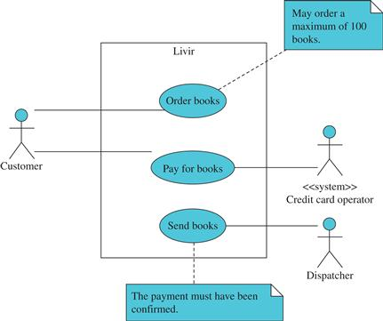    
`Figura 3.7 Requerimientos no funcionales anotados en casos de uso.`


Como puede verse en la Figura 3.7, el diagrama de casos de uso con notas se volverá demasiado complejo para ser útil. Por esta razón, se recomienda que dichas anotaciones se registren dentro de las especificaciones del caso de uso o en un documento separado. La mayoría de las herramientas CASE (Computer-Aided Software Engineering) permiten que un elemento del diagrama, como un caso de uso, tenga una ventana de especificación, como se muestra en la Figura 3.8. Una excepción a esta regla sería el caso cuando la anotación es absolutamente necesaria para ayudar a comprender el diagrama. Sin embargo, esto rara vez es así.


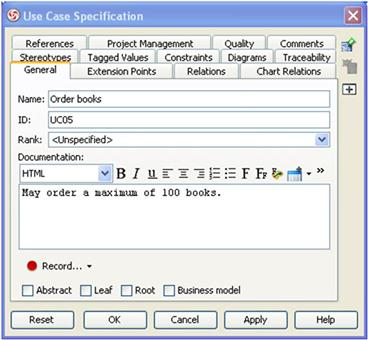   
`Figura 3.8 Ejemplo de ventana de especificación para un caso de uso. Imagen producida con la herramienta CASE Visual Paradigm ™ Community Edition.`


### 3.5.2 ¡Elegir requisitos no es diseño!
Un sistema que va a ser analizado es como un bosque. Para explorar un bosque desconocido no se puede empezar por examinar cada planta y cada animal. Hay un dicho popular que dice que los árboles no te dejan ver el bosque. El bosque es el sistema y los árboles son los requisitos. Sólo al final del proceso un equipo puede decir que ha adquirido conocimientos sobre las piezas más pequeñas. En primer lugar, hay que ver el conjunto, y sólo después se pueden estudiar los detalles.

Por lo tanto, la fase de `inicio` debe proporcionar una visión del todo - para que lo que es más importante se pueda ver primero - y luego, el todo se puede dividir en partes para que los detalles puedan ser analizados y finalmente se pueda diseñar una solución. La organización de las iteraciones en las fases de `Elaboración` y `Construcción` corresponde a la división del bosque en sectores, con el fin de ver cada sector a la vez, y de esa manera, poder hacer frente a la inherente complejidad. Por lo tanto, **uno de los objetivos finales de la fase inicial es organizar la división del trabajo en términos de casos de uso, que se explorarán en las próximas iteraciones**.

Durante el inicio, la obtención de requisitos debe ser rápida y genérica. La manera correcta de hacerlo es considerar la extensión de los requisitos, no sus detalles. El analista debe entender la extensión de lo que el sistema debe hacer, sin detallar cómo lo hará. Sólo durante las iteraciones de Elaboración se profundizará en el análisis de requerimientos.

El tiempo utilizado para la obtención de requisitos debe ser de descubrimiento, no de invención. Durante este período, el equipo de analistas, junto con los clientes, usuarios y otros grupos de interés, tratará de enumerar la mayoría de las capacidades y restricciones sin preocuparse por detallarlas. Los detalles sobre los requisitos se tendrán en cuenta en las próximas iteraciones.

También debe quedar claro que **los requisitos son algo que el cliente pide y no algo que el equipo diseña**. Algunos analistas mezclan la recolección de requerimientos - es decir, la memoria de las demandas del cliente - con el inicio del diseño del sistema. Un ejemplo de este tipo de confusión es un conjunto de requisitos relacionados con el diseño de bases de datos relacionales. A menos que existan sistemas heredados que deban ser compatibles con el nuevo sistema, ¿cómo puede justificarse que un conjunto de tablas relacionales sea una demanda del cliente? Eso podría ser posible con algunos clientes sofisticados con un título en Ciencias de la Computación, pero no es la regla general. Las tablas de base de datos son parte del dominio de solución, no del dominio de problema. El analista debe buscar los requisitos que correspondan a las necesidades y objetivos del cliente en materia de información. Más tarde, puede decidir si esa información se almacenaría en una base de datos relacional o en otra estructura.


### 3.5.3 Retos de Requisitos
El documento de requisitos, que puede estar formado por los esquemas de casos de uso con anotaciones y por las especificaciones complementarias, debe registrar las capacidades del sistema y las condiciones bajo las cuales debe operar. Los desafíos en cuanto a los requisitos son, como mínimo, los siguientes:

- Cómo descubrir los requisitos.
- Cómo comunicar los requisitos a las otras fases y equipos del proyecto.
- Cómo recuperar los requisitos durante el desarrollo para verificar si todos han sido implementados.
- Cómo gestionar el cambio de requisitos.
  
**Sería inútil desarrollar un buen diagrama de casos de uso, y luego no poder saber si los requisitos que allí se incorporan fueron incluidos en el diseño**. La existencia de *mecanismos automáticos* para llevar a cabo esta verificación es crucial. Por lo tanto, es importante mantener relaciones de trazabilidad entre los casos de uso y otras partes del diseño. 

Es necesario tener en cuenta que los requisitos cambian necesariamente durante el desarrollo de un proyecto. Por lo tanto, el cambio debe ser gestionado, no evitado, después del  Inicio.

A veces, los requisitos cambian después de la implementación del sistema. Las condiciones del contexto, las regulaciones, las políticas de la compañía o los métodos de trabajo pueden cambiar en cualquier momento. Aunque el analista no puede prever estos cambios, se pueden crear mecanismos para acomodarlos con el fin de facilitar el proceso de cambio cuando sea necesario. Existen patrones de diseño específicos para tratar estas inestabilidades de los requisitos (como, por ejemplo, el patrón de la Estrategia). Los cambios son totalmente impredecibles. Si el sistema no está estructurado para adaptarse a los cambios en los requisitos, probablemente será difícil implementarlo.

Este tipo de situación hace que los procesos de análisis y diseño basados en los requisitos (Alford, 1991) sean inadecuados para la mayoría de los sistemas. Utilizar los requisitos como base para soportar la arquitectura del sistema es como construir una casa sobre arena en movimiento; cuando los requisitos cambian, la estructura se resiente. Sin embargo, el proceso unificado (UP) utiliza una base mucho más estable para la arquitectura, que se basa en clases y componentes que encapsulan la información y el comportamiento.

Estas clases implementan funcionalidades que combinadas permiten la implementación de los requisitos. Si las necesidades cambian, las combinaciones cambian, pero no la estructura básica. Este tipo de arquitectura sigue el principio de Abierto y Cerrado (Meyer, 1988), en el sentido de que siempre está cerrada para su modificación (funciona), pero abierta para su extensión (puede acomodar nuevas funcionalidades).

Es importante rastrear el origen de cada requisito (por ejemplo, un actor del negocio, un trabajador del negocio, el propio cliente, o incluso un especialista del dominio), porque es necesario validar los requisitos con esas fuentes, verificando si están bien escritos, completos y sólidos.

A veces también puede ocurrir que diferentes personas o departamentos presenten diferentes especificaciones para el mismo requisito. En ese caso, es necesario presentar un acuerdo entre ellos, o identificar quién tiene la autoridad más alta para determinar la forma aceptable para el requisito.


### 3.5.4 Requisitos funcionales evidentes y ocultos.
Los requisitos funcionales pueden identificarse opcionalmente como evidentes u ocultos (Gause y Weinberg, 1989):

- **Los requisitos funcionales evidentes son funciones que se realizan con el conocimiento del usuario**. Estos requisitos suelen corresponder al intercambio de información entre el usuario y el sistema, como las consultas y la entrada de datos, que fluye a través de la interfase del sistema.
- Las necesidades funcionales ocultas son funciones realizadas por el sistema sin conocimiento explícito del usuario. Normalmente estas funciones son operaciones matemáticas y actualización de datos realizadas por el sistema sin conocimiento explícito del usuario, pero como consecuencia de otras funciones realizadas por el usuario.
  
El sistema realiza internamente las necesidades ocultas. Así, aunque no aparezcan explícitamente como casos de uso, deben estar adecuadamente asociados a ellos para poder ser recordados en el momento de su diseño e implementación. Por lo tanto, también podrían añadirse como anotaciones a un caso de uso.

Un ejemplo de un requisito evidente es la producción de un informe sobre los libros más vendidos, que es algo que un gerente podría necesitar. Un ejemplo de un requisito oculto es aplicar una política de descuentos a una venta. En ese caso, el usuario no solicita explícitamente que el sistema realice la operación. Como es una actividad que el sistema realiza automáticamente, es una necesidad oculta.


### 3.5.5 Requerimientos no funcionales
**Los requisitos no funcionales son restricciones o cualidades que pueden estar vinculadas a funciones específicas de un sistema** (por ejemplo, "*una orden no puede contener más de cien libros*", "*la transacción de la orden debe preservarse si se interrumpen las comunicaciones*", etc.), y por lo tanto pueden tratarse como anotaciones sobre los casos de uso que incorporan las funciones respectivas. A veces, sin embargo, los requisitos no funcionales pueden ser generales, es decir, no están necesariamente vinculados a una función (por ejemplo, "*el sistema debe estar implementado en Java*"), y en ese caso, aparecerán en el pliego de condiciones suplementario. Las restricciones y cualidades que están específicamente vinculadas a una función se denominan requisitos no funcionales, y las restricciones y cualidades generales se denominan requisitos suplementarios.

Hay dos tipos de requisitos no funcionales:

- Cuestiones lógicas: Reglas de negocio asociadas a una función. Por ejemplo, durante el registro de ventas, se pueden considerar una serie de restricciones, como *no cerrar la venta hasta que el operador de la tarjeta de crédito confirme el pago*, o *no cerrar la venta si la última entrega a la misma dirección ha sido devuelta debido a una dirección no válida*.
- Cuestiones tecnológicas: Limitaciones y cualidades relacionadas con la tecnología utilizada para realizar la función, como, por ejemplo, la interfaz de usuario, el tipo de protocolo de comunicación, las restricciones de seguridad, la tolerancia a fallos, etc.
  
Por ejemplo, establecer que la interfaz de usuario para realizar una orden debe seguir un patrón de diseño basado en un flujo secuencial de pantallas es una restricción tecnológica (restricción de interfaz) sobre la forma en que se debe realizar esa función. Otro ejemplo de un requisito no funcional es "*la confirmación del pago no debe durar más de 5 segundos*".

Esta es una restricción tecnológica relacionada con el rendimiento del sistema y afectaría la forma en que el diseñador piensa sobre el mecanismo de comunicación con el operador de la tarjeta de crédito. En este caso, el diseño del sistema tendría que considerar seriamente el ancho de banda de las conexiones a los operadores.

Un requisito no establece cómo se implementará la restricción, sólo la exige. El diseño y la implementación del sistema deben cumplir con el requisito de una manera u otra, o de lo contrario el analista debe negociar con el cliente para obtener cierta flexibilidad en los requisitos.


### 3.5.6 Permanencia y transitoriedad de los requisitos no funcionales.
Una de las características más fundamentales de un requisito es si un determinado requisito no funcional o suplementario es permanente o transitorio.

Los requisitos no funcionales y suplementarios pueden considerarse permanentes (no se espera que cambien) o transitorios (se espera que cambien) dependiendo de una decisión tomada por el cliente. La permanencia o transitoriedad no es una característica intrínseca de un requisito: se decide en función de la conveniencia. Los mismos requisitos dados pueden ser considerados permanentes o transitorios dependiendo de lo que se desee en cuanto al tiempo y costo del desarrollo y mantenimiento del software.

Si se invierte en un diseño flexible, de modo que la mayoría de las restricciones son transitorias, se gastará menos esfuerzo durante el mantenimiento para adaptarse a los cambios. Sin embargo, el costo de ese diseño flexible durante el desarrollo puede llegar a ser prohibitivo para algunos proyectos. Siempre será una buena idea considerar qué restricciones deben ser tratadas como requisitos transitorios.

Por ejemplo, un requisito suplementario podría establecer que el sistema **`Livir`** debe tratar con una moneda única: *el dólar*. Si ese requisito se considera permanente, entonces el sistema se diseñará para una sola moneda ("dólar" podría incluso ser un tipo de datos utilizado para definir variables y atributos). Sin embargo, si el requisito se considera transitorio, entonces, incluso si no hay otra moneda que se utilice hoy en día, todo el sistema debe estar preparado para acomodar la futura moneda, o incluso más de una moneda a la vez.

Las consecuencias de decidir que un requisito es permanente son las siguientes:
- Es más barato y rápido desarrollar el sistema.
- Es más caro y difícil cambiar el sistema si, por casualidad, los requisitos cambian en el futuro.
  
Por otro lado, decidir que el requisito es transitorio tiene las siguientes consecuencias:
- El desarrollo del sistema es más costoso y complejo (por ejemplo, debería incluir funcionalidades para cambiar la moneda).
- Es más fácil y rápido mantener el sistema (si la moneda cambia, el sistema ya está preparado para ello con una simple reconfiguración).
  
Por lo tanto, no es la naturaleza del requisito no funcional lo que decidirá si es permanente o transitorio. Es el cliente, con la ayuda del equipo, quien debe tomar la decisión. Lo ideal sería enumerar los requisitos de mayor importancia (los que realmente se espera que cambien en un futuro próximo con un mayor impacto en el sistema) y considerarlos transitorios, dejando los demás como permanentes.


### 3.5.7 Requisitos obligatorios y deseados.
Los requisitos también pueden considerarse obligatorios o deseados, es decir, los que deben obtenerse por cualquier medio y los que podrían obtenerse si ningún problema mayor obstaculiza el proceso de desarrollo.
En el caso de los requisitos funcionales, esa clasificación indica las prioridades de desarrollo. Si hay flexibilidad en la restricción de tal manera que sólo se implementen los casos de uso más importantes si no hay tiempo para implementarlos todos, entonces el equipo debe saber cuáles son obligatorios.

Sin embargo, si el equipo es capaz de hacer una buena estimación del esfuerzo necesario para desarrollar el sistema, y si tiene un buen historial de estimaciones precisas, habrá menos motivación para tal distinción con respecto a los requisitos funcionales, porque se espera que todos los requisitos se implementen a tiempo.

Por otra parte, los requisitos no funcionales y suplementarios son mucho más impredecibles que los funcionales con respecto a la estimación del esfuerzo. Por lo tanto, en algunos casos, puede ser necesario considerar esos requisitos con cierta flexibilidad.

En este caso, algunas restricciones se definen de tal manera que deben ser obtenidas por cualquier medio y otras pueden considerarse simplemente deseables, y se asigna un tiempo para aplicarlas.

Por ejemplo, en el caso del sistema **`Livir`**, el requisito de utilizar una interfaz web puede considerarse un requisito suplementario obligatorio. En ese caso, otras soluciones no son aceptables. Sin embargo, el acceso adicional a través de un teléfono móvil podría considerarse un requisito deseable, ya que dicho acceso no es absolutamente necesario para el éxito efectivo del sistema.

Hoy en día, con la formalización de las restricciones de desarrollo de software, hay menos flexibilidad en cuanto a los requisitos deseables.
 > En la mayoría de los casos, el desarrollador debe indicar qué requisitos se implementarán, cuánto tiempo tomará y cuánto va a costar. Sobrepasar esa línea puede requerir el pago de multas o incluso la cancelación del proyecto.


### 3.5.8 Requisitos suplementarios
Los requisitos suplementarios son todo tipo de restricciones y cualidades relacionadas con el sistema en su conjunto y no sólo con funciones individuales. Por ejemplo, un requisito suplementario puede establecer que el sistema debe ser compatible con una base de datos heredada determinada, o implementarse con un lenguaje de programación determinado, o incluso seguir un aspecto y una sensación determinados.

Se debe tener cuidado cuando se definen los requisitos suplementarios. Un requisito como "el sistema debe ser fácil de usar" no está suficientemente claro. Sería mejor decir algo como "los usuarios novatos deben ser capaces de completar las tareas sin errores en su primer intento".

 Esto da una idea más precisa de lo que se debe diseñar para cumplir el requisito.

Los requisitos no funcionales y suplementarios también pueden identificarse con diferentes grupos como, por ejemplo, la interfaz, la implementación, el rendimiento, la tolerancia a fallos, etc. El objetivo de hacer tales distinciones es permitir una mejor organización.

Aunque la mayoría de los profesionales del UP elegirían utilizar el sistema de clasificación FURPS+ (Grady, 1992) para organizar los requisitos suplementarios, la fuente más reciente para decidir sobre la clasificación de los requisitos suplementarios es ISO/IEC 25010,4 como se muestra en la Tabla 3.1.

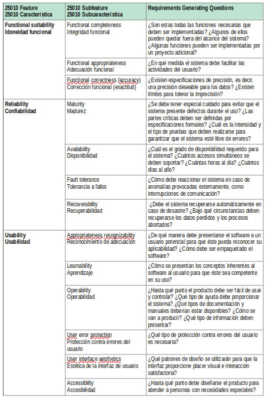 
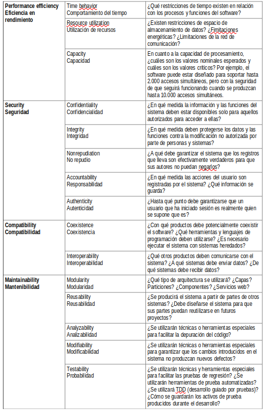 
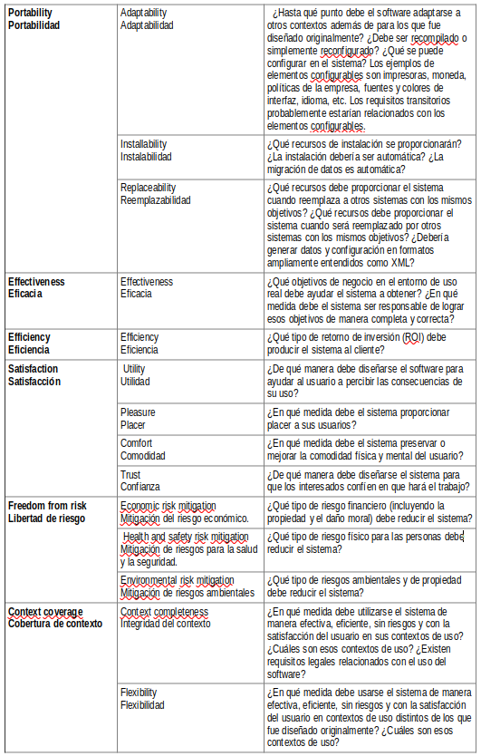 

` Tabla 3.1 Clasificación de requisitos suplementarios según ISO / IEC 25010: 2011 y preguntas generadoras de requisitos`


Aunque esta lista es extensa, el equipo debe tener en cuenta que es sólo una clasificación para mejorar la capacidad de identificar qué requisitos son realmente importantes. No hay necesidad de buscar requisitos inexistentes, por ejemplo, establecer requisitos de empaquetado complicados para un cliente que no se preocupa por la forma en que se empaquetará el software.

También es aconsejable no perder tiempo discutiendo si un determinado requisito pertenece a tal o cual tipo. Más importante que decidir sobre su tipo es saber que existe:
las largas discusiones sobre la clasificación de los requisitos no añaden conocimientos significativos al proyecto.

La tabla 3.2 presenta un ejemplo de requisitos suplementarios que podrían asignarse al ejemplo de **`Livir`**.

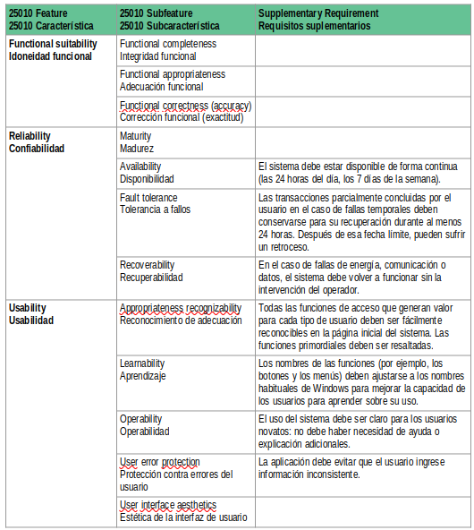 
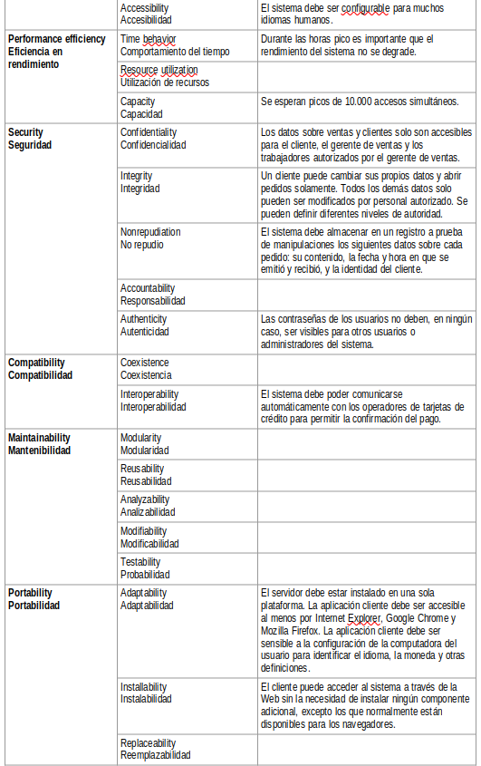 
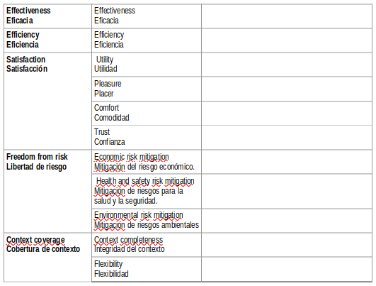 

`Tabla 3.2 Requisitos complementarios para el sistema **Livir**`

No se rellenaron todos los campos porque, como ya se ha dicho, los requisitos no deben ser inventados, sino que deben ser solicitados por el cliente. Por lo tanto, por lo general no hay requisitos en todas las categorías. Las preguntas que generan los requisitos mencionados en la Tabla 3.1 son una buena base para encontrar posibles necesidades. Pero no es obligatorio tener una respuesta a todas esas preguntas.


## 3.6 Modelo conceptual preliminar
Posteriores documentos presentan en detalle las técnicas de modelación conceptual, es necesario mencionar aquí que existen relaciones de interdependencia entre los casos de uso del sistema y el llamado modelo conceptual preliminar (Larman, 2004). El modelo conceptual preliminar se construye durante el Inicio, y consiste en un **diagrama de clase** que representa las principales unidades de información del sistema. Todavía no es necesario representar atributos. Aunque las asociaciones deben aparecer en ese modelo, no es necesario detallar sus características.

Analizando el diagrama de casos de uso del sistema, se pueden descubrir muchos conceptos importantes. Estos conceptos se representan como clases en el modelo conceptual preliminar; representan la estructura de la información que será manejada por el sistema. Al mismo tiempo, un analista, observando el modelo conceptual, podría notar si el diagrama de caso de uso es suficientemente completo. Esta verificación suele ocurrir cuando se identifican nuevas entidades en un proceso de negocio, y es necesario que el sistema las registre de alguna manera.

La Figura 3.9 presenta un posible modelo conceptual preliminar para el diagrama de casos de uso presentado en la Figura 3.6. 
> El proceso de descubrimiento de las clases consiste en pensar en los casos de uso e imaginar qué información (de alto nivel) se intercambia entre los actores y el sistema para permitir que el proceso funcione. Las asociaciones entre clases representan dependencias o relaciones entre las piezas de información representadas por ellas.

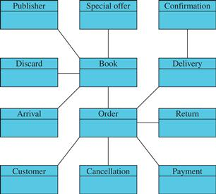   
`Figura 3.9 Modelo conceptual preliminar para los casos de uso de la Figura 3.6.`


Mirando la Figura 3.6 con el propósito de encontrar los conceptos mostrados en la Figura 3.9, se puede ver que:

- Pedir Libros es probablemente el caso de uso más importante del sistema. Da lugar a dos conceptos, Libro y Pedido, que están asociados.
- El pago de libros añade un nuevo concepto, el Pago, que se asocia al Pedido. En ese momento el equipo podría decidir cambiar el nombre del caso de uso a Orden de pago.
- El caso de uso de Recibir libros da lugar al concepto de Llegada, que está asociado a Libro. Tal vez en ese momento EntryOrder o BuyOrder podría ser introducido como un nuevo concepto.
- Deliver books produce un nuevo concepto, Delivery, que está asociado a Order. Ahora Deliver books puede/debe ser renombrado como Deliver order.
- La confirmación de registro de entrega produce el concepto de Confirmación, que se asocia con la Entrega.
- La devolución del libro de registro produce la devolución, que está asociada al Pedido. Tal vez en ese momento el nombre del caso de uso debería cambiarse a Registrar la devolución del pedido.
- Descartar libros produce Descarte, que está asociado a Libro.
- Reenviar libros no crea un nuevo concepto a primera vista porque puede considerarse la repetición del caso de uso Entregar libros. Sin embargo, eso aún debe ser analizado más a fondo.
- Cancelar la venta produce el concepto de Cancelación, que se asocia a un Pedido. Tal vez el nombre del caso de uso debería cambiarse a Cancelar pedido en este punto.
- Crear/quitar una oferta especial crea el concepto de Oferta Especial, que está asociado a Book.
  
La identificación de ese modelo conceptual preliminar es especialmente útil para facilitar la visualización de la estructura de la información que va a ser manejada por el sistema; esto ayuda a unificar el vocabulario entre los miembros del equipo y otros actores. Las decisiones sobre el cambio de nombres de casos de uso para limpiar el vocabulario ya están implementadas en la Figura 3.10.

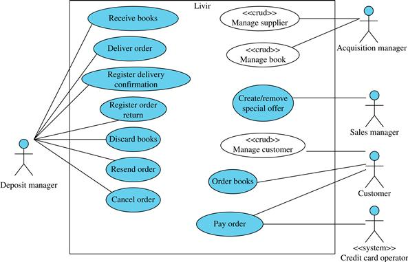   
`Figura 3.10 Un modelo de caso de uso con nombres revisados y añadidos los CRUDs.`


Pero también existe la siguiente utilidad práctica importante para el modelo conceptual preliminar. Entre los conceptos mostrados, la mayoría son elementos de información creados o modificados en el contexto de los casos de uso ya identificados. Sin embargo, algunos de ellos no son creados ni cambiados por esos casos de uso, y eso significa que algunos casos de uso todavía podrían estar ausentes. Este es el caso especialmente de las clases Book, Publisher y Customer. Estos conceptos pueden ser considerados como un CRUD, ya que permiten las cuatro operaciones clásicas: Crear, recuperar, actualizar y eliminar. Si se van a añadir al diagrama, en lugar de representarlas individualmente, sería mejor representar las cuatro operaciones utilizando un único caso de uso de CRUD, que está estereotipado con `<<crud>>`, como se muestra en la Figura 3.10.

Se definió un nuevo actor para la gestión de las editoriales y los libros: el Gestor de adquisiciones. Por otra parte, se decidió que el cliente sería responsable de su propio registro.

> ¿Por qué no hay CRUD para pedidos, cancelaciones, devoluciones, pagos, etc.? Porque estos ya están gestionados por los casos de uso del diagrama, y no es necesario crear otros casos de uso específicos para ellos. Por ejemplo, una orden es creada por el caso de uso Pedir Libros; es cambiada por casos de uso como Cancelar orden y Pagar orden; es visualizada (recuperada) en muchos casos de uso; y, finalmente, se asume que no puede ser removida del sistema.

Otra cuestión que podría plantearse a las partes interesadas es: ¿Cuáles son los informes que el sistema debe producir? Aunque son los casos de uso más simples, como se explica más adelante, los informes son una fuente importante de información para identificar qué información es necesaria para satisfacer las necesidades de las partes interesadas.

Existe una diferencia entre los informes y la consulta de recuperación de CRUD: la recuperación es simplemente la recuperación de datos almacenados sobre un objeto; sin embargo, un informe, por lo general, implica una serie de objetos, a veces de diferentes clases, y necesariamente incluye algún tipo de filtrado o combinación de datos (suma, producto, promedio, mayor valor, menor valor, etc.). Por ejemplo, una consulta de información sobre un libro, dado su ISBN, no debe considerarse como un caso de uso de un informe, porque esa consulta ya está incluida en el caso de uso de CRUD.
Para el ejemplo en curso, se podrían identificar algunos informes que son interesantes para ciertos actores, como por ejemplo:

- Gestor de depósitos: Informe de los próximos pedidos por periodo de tiempo, informe de las entregas por periodo de tiempo, informe del número total de libros disponibles para la venta, informe de las devoluciones recibidas por periodo de tiempo, e informe de los libros descartados por periodo de tiempo.
- Cliente: Informe sobre el estado de los pedidos e informe sobre las ventas anteriores.
- Gerente de ventas: Informe de ventas de libros por período de tiempo.
  
El cliente podrá exigir otros informes, y los anteriores son sólo ejemplos. Los que se utilizan exclusivamente dentro de uno de los casos de uso existentes deben excluirse de la lista de informes. Por ejemplo, el gestor de depósitos podría estar interesado en la lista de pedidos que están llegando. Si esa lista va a ser consultada sólo en el momento en que realmente llega un pedido y debe ser registrado, entonces la consulta debe ser considerada como parte del caso de uso Recibir libros, y no debe ser incluida en el diagrama. Sólo deben incluirse en el diagrama los informes que no son necesariamente parte de otros casos de uso; de lo contrario, la lista podría crecer rápidamente mucho más allá de lo manejable, y sería redundante e incompleta (porque es la expansión de casos de uso con diagramas de secuencias lo que realmente indicará qué pasos, incluyendo consultas, son necesarios para cada caso de uso). La Figura 3.11 muestra el diagrama de casos de uso actualizado con los informes (estereotipado con el informe) tal y como se ha indicado anteriormente.

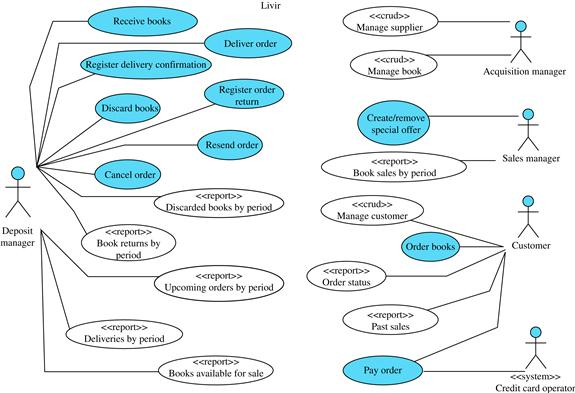   
`Figura 3.11  Diagrama de caso de usos con informes.`


La cantidad de casos de uso de informes dependerá de la estructura de la información que presenten. Cuando la parametrización es posible, debe utilizarse. No es necesario, por ejemplo, tener un informe de ventas por semana y un informe de ventas por mes. A menos que presenten estructuras de datos diferentes, se trata de un único informe. La referencia a una semana, mes o cualquier otro período de tiempo es sólo un parámetro.
Sin embargo, no es aconsejable agrupar informes de diversa naturaleza, por ejemplo, Informe de ventas por libro e Informe de entregas por período de tiempo: las entradas y salidas son diferentes. Por lo tanto, esos dos informes deben considerarse dos casos de uso diferentes. 

Como se ve en la Figura 3.11, el número de casos de uso puede llegar a ser alto y el diagrama puede volverse rápidamente difícil de organizar. Esta es una de las razones para evitar incluir fragmentos en estos diagramas. 

Cada caso de uso individual será detallado por otros medios. Además, el CRUD y los casos de uso de informes pueden no estar incluidos en el diagrama de caso de uso principal si el sistema es al menos de tamaño moderado. Deben ser listados en otro lugar (una hoja de cálculo o un diagrama de caso de uso separado, por ejemplo), para no contaminar el diagrama de caso de uso principal. Otra solución que se puede utilizar a veces es representarlos con un color diferente (como se hace en las Figuras 3.10 y 3.11), para que no impidan la visualización de los casos de uso clave en el diagrama.


## 3.7 El proceso visto hasta ahora


| | Inicio | Elaboración | Construcción | Transición |
| -- | -- | -- | -- | -- |
| **M**odelado del Negocio | [MI](#MI) | | | | 
| **R**equerimientos | [RI](#RI) | | | | 
| **A**nalisis y Diseño | [ADI](#ADI)  | | | | 
| **I**mplementación  | | | | |
| **P**ruebas/Test  | | | | | 
| **G**estión de Proyectos  | | | | |
| **D**espliegue  | | | | |
| **C**onfiguración y Gestión del cambio | | | | |
| **E**ntorno | | | | |


### MI
Construir una vista general del sistema:  
- Dibujar un caso de uso del negocio y determinar el ámbito de automatización para el proyecto.
- Dibujar un diagrama de actividad para el caso de uso del negocio
- Dibujar un diagrama de maquina de estado para los procesos clave del sistema

### RI
Preparar un diagrama de caso de uso del sistema (requisitos funcionales)
- Identificar los actores del sistema desde el modelo de caso de uso del negocio.
- Identificar los casos de uso del sistema desde  el modelo de caso de uso del negocio, y el diagrama de actividad y maquinas de estado desde el modelo de negocio.

Identificar los requisitos no funcionales como anotaciones de los casos de uso:
- Identificar las principales reglas de negocio asociadas a los casos de uso.
- Identificar las principales puntos de calidad asociados a los casos de uso.

Identificar requisitos suplementarios.

### ADI
Preparar un modelo conceptual preliminar observando los casos de uso del sistema y los conceptos expresados en el.

## 3.8 Preguntas

1. Explique las diferencias entre un caso de uso de negocio y un caso de uso del sistema.
2. ¿Cuál es la utilidad de un caso de uso del sistema a través del proceso de desarrollo de software?
3. ¿Qué actores del negocio y trabajadores del negocio se convierten en actores del sistema?
4. ¿Cuáles son los requisitos funcionales, no funcionales y suplementarios y qué características podrían tener?
5. ¿Por qué debe hacerse un modelo conceptual preliminar durante la fase inicial?
