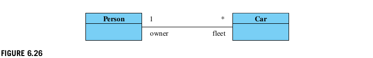
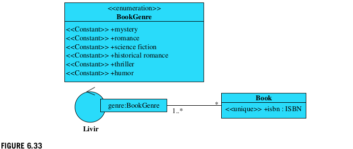

# MODELIZACIÓN CONCEPTUAL

- [MODELIZACIÓN CONCEPTUAL](#modelización-conceptual)
  - [Fundamentos](#fundamentos)
      - [Palabras clave](#palabras-clave)
      - [Conceptos](#conceptos)
    - [6.1 Introdución al modelado conceptual](#61-introdución-al-modelado-conceptual)
    - [6.2 Atributos](#62-atributos)
    - [6.2.1 Tipos de atributos](#621-tipos-de-atributos)
    - [6.2.2 Valores iniciales](#622-valores-iniciales)
    - [6.2.3 Atributos derivados](#623-atributos-derivados)
    - [6.2.4 Enumeraciones](#624-enumeraciones)
    - [6.2.5 Tipos primitivos](#625-tipos-primitivos)
    - [6.3 Conceptos](#63-conceptos)
    - [6.3.1 Atributos únicos](#631-atributos-únicos)
    - [6.3.2 Clases de **`control del sistema`**](#632-clases-de-control-del-sistema)
    - [6.4 Asociaciones](#64-asociaciones)
    - [6.4.1 Multiplicidad de Roles](#641-multiplicidad-de-roles)
    - [6.4.2 Dirección en la Asociación](#642-dirección-en-la-asociación)
    - [6.4.3 Asociación derivada](#643-asociación-derivada)
    - [6.4.4 Agregación y composición](#644-agregación-y-composición)
    - [6.4.5 Asociaciones n-arias](#645-asociaciones-n-arias)
    - [6.5 Colecciones](#65-colecciones)
    - [6.5.1 Conjunto/Set](#651-conjuntoset)
    - [6.5.2 Conjunto ordenado](#652-conjunto-ordenado)
    - [6.5.3 Bolsa](#653-bolsa)
    - [6.5.4 Secuencia](#654-secuencia)
    - [6.5.5 Mapa](#655-mapa)
    - [6.5.6 Partición](#656-partición)
    - [6.5.7 Relación](#657-relación)
    - [6.6 Organización del modelo conceptual](#66-organización-del-modelo-conceptual)
    - [6.6.1 Generalización, especialización y herencia](#661-generalización-especialización-y-herencia)
    - [6.6.2 Clases asociativas  - IDEM E/R](#662-clases-asociativas----idem-er)
    - [6.6.3 Clases modales](#663-clases-modales)
    - [6.3.1 Transición estable](#631-transición-estable)
    - [6.3.2 Transición monótona creciente](#632-transición-monótona-creciente)
    - [6.3.3 Transición no monótona  <-NO Estudiar](#633-transición-no-monótona---no-estudiar)
    - [6.7 Invariantes  <- REGLAS DE NEGOCIO](#67-invariantes----reglas-de-negocio)
    - [6.8 Construcción iterativa del modelo conceptual](#68-construcción-iterativa-del-modelo-conceptual)
    - [6.8.1 Cómo encontrar conceptos y atributos](#681-cómo-encontrar-conceptos-y-atributos)
    - [6.8.2 Conceptos dependientes e independientes](#682-conceptos-dependientes-e-independientes)
    - [6.8.3 Cómo encontrar asociaciones](#683-cómo-encontrar-asociaciones)
    - [6.8.4 Ejemplo de construcción iterativa del modelo conceptual](#684-ejemplo-de-construcción-iterativa-del-modelo-conceptual)
    - [6.9 El proceso hasta ahora](#69-el-proceso-hasta-ahora)
    - [MI](#mi)
    - [RI](#ri)
    - [RE](#re)
    - [ADI](#adi)
    - [ADIE](#adie)
    - [GPI](#gpi)
  - [6.10 Preguntas](#610-preguntas)

## Fundamentos
  
Se muestran los elementos básicos del modelado conceptual mediante el `diagrama de clases UML.`   
Presenta un estudio detallado de los tres elementos principales de un modelo conceptual:
 `conceptos`, `atributos` y `asociaciones`. 
   
Incluye las mejores prácticas sobre cómo utilizar esos elementos para que los modelos se mantengan claros y sostenibles.   
Finalmente, el documento discute `la organización del modelo conceptual`; la `herencia` no es la única estructura que se puede usar: es la más adecuada para representar conceptos que están estructuralmente relacionados, pero los roles asociativos y las clases modales también se deben usar para representar diferentes tipos de organización que no están adecuadamente descritos por la herencia. El documento también muestra cómo `descubrir` y `refinar` elementos conceptuales en casos de uso detallados y diagramas de secuencia del sistema, haciendo así la conexión entre esos artefactos de análisis.

#### Palabras clave
`Conceptual model`; `class diagram`; `attribute`; `association`; `inheritance`;

#### Conceptos

- Atributos
- Conceptos
- Asociaciones
- Colecciones
- Organización del modelo conceptual: estructural, asociativo y temporal
- Invariantes
- Construcción iterativa del modelo conceptual

### 6.1 Introdución al modelado conceptual  
**El `análisis del dominio` consiste en descubrir y modelar la información que debe ser gestionada por el sistema**. Esto significa que el equipo debe descubrir cómo debe estructurarse y transformarse la información. Comienza durante el Inicio con el modelo conceptual preliminar y continúa durante la Elaboración, cuando ese modelo es refinado y completado a medida que el análisis de requerimientos se profundiza con la expansión de los casos de uso.  
Se pueden analizar dos aspectos de la información: **la estática** (también llamada estructural), y **la funcional**. El aspecto estático puede estar representado en el `modelo conceptual` y el `aspecto funcional en los contratos de las operaciones` del sistema.   
Durante el Análisis no hay ningún modelo dinámico para los objetos, porque el análisis sólo tiene en cuenta una vista externa del sistema. El modelo dinámico, que consiste en las colaboraciones entre objetos, se realiza durante el diseño, porque sólo en ese momento se abordan los aspectos internos del sistema. Así, el modelo funcional de análisis indica sólo qué información entra y sale del sistema, sin decir cómo se transforma la información. Más tarde, el modelo dinámico de diseño mostrará claramente cómo las colaboraciones de objetos pueden cambiar la información.  
**El `modelo conceptual` describe la información que el sistema va a gestionar**. Es un artefacto del _dominio del problema_, no del dominio de la solución. Por lo tanto, el modelo conceptual no debe confundirse con el `Diagrama de Clases de Diseño` (DCD), que pertenece a la arquitectura del software. La DCD, aunque inicialmente derivada del modelo conceptual, pertenece al _dominio de las soluciones_ y, por lo tanto, tiene diferentes propósitos.  
El modelo conceptual no debe confundirse con el *modelo de datos*, porque el modelo de datos enfatiza la representación y organización de los datos almacenados, mientras que el modelo conceptual apunta a representar la comprensión de la información por parte de los usuarios, no su representación física. Así, un modelo de datos relacionales es sólo una de las posibles representaciones físicas de un modelo conceptual más esencial.  
Una forma interesante de comprender el modelo conceptual es imaginar que los elementos descritos por él corresponden a información que **inicialmente existe sólo en la mente del usuario**, como se representa en la `Figura 6.1`, y no en un sistema de almacenamiento físico.

  
`Figura 6.1 El modelo conceptual es una representación de la visión de los usuarios de la información`.
  
Un usuario envía información al sistema y recibe información del sistema a través de `eventos` y `retornos` del sistema, respectivamente. En este punto, el sistema ni siquiera necesita ser considerado un sistema computacional, porque la información existe independientemente del soporte informático para su almacenamiento y gestión.   
El objetivo del análisis es estudiar el problema. Pero el sistema computacional es una solución, y por lo tanto, pertenece al diseño. La solución del sistema podría incluso diseñarse sin tecnología informática. Es posible analizar toda una situación y luego proponer una solución manual para implementarla, en la que, por ejemplo, los datos se almacenan en hojas de papel, y las operaciones son realizadas por los trabajadores utilizando lápiz, goma de borrar y grapadoras.  
Al igual que los casos de uso esencial, `el modelo conceptual es independiente de las soluciones físicas que se puedan adoptar`, y debe contener únicamente `elementos que pertenecen al dominio del problema`, dejando al diseño los elementos de la solución, es decir, todos los elementos relacionados con la tecnología, tales como interfaces, almacenamiento, comunicación, etc.  
El modelo conceptual representa sólo el aspecto estático de la información. Por lo tanto, en el modelo conceptual no pueden existir referencias a las operaciones o aspectos dinámicos del sistema. Aunque el modelo conceptual está representado en un diagrama de clase UML, el analista no debería incluir ningún método. 
Cuando el diagrama de clase se utiliza para el modelado conceptual, hay precisamente tres tipos de elementos a utilizar para representar la información:
- `Atributos`: Información alfanumérica simple o primitiva, como números, textos, fechas, etc. Ejemplos de atributos en el proyecto **`Livir`** son el nombre del cliente, la fecha de pago, el título del libro y el importe total de un pedido. Un atributo siempre está relacionado con un elemento más complejo: el concepto.
- `Conceptos`: La representación de la información compleja que tiene un significado coherente en el dominio. Los conceptos generalmente agregan atributos y no pueden ser descritos simplemente como alfanuméricos. Los conceptos también pueden estar asociados entre sí. Ejemplos de conceptos en el proyecto **`Livir`** son libro, cliente, pedido y pago.
- `Asociaciones`: Un tipo de información que enlaza diferentes conceptos. Sin embargo, las asociaciones son algo más que meros enlaces: son información. En el ejemplo de **`Livir`** deberían existir asociaciones entre pedidos y clientes, y también entre pedidos y libros, por ejemplo.  
Estos tres elementos se detallan en las siguientes secciones. Es prácticamente imposible explicar una sin mencionar las otras, porque las tres están fuertemente entrelazadas.

### 6.2 Atributos  
Los `atributos` son, en el modelo conceptual, los `elementos alfanuméricos y primitivos como la fecha, el dinero, el número, la cadena, el intervalo`, etc.  
Aunque la mayoría de los lenguajes de programación permiten definir atributos como estructuras de datos tales como listas, matrices, conjuntos, árboles, etc., no es aconsejable en el modelado conceptual porque esas estructuras se modelan mejor como asociaciones, como se explica en las siguientes secciones.  
Los conceptos complejos (_clases_) tampoco deben ser usados como atributos de otros conceptos (aunque, de nuevo, los lenguajes de programación lo permiten). Por ejemplo, un libro no debe ser un atributo de un pedido. Si existe una relación entre los libros y los pedidos, entonces se debe utilizar una asociación, porque los libros y los pedidos son _conceptos complejos_. Una excepción a esta recomendación ocurre cuando un tipo primitivo o enumeración se utiliza para etiquetar un atributo; los tipos y enumeraciones primitivas se definen como clases estereotipadas, pero no se comportan como conceptos. Se utilizan como tipos de atributo. Por ejemplo, una fecha está compuesta por partes como año, mes y día, sin embargo, una fecha de nacimiento se considera un atributo de una persona, no un concepto complejo asociado a una persona.  
_Los atributos en UML siempre se representan dentro de una clase_, como se muestra en la `Figura 6.2`, donde la clase Cliente tiene los atributos: nombre, id, dirección y teléfono.


### 6.2.1 Tipos de atributos  
Los atributos pueden tener un tipo, aunque esto no es obligatorio para el modelo conceptual. La `Figura 6.3` presenta una versión de la clase de la `Figura 6.2` con atributos tipados.

  
`Figura 6.2` `Atributos representados dentro de una clase`.  
`Figura 6.3` `Atributos con tipos`.
  
_Los tipos en los modelos conceptuales tienen el mismo significado que tienen en los lenguajes de programación_. En la `Figura 6.3`, tenemos el tipo clásico String, y los tipos primitivos definidos por el usuario `IdNumber` y `PhoneNumber`.  
Cuando un atributo está definido por reglas de formación, como en el caso de id y phone, es aconsejable definir un tipo primitivo especialmente para él, como se hace en la `Figura 6.3`.  
La dirección es algo especial. ¿Es un atributo o un concepto complejo? `(VER E/R Bases de Datos)` ¿Es simplemente una cadena o un concepto complejo compuesto de calle, código postal, número, ciudad, etc.? Este caso, como muchos otros, se decide analizando las necesidades de información de los usuarios. Si las direcciones se usan sólo para imprimir sobres y enviar correo, entonces se comportan simplemente como cadenas, y pueden ser representadas como atributos escritos como cadenas.  
Sin embargo, si las direcciones se usan para calcular distancias y rutas, o si se usan para agrupar a los clientes que viven en el vecindario, entonces se comportan como conceptos complejos y deben ser modelados como un tipo primitivo. Además, si tienen una estructura de asociaciones entre ellos, entonces deben ser modelados como conceptos complejos.

### 6.2.2 Valores iniciales  
Un atributo puede declararse con un valor inicial, es decir, `cada vez que se crea una nueva instancia del concepto`, ese atributo recibirá automáticamente un valor inicial definido, que puede cambiarse más tarde si es necesario.  
En el sistema **`Livir`**, se puede crear una orden, por ejemplo, con un valor total que sea inicialmente cero. Esto se puede definir en el diagrama de clases, como se muestra en la `Figura 6.4`.

  
`Figura 6.4` `Una clase que muestra un atributo con un valor inicial`.
  
La definición de un valor inicial para un atributo también se puede crear con el uso del `Object Constraint Language` (`OCL`) (Object Management Group, 2010). Ejemplo:
```  
Context Order::totalValue:Money
  init: 0
```  
Un atributo puede tener su valor inicial definido por expresiones más complejas. 

### 6.2.3 Atributos derivados  
Los atributos derivados se entienden aquí sólo como valores alfanuméricos derivados. Si un "atributo derivado" se refiere a objetos o estructuras de datos, entonces se denominan asociaciones derivadas. Los atributos derivados difieren de los atributos normales porque no se pueden modificar directamente. En otras palabras, son de sólo lectura.
  
Un atributo derivado es calculado y debe definirse mediante una expresión. En el diagrama de clase, un atributo derivado puede ser representado por una barra oblicua (/) que precede al nombre (y tipo) del atributo, seguido de "=" y la expresión (OCL) que define el atributo. La `Figura 6.5` muestra un ejemplo en el que el beneficio se define como la diferencia entre el precio y el coste.

  
`Figura 6.5` Una clase que muestra un atributo derivado.
  
Los atributos derivados también pueden ser definidos por expresiones OCL. Ej:
```   
Context Book::profit
      derive:
        self.price-self.cost
```  
  
Es posible que los atributos derivados no se actualicen directamente. En la clase Book de la `Figura 6.5` sólo se pueden actualizar directamente los atributos coste y precio. El beneficio del atributo derivado se lee solamente: se calcula como resultado de su expresión definitoria.

### 6.2.4 Enumeraciones  
`Las enumeraciones son un equilibrio entre conceptos y atributos`. Son básicamente cadenas, y se comportan así. Pero hay un conjunto predefinido de cadenas válidas que constituyen el dominio de enumeración. Por ejemplo, un día natural sólo puede asumir un valor en un conjunto de siete posibilidades: Lunes, martes, miércoles, jueves, viernes, sábado y domingo. Por lo tanto, un atributo definido como `CalendarDay` (escrito con esa enumeración) sólo asumiría uno de esos siete valores.  
Las enumeraciones pueden aparecer en los diagramas UML como clases estereotipadas. Se sugiere que las enumeraciones que son independientes del dominio no se coloquen en el mismo diagrama que contiene el modelo conceptual, sino en un paquete especial destinado a contener las enumeraciones, como se muestra en la `Figura 6.6`, porque las enumeraciones independientes del dominio (como CalendarDay) son muy reutilizables de una aplicación a otra. Sólo las enumeraciones específicas del dominio deben mantenerse junto con las otras clases del modelo conceptual para que la gente pueda ver su significado más fácilmente.

  
`Figura 6.6` `Definición y utilización de una enumeración`.
  
En la `Figura 6.6`, la validez del atributo de la clase `Offer` puede haberle asignado uno de los siete valores posibles para la enumeración `CalendarDay`.  
**Las enumeraciones pueden considerarse clases estereotipadas. Si bien pueden tener asociaciones y atributos propios, no se anima al analista a usar esas características porque simplemente podrían convertir la enumeración en un concepto complejo y probablemente perdería su reutilización**. Por ejemplo, considere la enumeración `CalendarDay`. Es simplemente una lista de siete nombres. Supongamos ahora que el analista añade algunos atributos a la enumeración de CalendarDay, como, por ejemplo, las horas de trabajo. Entonces, por ejemplo, de lunes a viernes puede tener un horario de trabajo definido de 9 a.m. a 5 p.m., los sábados de 9 a.m. a mediodía, y los domingos puede no tener ningún horario de trabajo en absoluto. Diferentes aplicaciones podrían definir las horas de trabajo de una manera diferente. En este caso, ¿cuál es la diferencia entre esta enumeración y un concepto complejo, ya que también tiene atributos y posiblemente asociaciones e incluso métodos posteriores? En lugar de crear atributos o asociaciones para una enumeración, sería aconsejable crear un nuevo concepto complejo que acomode la enumeración y los demás atributos. En el ejemplo, se podría crear un nuevo concepto de día de trabajo con dos atributos: día natural (todavía una enumeración) y horas de trabajo (atributos normales como se explicó anteriormente). Por lo tanto, las enumeraciones que se considera que incorporan funcionalidades adicionales deben mantenerse sin esa estructura e incluirse en las clases normales.  
`Para seguir siendo reutilizable, una enumeración no debe poder acceder a otra clase a través de una asociación, pero cualquier otra clase debe poder acceder a la enumeración`. El hecho de que la Oferta de la `Figura 6.6` tenga un atributo etiquetado con CalendarDay permite a la clase normal de Oferta acceder a la enumeración CalendarDay pero no viceversa. Esto mantiene la enumeración desacoplada de las clases que la utilizan y por lo tanto es reutilizable.  
Los valores de enumeración en OCL pueden ser representados por el nombre de la enumeración seguido de ":" y el nombre del valor, como, por ejemplo, CalendarDay::Tuesday.

### 6.2.5 Tipos primitivos  
El equipo puede y debe definir tipos primitivos cuando se trata de atributos que tienen reglas de formación, como en el caso del `ISBN`. Los tipos primitivos pueden definirse como clases estereotipadas como primitive, como se muestra en la `Figura 6.7`.

  
`Figura 6.7` `Ejemplo de tipo primitivo`
  
La clase ISBN, que se estereotipa de esta manera, `es un tipo que se puede utilizar para definir atributos`. No es un concepto complejo como Libro, Cliente, etc. Tiene un valor con acceso público (marcado con "+"), y un predicado de validación que es privado (marcado con "-"), lo que significa que sólo se puede acceder a él mediante métodos dentro de la propia clase. Ese predicado puede ser llamado para verificar si el valor del ISBN es válido o no, considerando su regla de formación.3 Ese predicado puede ser usado en el constructor (el método que crea instancias de la clase) para garantizar que sólo se creen ISBNs válidos. Recuerde que las clases conceptuales no tienen métodos, pero los tipos primitivos no son parte del modelo conceptual. Son componentes de bajo nivel definidos por el usuario y reutilizables.  
Aunque el valor del tipo primitivo tiene acceso público, normalmente se acepta que es inmutable. Esto significa que el valor del tipo primitivo puede definirse sólo en el momento de la creación, y no actualizarse posteriormente. Esto es para hacerlo consistente con la idea de los elementos de datos primitivos como constantes, y no como objetos. Los objetos pueden cambiar su estado interno, y las constantes generalmente no lo hacen.4  
Algunos tipos primitivos, como Date y Money, ya están disponibles en algunos lenguajes de programación y sistemas de gestión de bases de datos. Otros tipos no tan comunes, como ISBN, código postal, números impares, etc., pueden ser creados.  
La regla de formación de tipos primitivos debe definirse sintácticamente, es decir, evaluando expresiones que no necesitan consultar datos gestionados por el sistema. Si una regla de formación depende de atributos de consulta o valores de asociación, entonces no es, probablemente, un tipo primitivo, sino una clase normal. Por ejemplo, la regla de formación de números primos puede verificarse sin consultar objetos y asociaciones, pero un nombre de cliente registrado puede no ser un tipo primitivo, porque para comprobar si una cadena es un nombre de cliente registrado, es necesario consultar los nombres existentes de los clientes actuales.  
Un tipo primitivo suele ser independiente de la aplicación, es decir, su significado suele ser independiente del sistema o proyecto que se está desarrollando. Un ISBN tiene el mismo significado y la misma regla de formación en cualquier dominio de aplicación que lo utilice. Conceptos como Cliente, Libro y Pedido pueden tener diferentes definiciones en diferentes aplicaciones y normalmente no pueden ser reutilizados sin un esfuerzo de refactorización. Sin embargo, los tipos primitivos suelen ser 100% reutilizables, sin ajustes ni modificaciones.

### 6.3 Conceptos  
Los conceptos son más que valores alfanuméricos. También son más que un montón de atributos, porque tienen significado y pueden estar asociados entre sí. `El modelado conceptual puede comenzar sólo con conceptos y asociaciones`, los atributos no son necesarios de inmediato. Sin embargo, cuando se examina en detalle, `un concepto suele contener un grupo coherente de atributos`.

### 6.3.1 Atributos únicos  
Se supone que las diferentes instancias de un concepto se distinguen entre sí sólo por el hecho de que fueron creadas de forma independiente. Este no es el caso de los tipos primitivos. Dos fechas, como el 05/03/2013 y el 05/03/2013, son las mismas. Pero dos clientes llamados John Smith no son necesariamente la misma persona. `Algunos lenguajes de programación utilizan dos predicados de comparación, uno para comprobar si dos objetos son iguales (tienen los mismos valores para sus atributos) y otro para comprobar si son idénticos (comparten el mismo espacio en la memoria).`  
Por lo tanto, siempre se pueden distinguir unas de otras, pero además pueden tener atributos que les son exclusivos. Una vez que un atributo ha sido estereotipado como unique, dos instancias del concepto no pueden tener el mismo valor para ese atributo. Un ejemplo de un atributo único es el ISBN para libros, que es único para cada libro (`Figura 6.8`), mientras que los otros atributos pueden tener valores idénticos para libros diferentes.

  
`Figura 6.8` `Clase que muestra un atributo estereotipado como` **`<<unique>>`**.
  
Los atributos únicos no deben confundirse con las claves primarias, pk. Las claves primarias se utilizan especialmente para el diseño de la base de datos para proporcionar una identificación única para un ejemplo. Pero unique y pk no son idénticos, porque un concepto puede tener sólo una clave primaria, pero más de un atributo único. Los atributos únicos se acercan más a la idea de claves candidatas en bases de datos relacionales (Date, 1982).

### 6.3.2 Clases de **`control del sistema`**  
>Normalmente, se espera que el modelo conceptual sea un gráfico conectado, es decir, que cada concepto tenga un camino (una secuencia de asociaciones) que lo conecte con cualquier otro concepto. Cuando no es así, se supone que falta algo, es decir, que aún no se han descubierto asociaciones o conceptos importantes.  
Aunque algunos autores se oponen, un concepto que representa el sistema como un todo (en nuestro ejemplo **`Livir`**) puede ser útil en el modelo conceptual si se toman algunas precauciones. En primer lugar, ese concepto debe ser declarado como un `Singleton` y en segundo lugar, no debe tener atributos, siendo sólo una clase de control. Esta clase corresponde al `controlador de sistema` o al controlador-fachada ya mencionado. No representa ningún dato; sólo sirve como punto de referencia para añadir asociaciones a otras clases, como se ve en las siguientes secciones.  
Todos los conceptos están asociados directa o indirectamente a la `clase controladora` para ser accesibles por la aplicación.  
La clase controlador del sistema puede ser estereotipada con `<<control>>` o dibujada usando el icono de Jacobson (1994), como se muestra en la `Figura 6.9`.

  
`Figura 6.9` `Una clase controlador de sistema`.
  
Posteriormente se explican detalladamente las ventajas de utilizar la clase de controlador. Hay algunas situaciones que se modelan muy bien como asociaciones de la clase de control.

### 6.4 Asociaciones  
Cuando `se relacionan conceptos complejos, se dice que hay una asociación entre ellos`. Las asociaciones suelen ocurrir sólo entre dos conceptos, pero también pueden definirse entre tres o más conceptos. También puede haber asociaciones reflexivas entre instancias de la misma clase. Por ejemplo, la asociación que vincula a los padres con los hijos se define como una asociación reflexiva de persona a persona.  
Cuando las clases están asociadas, entonces sus instancias pueden estar enlazadas. Por ejemplo, un pedido está vinculado a los libros que se piden y también al cliente que crea el pedido. Un pago, si existe, está vinculado a un pedido en el ejemplo de la librería.  
Las asociaciones pueden ser difíciles de identificar en los textos de casos de uso, especialmente porque a veces decidir si algo es un `concepto` o `una asociación` puede ser confuso. Por ejemplo, ¿una reserva de libros es una asociación entre un libro y un cliente? ¿O es un concepto? Si se considera un concepto, ¿cuáles son sus propias asociaciones?  
Además, los textos de los casos de uso mencionan a menudo operaciones que no son exactamente asociaciones estáticas. Las operaciones como la compra de libros o la realización de reservas son _transformaciones dinámicas de los datos_. Podrían producir conceptos para representar su existencia, pero normalmente no sería adecuado representarlos como asociaciones. Es necesario tener en cuenta la diferencia entre las asociaciones (_estáticas_) y las operaciones (_dinámicas_):
- **Una asociación es una relación estática que puede existir entre conceptos complejos**, complementando la información sobre ellos en un momento dado (una instantánea de su estado), o refiriéndose a nueva información asociativa (por ejemplo, barrio o padre/hijos).
- **Una operación es el acto de acceder y transformar la información existente**.  
Como descripción de un proceso dinámico, el texto de un caso de uso suele estar lleno de referencias explícitas a las operaciones, pero las asociaciones suelen tener que inferirse del texto.  
En un concesionario de coches usados hay personas que compran coches a otras personas. Cuando alguien compra un coche está realizando una operación. Esta operación modifica los enlaces entre objetos: un enlace de propiedad deja de existir, mientras que otro se crea en su lugar. No sería apropiado representar una operación como una asociación, como se muestra en la `Figura 6.10`.
  
  
`Figura 6.10 Una operación etiquetada inadecuadamente como una asociación.`

¿Por qué esa interpretación no es adecuada? Porque comprar no es un estado de la información, es una transición entre estados.  
El estado de la información sobre coches y personas en este caso es la propiedad: una persona determinada posee un coche o no. Esto puede ser representado como una asociación entre Persona y Coche (Figura 6.11).

    
`Figura 6.11 Representación de una asociación estática entre dos conceptos.`
  
Sin embargo, hay diferentes maneras de asociar a las personas y a los automóviles además de la propiedad. Una persona puede ser pasajero de un coche, o su conductor, o la asociación puede representar simplemente que a alguien le gusta un coche determinado. Para eliminar estas ambigüedades, en muchos casos es conveniente utilizar un nombre de función en uno o ambos extremos de la asociación para indicar qué función desempeña una clase. Los nombres de las funciones no se asignan a la asociación en su conjunto, sino a ambas partes. Por lo tanto, una asociación binaria tiene dos nombres de función: uno para cada clase participante. En la `Figura 6.12`, por ejemplo, una persona desempeña el papel de propietario en relación con un automóvil y un automóvil pertenece al rol flota de una persona.

    
`Figura 6.12 Una asociación con nombres de roles.  `
Diferentes roles pueden estar representados por diferentes asociaciones, como se muestra en la `Figura 6.13`.

    
`Figura 6.13 Múltiples asociaciones entre los mismos conceptos.`
  
Cuando falta un nombre de función explícito en el diagrama, se supone que el nombre de clase (no en mayúsculas) es el nombre de función por defecto. En el caso de la `Figura 6.1.3`, un coche tiene dos roles relacionados con las personas: propietario y conductor. Desde el punto de vista de una persona, hay dos papeles para los coches: la flota, que corresponde a los coches que posee una persona determinada, y un papel por defecto llamado car, que corresponde al coche que conduce una persona.  
De acuerdo con la especificación UML, las asociaciones también pueden tener nombres (la `Figura 6.11` presenta un ejemplo), que se colocan en el centro del borde que une las clases. Sin embargo, tales nombres, además de ser difíciles de dar (los analistas novatos suelen llenar sus diagramas con muchas asociaciones etiquetadas con "tiene" o sinónimos), no tienen mucho uso práctico.  
Puede ser más fácil y útil trabajar con nombres de roles en lugar de nombres de asociaciones. En la práctica, se puede ignorar el hecho de que las asociaciones pueden tener un nombre. Los modelos conceptuales pueden ser perfectamente claros, ya que los nombres de las funciones sustituyen a los nombres de las asociaciones. Los nombres de roles son más fáciles de dar porque definen posibilidades de navegación entre conceptos y son útiles también para nombrar elementos derivados del código de programación como las variables que representarían la asociación cuando se genera el código. Si de alguna manera se necesita un nombre de asociación, siempre es posible crearlo componiendo los nombres de los roles; lo contrario no es cierto. Por ejemplo, una asociación entre un libro y un cliente podría llamarse book2customer si realmente necesita tener un nombre (por ejemplo, con fines de referencia).  
A veces, puede ser interesante mantener información sobre las operaciones o transacciones que se realizaron. Por ejemplo, sería útil para el sistema de ventas de automóviles almacenar información sobre las transacciones de ventas, como por ejemplo, fecha, valor, etc. En este caso, la información sobre la transacción se representa en el diagrama, como un concepto complejo (`Figura 6.14`), y representa estáticamente la operación que se realizó.

    
`Figura 6.14 Una transacción representada como un concepto.`
  
En este caso, `la transacción se representa como un concepto, mientras que sus asociaciones representan relaciones estáticas entre conceptos`.

### 6.4.1 Multiplicidad de Roles   
En un modelo conceptual, es fundamental saber cuántos elementos acepta un rol. Por ejemplo, en la asociación entre Persona y Coche con el nombre del conductor en la `Figura 6.13`, ¿cuántos coches puede conducir alguien? ¿Cuántos conductores puede tener un coche?  
La respuesta depende de un estudio de la naturaleza del problema y del significado real de la asociación, especialmente si representa el presente o el pasado. Por ejemplo, si la asociación de la `Figura 6.13` representa el presente, entonces el coche puede tener sólo un conductor (uno a la vez). Pero si la asociación representa el pasado, entonces es posible que un coche haya tenido un número de conductores que lo condujeron durante diferentes períodos de tiempo.  
Por lo tanto, es fundamental que el equipo decida claramente lo que significa la asociación antes de decidir sobre su multiplicidad de roles. Debemos recordar que las asociaciones son restricciones estáticas; representan lo que puede existir entre las instancias de las clases asociadas. Por lo tanto, dependiendo del significado de la asociación, puede tener diferentes multiplicidades de roles.  
Básicamente, hay que tomar dos decisiones sobre la multiplicidad de una función de asociación:
1. ¿Es obligatorio el papel o no? Por ejemplo, ¿debe una persona tener al menos un coche? ¿Debe tener un coche al menos un conductor o propietario?
2. ¿El número de instancias que pueden vincularse a través de la función tiene un límite conceptual definido? Por ejemplo, ¿hay un número máximo o mínimo de coches que una persona puede conducir o poseer?  
Las respuestas a estas preguntas pueden ser difíciles. En cuanto a la primera decisión, por ejemplo, volver al proyecto **`Livir`**, se espera que cada pedido tenga un pago. Pero eso no califica el rol de pago para una orden como obligatorio, porque una orden puede existir sin un pago durante un período de tiempo. Eventualmente, se espera que cualquier pedido sea pagado, pero no necesariamente pronto. Por lo tanto, este rol no es obligatorio para la orden.  
La otra cuestión delicada se refiere al número máximo de elementos que permite un rol. Físicamente hablando, el número máximo de coches que una persona puede poseer es el número de coches que existen en el planeta Tierra (el número está aumentando, pero se define en un momento dado del tiempo, aunque sea difícil de contar). Pero a medida que se construyen los autos nuevos, pueden ser comprados. Así, aunque existe un límite físico para la función de propiedad, no existe un límite conceptual o lógico. Por lo tanto, el papel debe considerarse prácticamente sin límite superior.  
La multiplicidad de roles en UML está representada por una expresión numérica donde:
- El asterisco "`*`" significa "`cualquier cantidad`" e indica que no hay límite superior.
- La coma "`,`" significa "`o`".
- Dos puntos "`..`" significa "`hasta`".  
Los siguientes son ejemplos de los límites habituales de multiplicidad para los modelos conceptuales:
  - 1 - exactamente uno
  - 0..1 - cero o uno
  - * cero o más
  - 1..* - uno o más
  - 2..5 - dos a cinco
  - 2,5 - dos o cinco
  - 2,5..8 - dos o de cinco a ocho  
  
Los límites de multiplicidad que incluyen cero representan roles que son opcionales para un concepto. Todos los demás límites son obligatorios.  
La `Figura 6.15` muestra un ejemplo en el que una persona puede tener una flota con un número indeterminado de coches (opcional), y una persona puede ser conductor de un coche como máximo (también opcional). Por otro lado, muestra que un coche debe tener un único propietario (obligatorio) y que puede tener o no conductor (opcional).

    
`Figura 6.15 Ejemplo de asociaciones con la multiplicidad de roles.`
  
De acuerdo con las leyes de muchos países, un automóvil puede tener más de un dueño, o puede ser propiedad de una corporación; en algunas situaciones, un automóvil también puede no tener dueño alguno. El modelo conceptual (como el de la `Figura 6.15`) representa no necesariamente una verdad general, sino las necesidades de información para una aplicación dada. Para algunos sistemas de información podría ser obligatorio que un coche, para poder ser matriculado, tenga un único propietario y que este sea una persona. En este caso, el modelo conceptual debería representar las necesidades de información específicas y prácticas de ese sistema.

### 6.4.2 Dirección en la Asociación   
Una asociación en un modelo conceptual debe ser `adireccional`, es decir, la navegabilidad de la asociación aún no debe ser determinada (Booch et al., 2007). Esto se debe a que, a efectos de análisis, sólo es necesario saber si dos conceptos están asociados o no; el diseño dinámico decidirá más adelante sobre la navegabilidad.  
Por lo general, una definición prematura (antes del diseño dinámico) de la dirección de la navegabilidad resulta poco beneficiosa. Las asociaciones unidireccionales en general tienen las siguientes ventajas sobre las bidireccionales:
- No es necesario definir un nombre de función para ambas partes (sólo una).
- Son más fáciles de implementar.  
  
Sólo la primera ventaja tiene algún significado para el modelado conceptual, pero es demasiado débil para justificar la toma de decisiones de manera prematura.

### 6.4.3 Asociación derivada  
Tan útiles como los atributos derivados son las asociaciones derivadas, es decir, las asociaciones que en lugar de estar representadas físicamente se calculan a partir de la información disponible. Por ejemplo, supongamos que a menudo es necesario saber qué libros ha comprado ya un determinado cliente en el sistema **`Livir`**. Como los libros no están vinculados directamente al cliente en el modelo conceptual, referirse a esa información podría ser un poco más complicado de lo esperado. La `Figura 6.16` muestra un ejemplo de cómo un modelo conceptual de **`Livir`** puede relacionar _libros_ y _clientes_ indirectamente a través de _pedidos_ y _artículos de compra_; en este caso, el conjunto de todos los libros comprados por un cliente se denomina conjunto de libros vinculados a los artículos vinculados a los pedidos vinculados al cliente.

    
`Figura 6.16 Un cliente asociado indirectamente a los libros.`
  
En comparación con el modelo conceptual preliminar, la `Figura 6.16` presenta el concepto _Item_ entre _Book_ y _Order_. Los _items_ son necesarios si el concepto de Libro se refiere al título publicado, no a la copia física. En este caso, lo que se ordena es un artículo, que representa una o más copias físicas de un Libro dado. Es posible que el precio del libro se actualice regularmente, pero un cambio en el precio del libro no debería afectar al precio de los pedidos anteriores. Por lo tanto, el precio de un artículo sigue siendo el mismo aunque se haya modificado el precio del libro.  
Tenga en cuenta que con este modelo no existe un vínculo directo entre el cliente y los libros que ya ha comprado. Crear una nueva asociación directa entre Cliente y Libro no sería una buena solución porque sería redundante para el modelo, ya que el conjunto de libros ya puede obtenerse indirectamente. Además, una nueva asociación entre Cliente y Libro podría asociar a cualquier cliente con cualquier libro, no sólo aquellos que ya fueron comprados por el cliente a través de sus pedidos. Este modelo permite la representación de información inconsistente, lo que requeriría algún mecanismo de verificación (por ejemplo, permitir que sólo los libros que se compraron se asocien al cliente).  
Una solución de modelado para ese caso, cuando es relevante tener acceso directo a una colección de objetos que ya pueden ser derivados de información existente, es usar una asociación derivada, como se muestra en la `Figura 6.17`.

    
`Figura 6.17 Una asociación derivada.`
  
UML permite que las asociaciones derivadas se naveguen en ambas direcciones. Se asume que ambos roles son derivados. En el caso de la `Figura 6.17`, también se debe considerar que se ha derivado la función opuesta Cliente, incluso si su nombre de función predeterminado no lo indica en el diagrama.  
La multiplicidad de ambos roles de la asociación derivada de la `Figura 6.17` es múltiple porque al navegar en las asociaciones normales se puede ver que un cliente puede haber pedido cero o más libros, y que un libro puede haber sido pedido por cero o más clientes. Normalmente, la multiplicidad de una asociación derivada se define por el producto de las multiplicidades de los roles que deben ser navegados para alcanzar el concepto objetivo. Las siguientes reglas pueden ser utilizadas para determinar esa multiplicidad:
- El límite inferior de la multiplicidad derivada es el producto de los límites inferiores de los roles en la ruta de navegación.
- El límite superior de la multiplicidad derivada es el producto de los límites superiores de las funciones en el acceso de navegación.  
  
Por ejemplo, si las multiplicidades encontradas en el camino son 1..5, 2..* y 1, entonces la multiplicidad derivada es 2..*, porque los límites inferiores son 1, 2, y 1 (1 * 2 * 1=2), y los límites superiores son 5, infinito, y 1 (5 * infinito * 1=infinito).  
Sin embargo, si se aplican filtros a la definición de la asociación derivada, la multiplicidad resultante puede ser diferente. Por ejemplo, si la asociación derivada se define de manera que vincule a un cliente con el libro más caro que ya ha comprado, entonces la multiplicidad derivada es 1, y no *.  
A diferencia de las asociaciones normales que permiten añadir y eliminar enlaces entre objetos individuales, sólo se puede consultar una asociación derivada (similar a los atributos derivados, que son de sólo lectura).  
Una asociación derivada también puede ser definida por una expresión OCL. El ejemplo de la `Figura 6.17` puede definirse de la siguiente maneras:   

```  
Context Customer::orderedBook
  derive:
    self.order.item.book
```  
Se pueden hacer las siguientes observaciones sobre esta expresión OCL:
- El contexto es la clase al origen de la asociación derivada (Cliente). El subcontexto es el nombre del rol de la asociación derivada (orderedBook).
- La cláusula `derive`: se utiliza de forma similar al caso de los atributos derivados. Lo que determina si la expresión está definiendo un atributo o asociación derivado es el contexto y el tipo de información que devuelve la expresión. Los atributos derivados se definen por expresiones que devuelven un tipo alfanumérico, de enumeración o primitivo, mientras que las asociaciones derivadas se definen por expresiones que devuelven un objeto o una colección de objetos (estructura de datos).  

En los lenguajes de programación orientados a objetos, normalmente la notación ’.’ puede ser usada sobre un simple objeto. OCL, sin embargo, permite que se utilice sobre colecciones de objetos. Si x es una colección, entonces el significado de x.y es la colección de y que se puede obtener como propiedades de x. Por ejemplo, self.order denota el conjunto de pedidos de un cliente en el ejemplo actual; self.order.item es el conjunto de artículos vinculados a los pedidos de un cliente determinado; y self.order.item.book es el conjunto de todos los libros vinculados a los artículos vinculados a los pedidos vinculados al cliente.  
Una asociación derivada también puede utilizarse para definir un subconjunto de objetos a partir de un conjunto de objetos enlazados mediante la aplicación de un filtro. Por ejemplo, imagine que la librería tiene un registro de clientes especiales que han comprado libros por un valor superior a los 1000 dólares. Llamémoslos clientes de oro. Supongamos también que la clase Cliente tiene un atributo derivado totalSales con la suma de todos los pedidos de un cliente. La definición de ese atributo derivado no es importante para el ejemplo y será ignorada ahora. Una asociación derivada entre el controlador y la clase Cliente puede utilizarse para modelar a los clientes de oro como un subconjunto de los clientes de **`Livir`**. La `Figura 6.18` muestra el modelo conceptual parcial para este ejemplo.

    
`Figura 6.18 Asociación derivada que define un subconjunto de una asociación normal.`
  
La expresión OCL para esta asociación derivada tiene como contexto el propio controlador de **`Livir`**, porque es el origen de la asociación. La expresión que define la asociación derivada tiene que denotar el conjunto de clientes que compraron más de 1000 dólares, es decir, las instancias de Clientes cuyo valor total de ventas es superior a 1000.  
La expresión OCL para obtener un subconjunto de elementos que satisfacen una expresión booleana dada como ésta es select. La expresión booleana se coloca entre paréntesis después del comando de selección. La expresión booleana suele comenzar con una variable de iteración que en el caso de la siguiente expresión se llamaba:  `aCustomer`.   
```  
Context Livir::goldCustomer
  derive:
    self.customer->select(aCustomer|aCustomer.totalSales>1000)
```
En el caso de esta expresión, la variable de iteración se llama "aCustomer" pero podría tener cualquier otro nombre. Denota cada uno de los clientes para la evaluación de la expresión aCustomer.totalSales>1000.  
La notación de flecha "->" se utiliza antes de select en lugar de la notación ’.’.8 La función de selección se aplica sobre la estructura del conjunto y no sobre sus elementos.  
OCL también permite omitir la variable de iteración si el contexto de la expresión no es ambiguo. Así, la expresión anterior puede simplificarse a
```   
Context Livir:goldCustomer
  derive:
    customer->select(totalSales>1000)
```  
Observe que dentro de los paréntesis después de seleccionar el contexto es potencialmente ambiguo. Allí, la propiedad totalSales podría referirse tanto a un cliente como a la instancia de **`Livir`**. Lo que nos permite eliminar la ambigüedad es el hecho de que la propiedad totalSales existe sólo en la clase Cliente; no existe en la clase **`Livir`**. Si existía en ambas clases, se debería utilizar la notación no abreviada para eliminar la expresión ambigua.

### 6.4.4 Agregación y composición  
Algunas asociaciones pueden considerarse más fuertes que otras en el sentido de que definen un tipo de `objeto que se compone de otros`. Una casa, por ejemplo, se compone de habitaciones, un libro de capítulos, una carrera de pregrado de cursos, etc.  
Si la asociación es exclusiva, en el sentido de que un objeto no puede ser parte de otro objeto al mismo tiempo, entonces se considera una `asociación fuerte parte-todo, que se denomina composición`, y se dibuja con un diamante negro sobre la función que representa el todo (Figura 6.19).

    
`Figura 6.19 Un ejemplo de composición.`
  
La multiplicidad de la función que representa el compuesto (el lado donde está el diamante), en el caso de una composición, debería ser 1 o 0..1, y nada más, porque los compuestos no comparten partes, incluso con objetos de la misma clase.  
La composición indica exclusividad en toda la asociación. Cuando esta exclusividad no es obligatoria (la parte puede formar parte de otros agregados), se utiliza en su lugar un diamante blanco y la asociación se denomina `agregación compartida` (`Figura 6.20`).

    
`Figura 6.20 Un ejemplo de agregación compartida.`
  
El diamante blanco indica una `agregación compartida` en la que la parte puede pertenecer a conjuntos diferentes al mismo tiempo. En la `Figura 6.20`, un artículo dado debe ser parte de una Orden, pero también puede ser parte de una Venta.  
La composición y compartida son asociaciones especiales y deben utilizarse con mucho tiento, es decir, sólo cuando el equipo está seguro de que un objeto es realmente parte de otro, y no sólo una asociación normal. Incluso la especificación UML (Object Management Group, 2011) establece que la semántica precisa de una agregación compartida varía entre áreas de aplicación y modeladores.  
Es común ver que se abusa de la agregación y la composición en los modelos, cuando los objetos que no están relacionados en parte por completo están vinculados por ese tipo de asociación. Por ejemplo, un cliente no es parte de un pedido, si no es por cualquier otra razón, sino por el hecho de que un cliente es una persona y un pedido no es una cosa física, sino una transacción. Las agregaciones compuestas y compartidas deben unir elementos de la misma naturaleza: físicos con físicos, y abstractos con abstractos. Un pedido puede estar asociado a un cliente, pero el pedido no está hecho de clientes.  
Existen pocas ventajas reales en el uso de la agregación en el modelado conceptual. Esta es otra razón para minimizar o incluso abolir su uso en los modelos conceptuales. Entre las ventajas está que las partes compuestas o de agregación compartida suelen tener atributos que se combinan y derivan en el conjunto. Por ejemplo, el valor total de un pedido es la suma de sus artículos; el peso de un paquete es la suma del peso de cada libro; cuando se vende un coche, también se venden todas sus partes; y así sucesivamente. Sin embargo, estas preocupaciones suelen aparecer sólo en el momento del diseño.

### 6.4.5 Asociaciones n-arias  
La mayoría de las asociaciones son binarias, es decir, la mayoría de las asociaciones tienen sólo dos funciones. Sin embargo, hay situaciones en las que se necesitan asociaciones con tres o más roles. En UML, estas asociaciones pueden ser representadas usando un diamante que conecta todas las funciones de la asociación, como en la `Figura 6.21`.

    
`Figura 6.21 Un ejemplo de una asociación ternaria.`
  
El ejemplo de la `Figura 6.21` se tomó de una aplicación de control presupuestario. Cada proyecto puede estar asociado a múltiples partidas presupuestarias y a múltiples ejercicios. Cada ejercicio presupuestario puede tener un número de partidas presupuestarias por proyecto. Una asociación ternaria (es decir, una asociación con tres roles) representa esta situación, como se muestra en la `Figura 6.21`.  
Estos casos no son frecuentes, pero pueden aparecer en un proyecto. Antes de decidir usar una asociación ternaria o n-ary (que puede ser un dolor de cabeza durante el diseño y la implementación), el equipo debe verificar si no la está confundiendo con una situación en la que se debe usar una combinación de asociaciones binarias. Por ejemplo, el caso mostrado en la `Figura 6.22` no está correctamente modelado como una asociación ternaria, porque la relación entre el autor y el editor ocurre sólo cuando el autor publica un libro con un editor. Entonces, la asociación entre el autor y el editor sería derivada.

    
`Figura 6.22 Una asociación ternaria inadecuada.`
  
El modelo representado en la `Figura 6.23` es más preciso que el de la `Figura 6.22` para el caso que se discute. Sólo en un escenario en el que el mismo autor pudiera publicar el mismo libro utilizando un editor diferente y el editor pudiera publicar el mismo libro con un autor diferente (!), se daría el caso de una asociación ternaria.

    
`Figura 6.23 El modelo de Figura 6.22 representado correctamente con dos asociaciones binarias.`
  
Las asociaciones ternarias reales, sin embargo, pueden ser reemplazadas por una combinación de asociaciones binarias. Tal vez el enfoque más simple para lograr esto es reemplazar la asociación ternaria (o n-ary) por un nuevo concepto. A veces, nombrar el nuevo concepto puede ser difícil, pero se puede hacer. Por ejemplo, el modelo de la `Figura 6.21` podría ser reemplazado por el que se muestra en la `Figura 6.24`.

    
`Figura 6.24 Modelo en el que una asociación ternaria es sustituida por un nuevo concepto.`
  
Sin embargo, hay una sutil diferencia semántica entre los modelos de las figuras 6.21 y 6.24. En el caso de la `Figura 6.24`, puede haber dos o más casos de Gastos con exactamente la misma partida presupuestaria, año fiscal y proyecto. Esto no puede ocurrir en el caso de la `Figura 6.21`. Por lo tanto, para que esta simplificación tenga la misma semántica que la asociación ternaria, es necesario complementarla con una invariante (ver Sección 6.7).

### 6.5 Colecciones  
Las colecciones simples de objetos que no tienen ningún significado o estructura particular no deberían, en principio, ser representadas como conceptos, sino como asociaciones. Cualquier rol de asociación ya representa una colección de objetos de la clase asociada. Así, considerando nuevamente el ejemplo de la `Figura 6.15`, la flota es un rol que asocia un conjunto de autos a una persona. El modelo presentado en la `Figura 6.25` es, por lo tanto, innecesario y redundante.

    
`Figura 6.25 Una simple colección que no se representa adecuadamente como una clase.`
  
Así, a menos que la flota tenga sus propios atributos o asociaciones (por ejemplo, una persona que tenga varias flotas ubicadas en diferentes lugares), la forma correcta de representar una simple colección de objetos es a través de una función de asociación, no a través de una clase (Figura 6.26).

    
`Figura 6.26 Un modelo más simple para la situación presentada en la `Figura 6.25`.`
  
Por lo tanto, el equipo debe ser consciente de que `si la colección tiene atributos o asociaciones particulares, entonces debe ser representada como un concepto`. Por ejemplo, un Pedido se entiende inicialmente como un conjunto de artículos, pero un Pedido también tiene atributos como fecha de emisión, valor total, descuento, etc., y asociaciones como la del cliente, que puede tener múltiples pedidos. Si ese es el caso, la colección es un concepto. Sin embargo, una colección sin atributos o asociaciones particulares es sólo una colección, y por lo tanto se modela como un rol de asociación.  
Se puede pensar que los roles de asociación representan tipos de datos abstractos (Liskov, 1974) en modelos conceptuales. En los modelos de diseño también representarían tipos de datos concretos. Los tipos de datos abstractos se definen sólo por el comportamiento, no por la estructura. Aparecen, por ejemplo, en lo siguiente:
- La estructura de `set`, en la que los elementos no se repiten y no tienen una posición definida.
- La estructura de la `bolsa`, en la que los elementos pueden repetirse pero aún no tienen una posición definida.
- La estructura de `conjunto ordenado`, en la que los elementos no se repiten sino que tienen una posición definida.
- La estructura de la `secuencia`, en la que los elementos pueden repetirse y tener una posición definida.  
   
Los tipos de datos concretos, por otro lado, son implementaciones físicas para las versiones abstractas. Por ejemplo, una lista puede implementarse de muchas formas, como una matriz, un árbol binario, una lista enlazada, etc. En el caso de los tipos de datos concretos, además del comportamiento, existe también una estructura física que los define.

### 6.5.1 Conjunto/Set  
Una función de asociación, por defecto, es un conjunto, es decir, una estructura donde los elementos no se repiten y donde no hay una posición definida para ellos. En la `Figura 6.26`, la flota es un ejemplo de conjunto.  
Si alguien intenta conectar el mismo coche a la misma persona por segunda vez, no pasa nada, porque ya pertenece al set.

### 6.5.2 Conjunto ordenado  
Supongamos que un libro que aún no está en stock tiene una lista de personas interesadas en comprarlo tan pronto como esté disponible. Si no se puede asegurar que la cantidad de libros recibidos llenará todos los pedidos, entonces la manera más justa de atender a estos clientes es estableciendo una línea desde la reserva más antigua hasta la más nueva. Esto requiere que los clientes tengan una posición en la línea.  
Si el mismo cliente no puede reservar el mismo libro más de una vez, entonces sigue siendo una estructura sin elementos repetidos, pero ahora con posiciones definidas. Esto conduce a la estructura de set ordenada. En el diagrama, la función puede marcarse con la restricción {ordenada} para indicar que se trata de una colección en la que los elementos no se repiten sino que tienen posiciones definidas, como se muestra en la `Figura 6.27`.

    
`Figura 6.27 Un conjunto ordenado de reservas para un libro.`
  
La restricción {ordenada} sobre un rol de asociación significa que los elementos vinculados a ese rol tienen posición (primero, segundo, tercero, .... , último), pero aún no pueden ser repetidos.

### 6.5.3 Bolsa  
Hay situaciones en las que la posición de los elementos no importa, pero cada elemento puede aparecer más de una vez en la colección. Esa estructura se llama bolsa.  
Por ejemplo, uno puede necesitar saber cuántas personas vieron los detalles de un libro, y también puede ser importante saber cuántas veces cada uno lo vio. No es necesario saber quién lo vio primero, pero la información sobre el número de vistas es necesaria. Este es un caso típico para el uso de una bolsa. Cada vez que una persona ve los detalles de un libro, se añade un nuevo enlace a la asociación definida como una bolsa. El modelo se muestra en la `Figura 6.28`.


    
`Figura 6.28 Un ejemplo de una bolsa.`

### 6.5.4 Secuencia  
La secuencia permite que los elementos se repitan y también les asigna una posición. Por ejemplo, imagínese que las personas que compran un importe dado en libros se cualifican para recibir un regalo, pero la cantidad de regalos disponible es limitada. Por lo tanto, una lista de personas que califican para recibir el regalo puede ser construida y los regalos serán distribuidos a los primeros miembros de la lista tan pronto como los regalos estén disponibles. Si alguien vuelve a comprar más del límite establecido para recibir un regalo, volverá a entrar en la lista. Así, en esa estructura la posición de un elemento es relevante y cada elemento puede aparecer más de una vez: esto corresponde a una estructura secuencial, como se muestra en la `Figura 6.29`.

    
`Figura 6.29 Un ejemplo de una secuencia.`
  
La multiplicidad * en el lado del **`Livir`** significa que no todos los clientes están cualificados para un regalo y que pueden estarlo más de una vez.  
La secuencia tiene dos casos especiales importantes. Cuando el primer elemento a eliminar es siempre el más antiguo de la secuencia, como en el caso de la `Figura 6.29`, entonces la estructura es también una `cola`. UML no define una restricción para las colas, pero un estereotipo sobre la restricción de secuencia haría el trabajo: cola.  
Cuando el primer elemento a eliminar es el más nuevo de la secuencia, se comporta como una pila y puede ser estereotipado como tal: `pila`. Las colas y las pilas que no repiten elementos pueden definirse respectivamente como colas {ordenadas} y pilas {ordenadas}.  
Una lista general puede tener elementos eliminados e insertados en cualquier posición. Las colas y las pilas tienen elementos insertados y eliminados sólo en posiciones predeterminadas, como se ha explicado anteriormente, aunque, en algunos casos, todos sus elementos pueden ser consultados.  
Una curiosidad a mencionar ahora es que en el mundo real la mayoría de las colecciones son conjuntos estrictos y no secuencias, pero aún así, la estructura de programación más utilizada sigue siendo la secuencia, y no el conjunto, lo que indica una brecha entre la realidad y las estructuras de datos utilizadas en la programación.

### 6.5.5 Mapa  
Cuando un concepto tiene un atributo único, se puede crear un mapa a partir de ese atributo al concepto, de tal manera que sea más fácil identificar y encontrar instancias específicas del concepto. Por ejemplo, como el ISBN es único para un libro, las asociaciones a Book pueden ser calificadas por el ISBN, lo que significa que en lugar de tener un conjunto de libros, la clase de origen tiene acceso a un mapa que permite la identificación inmediata de cualquier libro si se conoce su ISBN. La `Figura 6.30` muestra un ejemplo de asociación cualificada.

    
`Figura 6.30 Un ejemplo de asociación calificada que representa un mapa.`
  
El pequeño rectángulo en el lado izquierdo de la asociación en la `Figura 6.30` representa un calificativo para la clase en el lado opuesto de la asociación. Observe que en lugar de "*", el papel del lado derecho está ahora limitado por "0..1"; la asociación debe leerse como sigue: "Por cada posible ISBN no hay más de un libro." Algunos valores válidos del ISBN pueden no estar asociados a ningún libro, porque no estaban registrados en el sistema o porque el ISBN, aunque válido, simplemente no ha sido asignado a un libro; sin embargo, si un ISBN es tomado por un libro, ningún otro libro puede compartirlo. En la práctica, una asociación cualificada sigue siendo una asociación "para muchos", pero se puede acceder a los objetos que pertenecen a la función por uno de sus atributos.  
El rol de la izquierda (el lado del calificador) está marcado con "1", lo que significa que cada libro tiene un solo ISBN, no menos o más. Esto tiene que ser necesariamente cierto, porque un ISBN es único y no opcional para la clase Book, y por lo tanto, es obligatorio y no permite la repetición.  
El calificador no es sólo una forma de acceder a los objetos de una manera más fácil. También es una poderosa herramienta de modelado. Por ejemplo, considere una situación en la que una persona puede tener muchos teléfonos, pero sólo uno de cada tipo. ¿Cómo lo representamos? En la `Figura 6.31` se muestra un modelo elegante para esta situación.

    
`Figura 6.31 Uso de un calificador como herramienta de modelado.`
  
En el caso de la `Figura 6.31` una persona puede tener hasta cuatro teléfonos, pero sólo uno de cada tipo. Si se añaden más tipos a la enumeración más adelante, se pueden asociar más teléfonos a cada persona. Si el papel en el lado derecho era 1 en lugar de 0..1, entonces una persona debe tener necesariamente cuatro teléfonos, cada uno de un tipo diferente. El uso de una asociación cualificada con una función obligatoria suele tener sentido sólo cuando el calificativo es una enumeración o un conjunto finito.  
En el ejemplo de la `Figura 6.30`, el calificador es un atributo de la clase calificada, y en ese caso se denomina calificador interno. Por otro lado, en la `Figura 6.31` el calificador no es un atributo de la clase, y se llama calificador externo.

### 6.5.6 Partición  
En las figuras 6.30 y 6.31, la multiplicidad 1 o 0..1 a la derecha de la figura significa que la asociación es una asignación, es decir, que para cada valor de la clave hay como máximo un ejemplo de la clase calificada.
¿Y si en lugar de "1" o "0..1" la multiplicidad se marcara con "*"? En este caso, la asociación diría lo siguiente: "Para cada clave hay un conjunto de instancias de la clase calificada."  
Por ejemplo, los libros pueden clasificarse por género. Como muchos libros pueden pertenecer al mismo género, el atributo de género puede no ser único. Pero es posible definir una partición en el conjunto de libros basándose en su género, como se muestra en la `Figura 6.32`.

    
`Figura 6.32 Un ejemplo de una partición.`
  
La `Figura 6.32` indica que para cada valor particular del género hay un conjunto de libros (con cero o más elementos). La multiplicidad de roles 1 a la izquierda indica que cada libro tiene un género.

### 6.5.7 Relación  
Ahora, imagina que un libro puede tener más de un género, como, por ejemplo, The Hitchhiker's Guide to the Galaxy (Adams, 1979), que puede clasificarse como ciencia ficción y humor. Para representar la posibilidad de que un libro tenga más de un género en el ejemplo de la `Figura 6.32`, sería suficiente cambiar la multiplicidad en el lado izquierdo de la asociación a * (si un género es opcional) o 1..* (si es obligatorio). Además, el género debe ser eliminado de los atributos de Book, convirtiéndose en un calificador externo, ya que el atributo de género debe permitir múltiples valores. La `Figura 6.33` muestra la relación resultante.

    
`Figura 6.33 Un ejemplo de una relación.`
  
La relación de la `Figura 6.33` establece que un libro puede tener uno o más géneros y que un género tiene un conjunto de libros asociados a él. Como un libro puede tener más de un género, entonces el calificador debe ser necesariamente externo.

### 6.6 Organización del modelo conceptual  
**La elaboración del modelo conceptual implica algo más que la simple unión de conceptos, atributos y asociaciones**. Para que el modelo conceptual sea una representación confiable y organizada de la información del mundo real, es necesario utilizar algunas técnicas de modelado.  
Las principales técnicas de organización de los conceptos pueden dividirse en tres grupos:
- `Estructural`: Representando **generalizaciones entre conceptos**, como por ejemplo, BankAccount generalizando SavingsAccount y CheckAccount.
- `Asociativo`: Representar los roles asociativos que algunos conceptos pueden jugar en relación con otros, como por ejemplo, Estudiante y Profesor siendo roles que una Persona puede jugar en relación con una escuela.
- `Temporal`: Representa las **relaciones entre los diferentes estados de un concepto**, como por ejemplo una Orden que se encuentra en los estados AttendingPayment y Paid.  
  
Los analistas noveles y a veces incluso los experimentados tienden a pensar que la única manera de factorizar la información es mediante el uso de la herencia, o la generalización. Sin embargo, es necesario aplicar algún juicio antes de decidirse a usar tal o cual técnica.

La herencia sólo se puede utilizar cuando un concepto tiene dos o más subtipos. Aunque UML permite que una instancia cambie su clase, sólo unos pocos lenguajes, como Smalltalk (Goldberg & Robson, 1989), intentaron implementar tal característica, tal vez porque hay algunas dificultades inherentes no resueltas asociadas al hecho de que una instancia podría cambiar su estructura interna sobre la marcha. La mayoría de los lenguajes orientados a objetos ignoran esta característica debido a los problemas que plantea y al hecho de que generalmente es innecesaria, ya que la mayoría de los comportamientos que podrían ser modelados por esta característica también tienen representaciones alternativas más simples. Por lo tanto, en términos prácticos, suele ocurrir que una instancia no puede cambiar de clase: nace como miembro de una clase y muere como miembro de la misma. Como los estudiantes pueden llegar a ser profesores, no califican como subtipos de personas (la mejor solución para modelar esta situación se da en la Sección 6.6.2).  
Otro contraejemplo es Trabajador y Cliente siendo modelados como subclases de Persona. Esto es malo primero porque nadie nace trabajador o cliente; una persona se convierte en trabajador o cliente cuando se asocia a una empresa. Además, la misma persona puede ser cliente o trabajador en más de una empresa. El uso de la herencia en este caso crearía problemas conceptuales que pueden producir duplicidad en los registros e incoherencia en los datos.  
En las subsecciones siguientes se presentan detalles sobre los tres enfoques de la organización de los conceptos.


### 6.6.1 Generalización, especialización y herencia  
Durante años, `la herencia fue considerada la característica más importante de los lenguajes orientados a objetos`. Lenguas como Smalltalk, por ejemplo, se construyeron sobre una única jerarquía de clases basada en la herencia.  
Con el paso del tiempo, este énfasis perdió fuerza, porque `se percibió que la herencia no siempre es la mejor idea para resolver problemas de modelado`. Hoy en día, la herencia es considerada sólo una de las técnicas que ayudan a factorizar la información que de otra manera se repetiría en las clases.  
**La herencia, en los sistemas orientados a objetos, ocurre cuando dos clases se relacionan a través de una asociación especial llamada generalización (o especialización, dependiendo de la dirección en la que se mire)**. Una clase que generaliza otra clase es su `superclase`, y la especializada es la `subclase`.  
La generalización debe usarse cada vez que hay un conjunto de clases X1, ...., Xn que tienen diferencias específicas y similitudes comunes, para que las similitudes puedan agruparse en una superclase X (generalización de X1, ..., Xn) y las diferencias mantenidas en X1, ..., Xn.  
La generalización tiene una semántica muy diferente de las otras asociaciones del modelo conceptual. Sólo existe entre clases, no entre instancias como lo hacen las asociaciones normales. Por ejemplo, si un Cliente de la clase está asociado a la clase Orden por una asociación normal, entonces las instancias del Cliente pueden estar vinculadas a las instancias de la Orden: la asociación normal permite que existan los enlaces. Por otro lado, si una clase BankAccount es una generalización de CheckAccount, entonces cada instancia de CheckAccount es también una instancia de BankAccount (`Figura 6.34`). No hay dos instancias a enlazar, sólo una instancia con las propiedades definidas en ambas clases. En el ejemplo, cada instancia de CheckAccount tiene tres atributos: número, límite de sobregiro y cargo por sobregiro. Sin embargo, no todas las instancias de BankAccount son instancias de CheckAccount: `la generalización es antisimétrica`. Una instancia de BankAccount tiene un solo atributo: número.


    
`Figura 6.34 Un ejemplo de generalización con la herencia.`
  
Por lo tanto, una de las razones para usar la herencia es cuando hay algunas propiedades similares (atributos, asociaciones o métodos) en diferentes clases, que pueden ser factorizadas en una construcción abstracta como una superclase.  
Si la superclase puede tener sus propias instancias, entonces es una clase normal. Sin embargo, la mayoría de las veces las superclases se definen para no permitir instancias directas: sólo sus subclases pueden tener instancias. En este caso se conocen como superclases abstractas. Las superclases abstractas están representadas en UML por una clase con su nombre escrito en cursiva o, más visiblemente, con la restricción {abstract}. (Figura 6.35).


    
`Figura 6.35 Dos clases siendo generalizadas por una clase abstracta.`
  
En la `Figura 6.35`, la clase BankAccount es abstracta, y por lo tanto no puede tener instancias directas; sólo sus subclases pueden tener instancias. Las instancias de CheckAccount tienen como atributos el número, el límite de transferencia y el costo de transferencia; las instancias de SavingsAccount tienen como atributos el número y el porcentaje de interés. Ambas subclases también heredan la asociación a la clase Cliente, y todas las instancias de ambas clases deben, por lo tanto, estar vinculadas a una instancia de Cliente.  
La generalización no es aconsejable cuando la superclase no tiene propiedades, es decir, no tiene atributos, asociaciones o métodos propios (Figura 6.36).
 
   
`Figura 6.36 Situación en la que no se recomienda la generalización,   `
ya que no hay propiedades generalizadas.
  
La generalización tampoco debe utilizarse cuando las subclases no tienen propiedades (atributos, asociaciones o métodos12) que las diferencien entre sí, como se muestra en la `Figura 6.37`.

    
`Figura 6.37 Situación en la que no se recomienda la especialización porque no hay propiedades especializadas en subclases`.
  
En estos casos, la solución ideal es utilizar un único atributo, posiblemente escrito con una enumeración, para diferenciar los grupos de instancias de objetos que tienen las mismas propiedades (Figura 6.38).

    
`Figura 6.38 Un modelo más adecuado para la situación de la Figura 6.37.`
  
Además de estas reglas, antes de decidir sobre el uso de la herencia, es aconsejable verificar si la generalización representa realmente una clasificación estructural de los elementos, y no una organización asociativa o temporal, como se ve en las siguientes secciones.

### 6.6.2 Clases asociativas  - IDEM E/R
Un tema frecuentemente malentendido en el modelado conceptual está relacionado con la definición de generalización entre clases que no son realmente subtipos estructurales, sino roles. Por ejemplo, una librería puede tener dos "tipos" de personas: clientes y trabajadores. Después de descubrir que ambos tienen nombre, dirección, teléfono, etc., un analista podría asumir que son dos conceptos que deben generalizarse como Persona. Pero esa solución aparentemente sencilla (`Figura 6.39`) genera un problema complicado, porque no son diferentes tipos de personas, sino diferentes roles que las personas pueden jugar cuando se relacionan con una empresa.


    
`Figura 6.39 Una forma inadecuada de representar roles con generalización.`

¿Por qué es esto un problema? Imagine que una trabajadora de una librería decide comprar libros en su lugar de trabajo. En este caso el trabajador se comportará como un cliente. Una solución inadecuada, aunque muy frecuente, es crear un segundo registro para la trabajadora como cliente, como si fuera una persona diferente. Como consecuencia, la misma persona tendría dos registros en el sistema: uno como trabajador y otro como cliente. Esto produce redundancia de datos y es una fuente de inconsistencia de datos, porque, por ejemplo, si el trabajador ha registrado un cambio de dirección, el cliente todavía puede conservar la dirección antigua. Como son la misma persona, esta información es inconsistente.  
Una solución más adecuada es considerar que existe una Persona que puede relacionarse con una Empresa de al menos dos maneras: como cliente y como trabajador. Las propiedades específicas de un cliente (límite de crédito, por ejemplo), y de un trabajador (salario, por ejemplo), serían propiedades de las asociaciones, y no de la persona. Para representar estas propiedades de asociación, se debe definir una clase de asociación para cada una de ellas, como se muestra en la `Figura 6.40`.


    
`Figura 6.40 Una representación más adecuada de los roles como clases asociaciativas.`
  
Por lo tanto, cuando el mismo objeto puede desempeñar diferentes funciones relacionadas con otros objetos, estas funciones no deben representarse como subclases, sino como clases de asociación.  
Para decidir qué situación demanda herencia y qué situación demanda clases asociativas, se puede verificar si los "subtipos" dependen de la existencia de una tercera clase para tener sentido. Si el "subtipo" depende de una tercera clase, la solución consiste en utilizar una clase de asociación. Por ejemplo, nadie puede ser simplemente un estudiante; si alguien es un estudiante, entonces debe estar asociado a una escuela o al menos a un profesor.  
Por lo tanto, no es conveniente crear clases que representen tipos de personas que en realidad no son subclases, sino roles. Los trabajadores, maestros, estudiantes, directores, clientes, etc., no deben ser subclases de Persona. Conceptos como estos sólo tienen sentido si se relacionan con otros conceptos como Empresa, Escuela, Departamento, etc. Una persona puede ser un trabajador de una empresa, un estudiante de una escuela, etc.  
La diferencia entre usar una clase de asociación y un concepto intermediario es sutil. En la `Figura 6.41` se muestra un ejemplo de cómo se modela una reserva como concepto intermedio, y la `Figura 6.42` es una versión de esa reserva modelada como una clase de asociación.


    
`Figura 6.41 Una reserva que se modela como un concepto intermedio.`
 
   
`Figura 6.42 Una reserva siendo modelada como una clase de asociación.`
  
En el caso de la `Figura 6.41`, una reserva asocia a un cliente a un libro. En el caso de la `Figura 6.42` el cliente y el libro están directamente asociados, y la reserva, como clase de asociación, es una consecuencia de esa asociación. Sin embargo, en la `Figura 6.41`, el mismo cliente puede tener muchas reservas para el mismo libro (nada en el modelo lo impide), mientras que en la `Figura 6.42` un cliente puede tener sólo una reserva para cada libro. El vínculo entre el cliente y el libro puede existir o no; no es una bolsa. Sin embargo, si ambas funciones de la asociación en la `Figura 6.42` estuvieran marcadas con {bag}, entonces un usuario podría tener más de una reserva para el mismo libro y el modelo en la `Figura 6.42` sería equivalente al de la `Figura 6.41`.  
La cuestión de tener diferentes registros para la misma persona, como se discutió anteriormente, frecuentemente crea problemas en los sistemas de información. Por ejemplo, un estudiante entra en la universidad y se registra como tal. Luego, recibe una beca y se crea un nuevo registro. Luego, trabaja en un laboratorio y se registra de nuevo. Finalmente, es contratado como profesor y se crea un nuevo registro. Aparece muchas veces en los registros de la universidad, como si fuera otra persona. Sus viejos registros se vuelven obsoletos; la dirección y los números de teléfono por lo general sólo se actualizan en los registros más recientes. Esto sucede porque los sistemas suelen utilizar la herencia (`Figura 6.43`), o registros completamente separados (`Figura 6.44`) en estos casos.


    
`Figura 6.43 Representación inadecuada de muchos registros para la misma persona con herencia.`
 
   
`Figura 6.44 Representación inadecuada de muchos registros para la misma persona como conceptos separados`.
  
Para evitar este problema, como se ha visto antes, la solución es reconocer que una persona es siempre la misma. Los roles de la persona en la institución cambian, pero la persona no se convierte en una persona nueva. Por lo tanto, la solución para esta situación es más adecuada cuando se basa en clases de asociación, como se muestra en la `Figura 6.45`.


    
`Figura 6.45 Representación de muchos registros para la misma persona como clases de asociación.`
  
En la `Figura 6.45`, si una persona puede desempeñar el mismo papel más de una vez, entonces la multiplicidad a la izquierda de la asociación debe ser *.  
Una excepción razonable puede ser admitida si sólo existe un tipo de persona en el contexto del sistema. Por ejemplo, si el sistema sólo gestiona la información sobre los profesores y ese es el único papel que una persona puede desempeñar en la universidad en el contexto de ese sistema de información, entonces sería más fácil crear una clase llamada Profesor, y en el contexto de ese sistema, Profesor es sinónimo de Persona porque no hay otro tipo de personas. Lo mismo sucede en el ejemplo de **`Livir`**, donde se decidió mantener al Cliente como la única clase que representa a las personas, en lugar de transformarla en una clase de asociación.

### 6.6.3 Clases modales   
`Las clases modales se utilizan para modelar conceptos con instancias que pueden cambiar de un estado a otro durante su existencia, cambiando, posiblemente, la estructura de sus propiedades, incluyendo atributos, asociaciones y comportamiento`. Aunque algunos lenguajes de programación permiten que las instancias cambien su estructura cambiando su clase, esto no se asume como un principio de modelado porque tales cambios pueden crear problemas estructurales impredecibles.  
Incluso si una instancia pudiera cambiar su clase, redefinir sus atributos y asociaciones sigue siendo un problema. Sin embargo, existen técnicas de modelado que permiten representar situaciones en las que se necesitarían objetos que cambien de clase sin utilizar esta característica. La idea no es cambiar la clase de objeto, sino su estado. Cuando se enciende un televisor, no se convierte en un nuevo tipo de televisor: sólo cambia de estado.  
Se pueden identificar tres situaciones cada vez más complejas relacionadas con el modelado de estados:
- `Transición estable`: Los diferentes estados de un objeto no afectan a su estructura, sino sólo a sus valores de propiedad (atributos y enlaces).
- `Transición monótona creciente`: A medida que el objeto cambia de estado, sólo puede conservar sus propiedades o adquirir otras nuevas.
- `Transición no monótona`: A medida que el objeto cambia de estado, puede conservar, adquirir o perder propiedades.  
    
Las soluciones de modelado para las transiciones crecientes estables y monótonas son bastante simples. Sin embargo, para modelar la transición no monótona, es necesario un patrón de diseño llamado State (Gamma, Helm, Johnson y Vlissides, 1995), como se ve en las siguientes subsecciones.

### 6.3.1 Transición estable  
Frecuentemente, diferentes estados de un objeto pueden ser representados por un simple atributo. De hecho, el conjunto de todos los atributos y enlaces de un objeto define su estado. Por ejemplo, el estado de una orden podría modelarse simplemente como un atributo de estado escrito con una enumeración cuyos valores pueden ser "enproceso", "concluido" y "pagado".  
Otro ejemplo es el atributo suspendido de la clase Address (Figura 6.46). Si un paquete enviado a esa dirección se devuelve, entonces la dirección se marca como suspendida (el atributo se cambia a true). Cuando el cliente actualiza la dirección, éste vuelve a ser falsa. El valor por defecto para el atributo suspendido es falso.

    
`Figura 6.46 Un concepto con una transición de estado estable.`
  
Si el atributo suspendido es verdadero, la dirección no puede utilizarse para las entregas.  
La transición se considera estable porque sólo cambia el valor del atributo. La estructura interna del objeto se mantiene igual. Esto no sucede con los dos casos presentados en las siguientes subsecciones.

### 6.3.2 Transición monótona creciente  
La situación es un poco más compleja cuando el concepto puede adquirir nuevos atributos o asociaciones a medida que cambia de estado. Por ejemplo, las facturas que están a la espera de pago sólo tienen como atributos dueDate y dueValue. Pero una factura que se paga adicionalmente tiene paymentDate y paidValue (Figura 6.47).

    
`Figura 6.47 Un concepto con una transición monótona creciente.`
  
Se dice que la transición en la `Figura 6.47` es monótona, ya que se pueden crear nuevos atributos y asociaciones para ella, pero no eliminarla. Esto implica que una factura pagada no puede volver a ser una nueva factura.  
No sería adecuado modelar esa situación con herencia, como se ve en la `Figura 6.48`, porque en ese caso, una instancia de Factura Nueva debería transformarse en una instancia de Factura Pagada, o tendría que ser destruida y creada de nuevo desde cero, y todas sus referencias deberían ser reconstruidas.


    
`Figura 6.48 Una forma inadecuada de modelar una transición monótona creciente con la herencia.`
  
Otra solución que no es muy agradable, pero que sigue siendo muy popular, consiste en crear una única factura de clase y permitir que ciertos atributos sean nulos hasta que la clase cambie su estado, como se muestra en la `Figura 6.49`. Normalmente, la verificación de la coherencia de la instancia se realiza en los métodos de actualización. Pero también se puede utilizar una invariante (como se explica en la Sección 6.7) para garantizar que ninguna instancia alcance un estado inválido, como, por ejemplo, con una fecha de pago definida y un valor de pago nulo.

 
   
`Figura 6.49 Una forma inadecuada de modelar una transición monótona creciente   `
con una sola clase y atributos nulos.
  
Este modelo todavía no es bueno porque genera una clase con baja cohesión, que tiene, en consecuencia, reglas de consistencia complejas que deben ser revisadas con frecuencia. Este tipo de clase es altamente susceptible a errores de diseño y programación.  
Sería mejor modelar el concepto de factura para que la consistencia de los objetos pudiera verse limitada por la estructura del propio modelo, y no por reglas externas. Al tratarse de una transición monótona y creciente, es posible modelar esta situación dividiendo el concepto original en dos: uno que representa la factura y otro que representa su pago con las propiedades que se añadieron cuando se realizó el pago. Estos dos conceptos están, entonces, unidos por una asociación de 1 a 0..1 (Figura 6.50).

    
`Figura 6.50 Una manera efectiva de modelar una transición monótona creciente.`
  
Con el modelo presentado en la `Figura 6.50` es imposible que una factura tenga una fecha de pago definida y un valor de pago indefinido, y esto se garantiza sin realizar ninguna otra limitación sobre sus atributos o asociaciones.  
El estado de una factura es un atributo derivado, que se calcula de la siguiente manera: si no hay ningún pago vinculado a la factura, entonces la factura es nueva; de lo contrario, se paga. En OCL esa condición puede expresarse como
```   
Context Invoice::state
  derive:
    if self.payment->isEmpty() then
      InvoiceState::new
    else
      InvoiceState::paid
    endif
```  
La expresión anterior introduce dos nuevas características de OCL:
- `if-then-else-endif`, que es una de las funciones de selección de OCL. Si la condición después de if es verdadera, entonces la función resulta en la evaluación de la expresión después de if; de lo contrario, resulta en la evaluación de la expresión después de if.
- `isEmpty()`, que es una función aplicada a una estructura de colección y devuelve true si la colección está vacía o es falsa. Es una manera fácil de comprobar si hay algún objeto vinculado a otro objeto o no.

### 6.3.3 Transición no monótona  <-NO Estudiar
Con la transición no monótona, un objeto puede ganar y perder propiedades a medida que cambia de estado.  
Afortunadamente, no es frecuente que un sistema de información requiere que se pierda información. Sin embargo, a veces, eso es exactamente lo que se debe hacer.  
Hay muchas maneras de concebir y modelar un sistema de reservas para un hotel, por ejemplo. Una de ellas consiste en considerar el alojamiento como una entidad que evoluciona a partir de una reserva en tres pasos:
1. Inicialmente, una huésped potencial hace una reserva indicando los días en que tiene intención de llegar y salir, el tipo de alojamiento y el número de personas. El hotel proporciona la tarifa.
2. Cuando el huésped se registra, se registra la fecha de llegada (puede ser la misma fecha de la reserva o una fecha diferente). El hotel asigna una habitación que puede ser diferente a la inicialmente reservada y, en este caso, informa al huésped de la nueva tarifa. La fecha prevista de salida sigue existiendo, aunque puede ser actualizada durante la estancia.
3. Cuando el huésped se va, la fecha de salida prevista deja de existir y se registra la fecha de salida efectiva, y la factura tiene que ser pagada.  
Este conjunto de estados puede ser modelado durante el análisis de negocio con un diagrama de máquina de estados similar al de la `Figura 6.51`.

    
`Figura 6.51 Un diagrama de máquina de estado para modelar un proceso de alojamiento simple.`
  
Si un alojamiento sólo adquiere nuevos atributos y asociaciones a medida que evoluciona a través de los estados de la `Figura 6.51`, entonces podría ser representado por una cadena de conceptos como la que se muestra en la `Figura 6.52`.

    
`Figura 6.52 Posible modelo para reservas como transiciones monótonas crecientes.`
  
Sin embargo, es posible asumir que algunas transiciones de estado pueden eliminar algunos atributos o asociaciones que ya no tienen sentido en el nuevo estado, como, por ejemplo, las fechas estimadas, que son reemplazadas por fechas reales, y el tipo de habitación, que será reemplazada por una habitación real que ya tiene un tipo.  
Para representar este tipo de situaciones, es necesario utilizar un patrón de diseño conocido como State (Gamma, Helm, Johnson y Vlissides, 1995). De acuerdo con este patrón, una clase debe ser separada de sus estados. Las propiedades que son compartidas por todos los estados se mantienen en la clase original, y las propiedades que pertenecen sólo a uno o unos pocos estados se trasladan a los respectivos estados. Estos estados son especializaciones de una clase abstracta, como se muestra en la `Figura 6.53`.


    
`Figura 6.53 Transiciones de estado no monótonas`
 modeladas con el patrón de diseño de estado.
  
En la `Figura 6.53`, los atributos nrPeople y fee existen en todos los estados posibles de un alojamiento, y por eso están representados en la clase Hosting. Las otras propiedades se distribuyen entre los tres estados posibles:
- Reserva: Un alojamiento, además del número de personas, tiene fechas estimadas de llegada y salida y el tipo de alojamiento (aún no una habitación), del que se obtiene el valor inicial de la cuota de alojamiento.
- Alojamiento Actual: Un alojamiento, además del número de personas y la tarifa, tiene una fecha efectiva de entrada, una fecha estimada de salida y una habitación efectiva asignada. El atributo estimatedArrival y el enlace directo al tipo de alojamiento ya no son necesarios y se descartan.
- Alojamiento Finalizado: Un alojamiento, además del número de personas y la tarifa, tiene fechas efectivas de entrada y salida, y una habitación efectiva que fue asignada. La fecha estimada de salida ya no es necesaria y se descarta.  
Desde el punto de vista de una Habitación, se puede vincular a un máximo de un CurrentLodging (0..1), pero se puede asociar a muchos FinishedLodging (*).
 De esta manera, la propiedad temporal de esa asociación ya está modelada también, porque la asociación de una habitación a alojamiento puede ser como mucho una en el presente, pero muchas en el pasado.

### 6.7 Invariantes  <- REGLAS DE NEGOCIO
`Hay situaciones en las que la expresividad de los diagramas no es suficiente para representar reglas que deben ser registradas en el modelo conceptual. En estos casos, el analista debe utilizar invariantes`.  
Las invariantes son restricciones generales sobre las instancias de las clases. Algunas restricciones están representadas en los roles de asociación; por ejemplo, una restricción que establece que una orden no debe tener más de cinco ítems puede ser representada como en la `Figura 6.54`.

    
`Figura 6.54 Una restricción que puede ser representada como una multiplicidad de roles.`
  
Sin embargo, no todas las restricciones posibles pueden estar representadas en las funciones de la asociación. Considere el modelo mostrado en la `Figura 6.55`.

    
`Figura 6.55 Un ejemplo de una clase con una invariante.`
  
El valor total de un pedido es un valor derivado de la `Figura 6.55`. La función de suma en OCL devuelve la suma de los elementos numéricos que se producen para cada uno de los elementos del conjunto. La expresión entre paréntesis después de la suma indica cómo se obtiene cada valor numérico individual a partir de los elementos del conjunto. La expresión utilizada para definir el valor total en la `Figura 6.55` es una abreviatura de
```   
Context Order::totalValue:Money
  derive:
    self.item->sum(anItem|anItem.subtotal)
```  
Alguien también podría intentar escribir la expresión anterior como self.item.subtotal->sum(aSubtotal|aSubtotal) o self.item.subtotal->sum(). Sin embargo, en ese caso, como la posición de función es un set y no una bolsa o secuencia, los subtotales también serían un set. Si dos ítems tienen el mismo valor para el subtotal, entonces aparecería sólo una vez en el set y la suma no reflejaría las intenciones del modelador.  
El subtotal de la clase item es también un valor derivado calculado mediante la siguiente expresión:
```   
Context Item::subtotal:Money
  derive:
    self.quantity*self.price
```  
El precio del artículo tiene un valor inicial definido como el precio del libro que está vinculado al artículo:
```   
Context Item::price:Money
  init:
   self.book.price
```  
Ahora bien, si existe una restricción que indica que ningún pedido puede tener un valor total superior a 1000 dólares, no sería posible representarlo en la multiplicidad de roles, como se muestra en la `Figura 6.54`. Sin embargo, la restricción podría representarse utilizando una invariante como la siguiente:
```   
Context Order
  inv:  
     self.totalValue<=1000
```  
Las invariantes pueden aparecer en el diagrama indicado como restricciones asociadas a una clase. La invariante mencionada anteriormente se representa justo debajo del nombre de la clase de orden en la `Figura 6.55`.  
La declaración invariante en OCL no tiene un subcontexto; debe ser verdadera para cada instancia de la clase, no para un atributo o rol de asociación en particular.  
Muchos desarrolladores de software, cuando se enfrentan a la necesidad de utilizar restricciones como invariantes, eligen incorporar estas reglas en métodos que actualizan los atributos y enlaces de los objetos. Por ejemplo, considerando la `Figura 6.55`, se podría agregar una prueba de restricción al método que agrega un nuevo ítem al pedido para verificar si el valor total supera los mil dólares; en ese caso, se impediría que se completara la operación.  
El problema con ese enfoque es que la verificación se haría únicamente con ese método, pero no sería una regla general para todos los métodos. El desarrollador conoce la regla ahora, pero ¿qué pasa si otro desarrollador asume el proyecto más tarde? ¿Qué pasa con el mantenimiento? Un desarrollador que cambie el sistema algunos años más tarde no sabría necesariamente que esa regla existe. Probablemente no revisaría el documento de requisitos (asumiendo que todavía existe y está actualizado), y podría introducir un error conceptual en el sistema si permite que otros métodos no sigan esa regla.  
Por ejemplo, si la verificación se implementó sólo en la operación que añade un item nuevo a un pedido, ¿qué sucede si el item tiene su precio modificado? ¿Qué pasa si el artículo ha cambiado de cantidad?  
Por lo tanto, las reglas conceptuales generales que siempre se aplican deberían ser explícitas en el modelo conceptual y no estar relegadas a las verificaciones en el código de programación. Los casos incoherentes pueden prevenirse. Si es posible, tales restricciones pueden ser representadas en la estructura del diagrama; de lo contrario, deben ser representadas por invariantes.  
Otro ejemplo, que ocurre con frecuencia, es la necesidad de restringir dos asociaciones que de otro modo serían independientes. En la `Figura 6.56`, se observa que los estudiantes están asociados a una carrera elegida, cada carrera tiene cursos, y los estudiantes toman cursos.

    
`Figura 6.56 Un modelo que necesita una restricción adicional para ser consistente.`
  
Sin embargo, el modelo representado en la figura no garantiza que los estudiantes elijan cursos asociados a su carrera. Según el modelo, un estudiante puede tomar cualquier curso, y si ese no es el caso, una restricción debe ser añadida al modelo. UML permite añadir restricciones entre asociaciones (con el uso de líneas discontinuas). Esta notación es una forma alternativa para una invariante.  
Para garantizar que un estudiante sólo pueda tomar cursos relacionados con su propia carrera, se debe proporcionar una invariante como la siguiente:
```   
Context Student
  inv:     
    self.course.career=self.career
```  
La expresión utiliza una característica de conjuntos (no permitiendo que los elementos se repitan) para verificar que todos los cursos tomados por el estudiante pertenecen a la carrera del estudiante. La expresión self.career resulta en la carrera del estudiante (un conjunto con un solo elemento debido a la multiplicidad del rol de estudiante a carrera). Por otro lado, la expresión self.course.career resulta en el conjunto de todas las carreras asociadas a todos los cursos realizados por el estudiante. Si hay cursos de carreras diferentes, entonces ese conjunto no podría ser igual a la carrera personal (que tiene un solo elemento). De lo contrario, si todas las carreras son iguales, entonces el set self.course.career contendrá un solo elemento (porque los sets no repiten elementos). Si ese elemento es el mismo que self.career, entonces la invariante será verdadera y válida.

### 6.8 Construcción iterativa del modelo conceptual  
Esta sección muestra cómo se puede refinar el modelo conceptual con información de los casos de uso ampliado. Inicialmente, discutimos cómo encontrar conceptos y atributos de los textos de los casos de uso. A continuación, discutimos cómo identificar las asociaciones del modelo. Finalmente, presentamos un ejemplo completo con algunos casos de uso de las primeras iteraciones del proyecto **`Livir`**, y su contribución al modelo conceptual.

### 6.8.1 Cómo encontrar conceptos y atributos  
El proceso de descubrir los elementos del modelo conceptual puede variar. Sin embargo, una de las técnicas más útiles es mirar el texto de los casos de uso expandido o los diagramas de secuencia del sistema. De esos artefactos se pueden descubrir todos los elementos textuales que eventualmente se refieren a la información a manejar.  
Normalmente, estos elementos textuales están compuestos por sustantivos como "persona", "orden", "pago", etc., o por expresiones que denotan sustantivos (conocidos en lingüística como "frases sustantivas"), como "autorización de pago". Además, a veces incluso los verbos pueden representar conceptos, cuando los verbos expresan un acto que corresponde a un sustantivo, como, por ejemplo, el verbo "pagar", que corresponde al sustantivo "pago".  
El analista debe tener en cuenta los objetivos y el alcance del proyecto al buscar los elementos del modelo conceptual. No es aconsejable representar en el modelo conceptual información irrelevante para el sistema. Por lo tanto, no todo sustantivo, adjetivo o verbo debe ser considerado como un elemento modelo. El analista es responsable de comprender cuáles son las necesidades reales de información del sistema y de filtrar las irrelevancias.  
El proceso de identificación de conceptos y atributos consiste en lo siguiente:
1. Identifique en el texto de caso de uso ampliado o en los argumentos de las operaciones del diagrama de secuencia del sistema las palabras o frases que corresponden a conceptos que son relevantes para mantener el registro.
2. Agrupar palabras o frases que se refieren a la misma entidad como, por ejemplo, "compra" y "adquisición", "cliente" y "cliente", etc.
3. Decidir cuáles de los elementos identificados son conceptos complejos y cuáles son meros atributos. Normalmente, los atributos son los elementos que pueden considerarse alfanuméricos (nombres, números, códigos, valores monetarios, valores booleanos, etc.), enumeraciones o primitivos (fechas, ISBNs, etc.).  
Aplicando esta técnica al caso de uso de la `Figura 5.10`, se pueden encontrar los principales elementos relacionados con el caso de uso. La `Figura 6.57` muestra estos elementos subrayados.


  
>**Caso de uso 01: Pedir Libros**  
 1. El cliente proporciona palabras clave para la búsqueda de libros.
 2. El sistema presenta una lista de libros a la venta que coincide con las palabras clave, incluyendo al menos el _título_, _autor_, _precio_, _número de páginas_, _editorial_, _ISBN_, e _imagen de portada_.  
 3. El cliente selecciona los libros de la lista e indica la _cantidad_ deseada para cada uno.   
 4. El sistema genera el _resumen del pedido (título, autor, cantidad, precio unitario y subtotal para cada libro)_ y el _valor total_.   
 5. El cliente termina el pedido.  
    
**Excepción 3a**: La cantidad solicitada es superior a la cantidad en stock de uno o más libros.   
`3a.1.` El sistema informa al usuario de las cantidades disponibles para cada libro en el que el usuario ha pedido más de lo que está disponible. 
`3a.2.` El cliente cambia las cantidades deseadas para satisfacer las cantidades en stock. 
`3a.3.` Avance al paso 4.  

**Excepción 5a**: El cliente aún no está identificado.   
`5a.1.` El cliente proporciona una identificación válida.  
`5a.2.` Vuelva al paso 5.   

**Excepción 5b**: El cliente no tiene una cuenta.   
`5b.1.` El cliente se registra proporcionando su nombre de usuario, contraseña y dirección de correo electrónico.  
`5b.2.`  Volver al paso 5.   

**Excepción 5c**: No se seleccionó ningún libro para la compra. 
`5c.1.` Volver al paso 1. 

  
`Figura 6.57 Caso de uso con los conceptos y atributos candidatos subrayados.`
  
Aunque no exista un modelo conceptual preliminar, este caso de uso es suficiente para identificar algunos conceptos que pertenecen al dominio del sistema. Si el modelo conceptual preliminar ya existe, entonces el caso de uso ayuda a refinar el modelo, indicando nuevos conceptos, nuevos atributos o cambios de estructura. Para el ejemplo, suponemos que ya existe un modelo conceptual preliminar, que se representa en la `Figura 6.58`.


    
`Figura 6.58 Modelo conceptual preliminar para el ejemplo actual.`
  
Los términos identificados en el texto del caso de uso de la `Figura 6.57` son, en orden de aparición:
- `Cliente`: Una clase que ya está en el modelo conceptual.
- `Palabras clave`: Las palabras clave se utilizan para la búsqueda; en este punto no se consideran atributos de conceptos complejos por sí solos (aunque podrían serlo si hay que registrar el historial o las preferencias de búsqueda).
- `Libro`: Una clase que ya está en el modelo conceptual.
- `Venta`: En el contexto de ese caso de uso y en este punto de análisis, "venta" y "pedido" podrían considerarse sinónimos. Por lo tanto, esta es una clase que ya está en el modelo conceptual.
- `Título`, `autor`, `precio` y `número de páginas`: Atributos del libro. El autor podría ser considerado un concepto complejo si la información sobre los autores es más compleja que un solo nombre.
- `Editorial`: Una clase que ya está en el modelo. El caso de uso probablemente se refiere al nombre del editor.
- `ISBN` e imagen de portada: Atributos del libro.
- `Cantidad deseada`: No se puede considerar un atributo del Libro porque varía según la orden. Tampoco puede considerarse un atributo del pedido porque varía según el libro (puede haber muchos libros en un pedido). La cantidad deseada es, por lo tanto, un atributo de la asociación entre un libro y un pedido, representado por un concepto intermedio o por una clase de asociación llamada Item.
- `Resumen de la Orden`: Se refiere a una Orden; no parece ser un concepto nuevo.
- `Título`, `autor` (o nombre del autor), `cantidad`, `precio unitario` y `subtotal`: Excepto el subtotal, ya se han mencionado todos los atributos. El subtotal puede ser un atributo derivado de un elemento. El precio unitario es equivalente al precio, que ya se considera un atributo del Libro. Sin embargo, de hecho también puede ser un atributo del Item.
- `Valor total`: Atributo derivado de la Orden.
- Termina el pedido: Esto indica una acción que representa un `cambio en el estado de una orden`. Tal vez un atributo sería suficiente para representar este estado, pero sería aconsejable un mayor análisis para ver si la finalización de una orden no es una operación más compleja (que es lo que es).
- `Cantidad solicitada`: Lo mismo que la cantidad.
- `Cantidad en stock`: Probablemente un nuevo atributo del Libro.
- `Cantidades disponibles`: Sinónimo de cantidad en stock.
- `Identificado`: ¿Podría ser el estado de un cliente? Tal vez no. Se refiere a si el usuario está conectado o no.
- `Identificación válida`: Esto pertenece al dominio de seguridad. Sin embargo, es probable que el modelo conceptual tenga una manera de identificar a los clientes. Por lo general, los números de identificación, como el número de Seguro Social, se utilizan para ese propósito.
- `Cuenta`: Esto también tiene que ver con el inicio de sesión.
- `Nombre de usuario`, `contraseña` y `dirección de correo electrónico`: Dependiendo del tipo de marco de seguridad que se utilice (o no), estos pueden ser atributos de un cliente (o atributos de un usuario que está vinculado a un cliente), o incluso pueden ser completamente abordados por el marco de seguridad e ignorados en el modelo conceptual. Por ahora se dejan como temas de seguridad, y no se incluyen en el modelo conceptual.  
A partir de la información recopilada anteriormente, el modelo conceptual preliminar puede ser refinado, y se volvería similar al que se muestra en la `Figura 6.59`, donde se destacan las nuevas clases y atributos.


    
`Figura 6.59 La segunda versión del modelo conceptual, refinada tras el análisis del caso de uso 01:  Pedir Libros`
  
Nótese que un solo caso de uso agregó nueva información significativa al modelo. Esto no es una coincidencia, porque ese caso de uso fue considerado el más importante en el sistema y por lo tanto el primero en ser detallado en iteraciones. Su complejidad tiene mucho que aportar a la comprensión de la estructura de información que el sistema debe gestionar.  
No todas las asociaciones de la `Figura 6.59` tienen sus multiplicidades definidas. El UML por defecto para la multiplicidad de roles no definidos es 1, pero la situación en la `Figura 6.59` es que las asociaciones sin multiplicidad definida simplemente no fueron analizadas hasta este punto y se consideran "por definir".

### 6.8.2 Conceptos dependientes e independientes  
`Un concepto depende de otros si necesita ser asociado a ellos para tener sentido`, es decir, para representar información que sea mínimamente significativa. Mirando la `Figura 6.59`, se puede ver que un pedido no tendría sentido a menos que estuviera asociado a un cliente y a un conjunto de ítems. Sin esas asociaciones, el concepto de Orden no tendría sentido. La orden también tiene otras asociaciones en esa figura, pero son opcionales.  
Un concepto es independiente si tiene un significado aunque no esté asociado a otros.15 Por ejemplo, el concepto de editor puede ser entendido sólo a partir de sus atributos, sin estar asociado a otros conceptos. Las asociaciones existentes para un editor son opcionales. Por lo tanto, el concepto de editor, en ese sentido, es independiente.  
Pero, ¿para qué sirve esta distinción? Antes se discutió que sólo los conceptos más simples pueden ser manejados por los casos de uso de CRUD. Los conceptos dependientes no deben considerarse simples en principio, mientras que los conceptos independientes pueden ser simples en principio.  
En la `Figura 6.59`, casi todos los conceptos son dependientes. Por ejemplo, una entrega depende de un pedido, una confirmación depende de una entrega, etc. Sólo Publisher, Book y Customer son conceptos independientes y candidatos a ser gestionados por casos de uso de CRUD.  
Los conceptos que son manejados por los casos de uso de CRUD son generalmente aquellos a los que se puede acceder directamente cuando se está recuperando información de un sistema. Aunque añadir la clase de controlador-fachada al modelo podría esperar a las actividades de modelado de diseño, se puede añadir ahora para indicar qué conceptos son independientes. En principio, sólo los conceptos independientes tienen vínculos obligatorios con la clase de controlador. Estar vinculado a la clase del controlador significa que se puede acceder directamente a las instancias de la clase. Por ejemplo, una instancia de Book puede ser accedida directamente por su ISBN. Sin embargo, una instancia de Item no es accesible directamente. Para acceder a un artículo hay que navegar desde un Libro o un Pedido. Por lo tanto, el artículo no está vinculado a la clase de control de fachada.  
Aunque Book es una clase independiente, no estaba vinculada al controlador porque tiene una asociación obligatoria con otra clase independiente: la Editorial. En este caso, se puede acceder a cualquier libro mirando el conjunto de libros de los editores. Si más tarde se descubre que los libros deben ser accedidos directamente, independientemente de su editor o que cualquier otro concepto necesita este tipo de acceso, entonces se pueden crear asociaciones (derivadas) al controlador según sea necesario, pero no se crean por defecto para cada concepto, para evitar aumentar el acoplamiento entre clases.  
Hay, por lo tanto, dos caminos principales para alcanzar la información en el modelo de la `Figura 6.60`: desde un editor y desde un cliente. Todos los demás conceptos se alcanzan empezando por uno de ellos. Más adelante, como ya se ha mencionado, las necesidades de información pueden requerir la definición de otras vías. Posteriormente veremos que una orden también debe ser accedida directamente, porque un número de operaciones del sistema necesitan obtener una orden por su número o fecha independientemente de quién es el cliente o qué libros hay en ella.

    
`Figura 6.60 Modelo conceptual refinado con un controlador de fachada.`

### 6.8.3 Cómo encontrar asociaciones  
Si la información relacionada con los conceptos y atributos se encuentra fácilmente en los textos de los casos de uso, las asociaciones no lo son. Como se mencionó anteriormente, los casos de uso indican muchas operaciones que transforman la información, pero hay que buscar pistas sobre las asociaciones.  
Entonces, ¿cómo encontramos asociaciones entre conceptos complejos? Hay al menos dos reglas que se pueden utilizar:
- Los conceptos dependientes (como Orden, Pago, Cancelación, etc.) deben asociarse necesariamente a los conceptos que los complementan (que pueden ser dependientes o independientes).
- La información asociativa, es decir, las asociaciones que no son obligatorias, pero que complementan la información del modelo (como "una persona puede ser propietaria de un coche"), debe estar representada por asociaciones.  
A veces, la información asociativa aparece en los textos de los casos de uso como conceptos. Por ejemplo, un pedido podría ser una asociación entre un cliente y los libros), pero es lo suficientemente complejo como para ser representado como un concepto. Como un pedido es un concepto dependiente, hay asociaciones entre esos conceptos y sus complementos.  
Cuando se afirma que una persona puede ser propietaria de un automóvil, esa información debe ser representada por una asociación. Muchos profesionales que trabajan con programación pero no con modelado podrían producir modelos similares a los presentados en la `Figura 6.61`. Sin embargo, esto no es adecuado, porque (primero) los atributos no deben tener conceptos como tipo, y (segundo) el modelo está disfrazando una asociación real.


    
`Figura 6.61 Un atributo que disfraza una asociación.`
  
Tampoco es adecuado utilizar claves externas (Date, 1982), como se muestra en la `Figura 6.62`, porque esto también disfraza las asociaciones. Este error lo cometen comúnmente los modeladores utilizados para diseñar bases de datos relacionales. Las claves externas no deben utilizarse en el modelado conceptual porque son una técnica de implementación.

    
`Figura 6.62 Una asociación disfrazada de atributo de clave extranjera.`
  
Así, cuando dos conceptos complejos se relacionan entre sí, el constructo a utilizar es la asociación (Figura 6.63).


    
`Figura 6.63 Representación adecuada para la situación mostrada en las Figuras 6.61 y 6.62.`
  
El ejemplo de la `Figura 6.63`, a diferencia de los demás, respeta una regla de cohesión que establece que un concepto sólo debe contener sus propias propiedades. Como el ID es un atributo del propietario, no debe representarse como un atributo de un coche (como en la `Figura 6.62`). Otra razón para tener asociaciones visibles no disfrazadas es más práctica: es más fácil ver qué objetos tienen referencias a otros. Más adelante, discutimos cómo estas líneas de visibilidad pueden ser usadas para diseñar código efectivo y de buena calidad orientado a objetos.

### 6.8.4 Ejemplo de construcción iterativa del modelo conceptual

La seccion 6.8.1 muestra cómo se puede perfeccionar el modelo conceptual preliminar con información del primer caso de uso detallado (Pedir Libros).  

Aplicando de nuevo ese proceso, simulando una segunda iteración para el caso de uso 02 Orden de pago, se descubren nuevos conceptos y atributos (Figura 6.64).

  
> **Caso de uso 02: Orden de pago**    
1. El sistema genera el resumen del pedido pendiente (título, autor, cantidad, precio unitario y subtotal para cada libro), así como el precio total del pedido y una lista de direcciones de entrega registradas para el cliente. 
2. El cliente selecciona una dirección de entrega.
3. El sistema presenta la tarifa de envio, la fecha de llegada programada y una lista de tarjetas de crédito ya registradas para el cliente (marca y los últimos cuatro dígitos del número de la tarjeta de crédito). 
4. El cliente selecciona una de sus tarjetas de crédito para el pago. 
5. El sistema envía al operador de la tarjeta de crédito correspondiente los siguientes datos: número de tarjeta, nombre del propietario, validez, código de seguridad, valor total de la compra y código de la tienda. 
6. El operador de la tarjeta de crédito aprueba la venta enviando un código de autorización. 
7. El sistema informa al cliente de que la venta ha sido autorizada y le proporciona el número de seguimiento del paquete.   

`Figura 6.64 Caso 02: Pago de libros con los conceptos y atributos candidatos identificados.`
  
Los elementos identificados en este caso de uso son:
- Direcciones de entrega: Dado que un cliente puede tener más de una dirección de entrega y que las direcciones se utilizan para calcular los gastos de envío, pueden no estar representadas por un simple atributo, sino por una clase.
- La segunda aparición de la dirección de entrega se refiere a la dirección específica asociada al pedido actual. Así, se encuentra una nueva asociación entre una orden y una dirección.
- Gastos de envío: Atributo de la orden. ¿Pero de dónde se obtiene este valor? Si se analizan más a fondo los requisitos, se descubrirá que las diferentes ciudades tienen diferentes tarifas que dependen fundamentalmente de la distancia entre la ciudad y la sede de la empresa. Así se crea una nueva clase (City), que se asocia a Address, y la tarifa por defecto para cada ciudad se define como un atributo de esa clase.
- Tarjetas de crédito: Nuevo concepto. Debe estar asociado a un cliente.
- Marca: Probablemente no es un atributo, sino un concepto complejo asociado a una tarjeta de crédito.
- Tarjeta de pago: Una asociación entre un pedido y la tarjeta de crédito de un cliente.
- Operadora de tarjetas de crédito: De hecho, es un actor externo; sus datos pueden estar asociados a la marca de la tarjeta de crédito.
- Número de tarjeta, nombre del propietario, validez, código de seguridad: Atributos de una tarjeta de crédito.
- Valor total de la compra: Igual que el valor total del pedido.
- Código de la tienda: No es un atributo de la librería, como se podría pensar. Este código identifica la librería para cada operador de tarjetas. Dado que los distintos operadores pueden proporcionar códigos diferentes, este atributo debe estar representado en el concepto de marca de tarjeta de crédito, a menos que se esté modelando una red de tiendas.
- Aprobación: Esto sucede cuando se recibe un código de autorización (véase el siguiente punto).
- Código de autorización: Puede ser pensado como un atributo de la orden. Pero sólo puede existir cuando una tarjeta de crédito ya está enlazada con el pedido. Por lo tanto, sería mejor colocarlo como un atributo de la asociación entre tarjeta de crédito y orden.
- Número de seguimiento del paquete entregado: Puede ser un atributo de la entrega.  
  
Los nuevos elementos se destacan en la `Figura 6.65`, que es la tercera versión del modelo conceptual para el ejemplo de **`Livir`**. Nótese que todavía hay algunos conceptos sin atributos y que algunas asociaciones quedan con una multiplicidad indefinida. Esto se debe a que los casos de uso analizados hasta este punto no produjeron información para refinar esos elementos. Se perfeccionarán más tarde cuando se amplíen otros casos de uso y se incorpore su información en el modelo conceptual.

    
`Figura 6.65 Un modelo conceptual refinado con información del flujo principal del caso de uso de la segunda iteración: 02 Orden de pago.`
  
Observe que en el ejemplo sólo se utilizó el flujo principal de este caso de uso. Todavía hay que analizar e incluir flujos alternativos de este caso de uso. Recientemente, Jacobson et al. (2011) han propuesto la tecnología de caso de uso 2.0, que sugiere específicamente que un caso de uso debe ser tratado en rodajas, y no como un todo indivisible.  
Al menos dos invariantes deben añadirse al diagrama de la `Figura 6.65` para evitar la existencia de información inconsistente: la dirección del pedido debe ser una de las direcciones del cliente del pedido y la tarjeta de crédito utilizada para pagar el pedido debe ser una de las tarjetas de crédito del cliente. Estas invariantes se pueden definir en la clase de orden como
```   
Context Order
  inv:
    self.customer.address->includes(self.address)
      and
    self.customer.creditCard->includes(self.creditCard)
```  
El predicado OCL includes verifica si el objeto recibido como argumento está incluido en el conjunto. Es equivalente al operador matemático "⊇". Por ejemplo, auto->includes (auto-dirección) significa auto-dirección del cliente ⊇ auto-dirección, es decir, auto-dirección del cliente contiene auto-dirección. Se asume que si el elemento recibido como argumento es el conjunto vacío, entonces la expresión es verdadera. Por lo tanto, si la dirección de entrega y la tarjeta de crédito todavía no están definidas, entonces la invariante no está siendo violada.  
El análisis del segundo caso de uso ha incrementado el modelo conceptual con un número significativo de nuevas clases y atributos. La idea es que la cantidad de novedades disminuye a medida que avanzan las iteraciones, ya que, al final, sólo se abordarán los CRUDs de los elementos ya estudiados y los informes con información que ya deberían estar en el sistema. No se espera que aporten nueva información al modelo conceptual.  
Obsérvese que la inversión de ese orden dejaría para las iteraciones finales la inserción de muchas clases y atributos, y esto requeriría mucho trabajo en el diseño, y posiblemente se necesitaría algo de refactorización de la arquitectura para acomodar esas necesidades. Por eso es tan fundamental iniciar el proyecto con los casos de uso más complejos y sólo después incorporar los más sencillos a la arquitectura.

### 6.9 El proceso hasta ahora


| | Inicio | Elaboración | Construcción | Transición |
| -- | -- | -- | -- | -- |
| **M**odelado del Negocio | [MI](#MI) | | | | 
| **R**equerimientos | [RI](#RI) | [RI](#RE) | | | 
| **A**nalisis y Diseño | [ADI](#ADI) | [ADIE](#ADIE) | | | 
| **I**mplementación  | | | | |
| **P**ruebas/Test  | | | | | 
| **G**estión de Proyectos  | [GPI](#GPI) | | | |
| **D**espliegue  | | | | |
| **C**onfiguración y Gestión del cambio | | | | |
| **E**ntorno | | | | |

### MI
Construir una vista general del sistema:  
- Dibujar un caso de uso del negocio y determinar el ámbito de automatización para el proyecto.
- Dibujar un diagrama de actividad para el caso de uso del negocio
- Dibujar un diagrama de maquina de estado para los procesos clave del sistema


### RI
Preparar un diagrama de caso de uso del sistema (requisitos funcionales)
- Identificar los actores del sistema desde el modelo de caso de uso del negocio.
- Identificar los casos de uso del sistema desde  el modelo de caso de uso del negocio, y el diagrama de actividad y maquinas de estado desde el modelo de negocio.

Identificar los requisitos no funcionales como anotaciones de los casos de uso:
- Identificar las principales reglas de negocio asociadas a los casos de uso.
- Identificar las principales puntos de calidad asociados a los casos de uso.

Identificar requisitos suplementarios. 

### RE
Detalle de requisitos ampliando los casos de uso: 
- Identificar el flujo principal. 
- Identificar flujos alternativos: variantes y manejadores de excepciones. 
  
### ADI
Preparar un modelo conceptual preliminar observando los casos de uso del sistema y los conceptos expresados en el.  

### ADIE
Elaborar los diagramas de secuencia del sistema: 
- Representar el flujo principal de un caso de uso como un diagrama de secuencia del sistema. 
- Representar los comandos y consultas del sistema utilizando estrategias de estado o sin estado. 
- Completar los diagramas de secuencia del sistema con flujos alternativos. 

Refinar el modelo conceptual: 
- Identificar conceptos, atributos y asociaciones en el texto de los casos de uso ampliado. 
- Detallar los atributos y asociaciones con los estereotipos, la multiplicidad y las limitaciones, según sea necesario. 
- Organizar el modelo utilizando la herencia, las clases de asociación y las especificaciones temporales.
- Añadir invariantes según sea necesario.   


### GPI
Estimar el esfuerzo total, el cronograma ideal y el tamaño medio del equipo para el proyecto.   

Estimar la duración y el número de iteraciones para cada fase.  

Preparar la fase de planificación y el plan de Iteración para la primera iteración.
  

## 6.10 Preguntas  
1. Trate de imaginar una situación del mundo real en la que la estructura correcta a utilizar sea una secuencia. Recuerde que una secuencia real permite que los elementos se repitan y asigna posición a los elementos. Trate de no dejarse engañar por el uso del lenguaje natural de la palabra "lista". Una "lista de la compra", por ejemplo, no es una secuencia, porque los elementos no se repiten y su posición en la lista es irrelevante; se puede organizar una lista de estudiantes en orden alfabético, pero una vez más, la repetición no está permitida y el orden es de nuevo irrelevante aunque conveniente. Por lo tanto, esas no son secuencias reales.
2. ¿Cuál es el propósito de la clase de controlador? ¿Cuál es su relación con conceptos dependientes e independientes?
3. ¿Por qué no se debe escribir un atributo con un nombre de clase? ¿Por qué no se debe utilizar un atributo para hacer referencia a otra clase?
4. Elaborar una lista de conceptos y subconceptos (subtipos del concepto original, como, por ejemplo, perro y sabueso) de sentido común. Luego, trate de identificar el tipo de cada relación: estructural, asociativa o temporal. Trate de tener al menos un ejemplo de cada tipo en su lista.
5. ¿Cuál es la diferencia entre una asociación normal, una agregación y una composición?
6. Enumere algunos ejemplos de tipos de datos que podrían definirse como primitivos.
