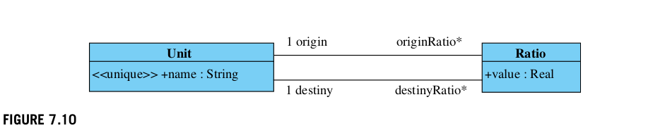

# MODELADO CONCEPTUAL


Construir un modelo conceptual es mucho más que poner conceptos, asociaciones y atributos juntos. Frecuentemente el modelo no funciona por estar equivocado, sino por ser demasiado complejo de mantener. Los patrones de análisis consisten en soluciones ya probadas que pueden resolver familias de problemas recurrentes. Cuando se utilizan adecuadamente, estos patrones pueden reducir significativamente la complejidad de un modelo conceptual que de otro modo sería ingenuo. Este capítulo presenta y a veces reinterpreta algunos patrones como alta cohesión, cantidad, estrategia, cuenta, temporal y otros.

#### Palabras clave
Design pattern; analysis pattern; high cohesion; temporal pattern; conceptual modeling

#### Conceptos

- Alta cohesión  
- Clases de especificaciones  
- Cantidad  
- Medida  
- Estrategia  
- Compuesto  
- Jerarquía de organización  
- Cuenta/operación  
- Gama  
- Patrones temporales  

## 7.1 Introducción a los patrones del modelo conceptual   
Los diagramas de clase que representan modelos conceptuales casi siempre se vuelven más complejos y difíciles de mantener de lo que los analistas y otros miembros del equipo desearían. Existen técnicas que reducen la complejidad de estos diagramas y, al mismo tiempo, mejoran su expresividad. Los modelos ingenuos pueden ser innecesariamente complejos.
Estas técnicas se denominan patrones de análisis y pueden entenderse como un caso especial de patrones de diseño (Gamma, Helm, Johnson y Vlissides, 1995) que se aplican específicamente al modelo conceptual. La mayoría de los patrones presentados en este capítulo fueron descritos por primera vez por Fowler (2003).
El análisis o los patrones de diseño no son reglas que deben ser obedecidas, sino recomendaciones basadas en la experiencia previa. Es responsabilidad del analista decidir cuándo aplicar un determinado patrón en los modelos.

## 7.2 Alta cohesión   
La alta cohesión es tan importante para el modelado orientado a objetos que se considera más un axioma de principio o pauta que un patrón en sí mismo. Un concepto con alta cohesión es más estable y reutilizable que un concepto con baja cohesión, que puede llegar a ser rápidamente confuso y difícil de mantener. La mayoría de los sistemas podrían tener toda su información representada en una sola tabla, pero ese sería el peor caso de baja cohesión, y no sería práctico.  
Anteriormente, mencionamos que los conceptos no deben tener atributos que pertenezcan a otros conceptos (por ejemplo, un coche no debe tener el ID del propietario como uno de sus atributos). Los atributos tampoco deben tener nombres de clase o estructuras de datos (conjunto, lista, matriz, etc.) como tipos de datos porque todas esas situaciones son evidencias de baja cohesión (una clase con ese tipo de atributo probablemente representa más de un único concepto). 
Por ejemplo, una instancia de Orden no debe tener un atributo itemsList porque los elementos tienen sus propios atributos y asociaciones; deben aparecer relacionados con Orden por una asociación de 1 a *.  
En el ejemplo de la Figura 6.65, cuando se descubrió que un cliente podía tener más de una dirección, en lugar de la solución ingenua de crear atributos como address1, address2, etc., o incluso address:Array of Strings, creamos un nuevo concepto (Address), que estaba asociado al cliente. Imagine lo difícil que sería tratar con información como deliveryFee si las direcciones fueran modeladas como un conjunto de cadenas.  
Los conceptos y atributos deben tener una estructura simple con elementos de alta cohesión. La evidencia de baja cohesión incluye escenarios donde algunos atributos de una clase pueden ser nulos dependiendo del valor de otros atributos. Si se necesitan restricciones complejas (invariantes) para mantener un concepto consistente, esto equivale a usar cinta adhesiva para mantener juntas las piezas de una maceta rota.  
En la Figura 7.1, los atributos paidValue y paymentDate son mutuamente dependientes: ambos son nulos o ambos no lo son. Se debe añadir una invariante a la clase para evitar que una de ellas sea nula y la otra no, con el fin de evitar casos inconsistentes. Las invariantes son buenas para representar reglas de negocio que siempre deben ser válidas. Pero cuando una invariante sólo relaciona dos atributos de una clase, es un fuerte indicio de falta de cohesión.


    
`Figura 7.1 Una clase con baja cohesión porque los atributos dependen unos de otros.`   
Una mejor manera de modelar esta situación se muestra en la Figura 7.2, donde los conceptos Orden y Pago aparecen separados pero con alta cohesión. En este caso, no hay atributos opcionales que dependan unos de otros y no hay necesidad de restricciones.


    
`Figura 7.2 Una solución de modelado con clases de alta cohesión.`   
Otro problema potencial relacionado con la baja cohesión es la existencia de grupos de atributos fuertemente correlacionados, como se observa en la Figura 7.3, donde se puede observar que los grupos de atributos tienen relaciones más fuertes dentro del grupo, como calle, número, ciudad y estado, que componen una dirección, o prefijo ddd (marcación directa a distancia) y teléfono, que forman parte de un número de teléfono completo, o pasaporteNúmero y emisiónPaís, que forman parte de la información del pasaporte. La relación que existe dentro de cada grupo aparece implícitamente en el orden en que se presentan en la clase. Esto es malo, porque si los atributos fueran ordenados en orden alfabético, por ejemplo, la estructura débil de los grupos se desordenarían: ciudad, ddd, país emisor, nombre, número, número de pasaporte, teléfono, estado y calle. La comprensión de un concepto no debe depender de la forma en que se ordenan sus atributos.


    
`Figura 7.3 Una clase con baja cohesión debido a atributos fuertemente relacionados.`   
En la Figura 7.4 se muestra una mejor solución para mejorar la alta cohesión en ese modelo. También abre una vía a otras posibilidades de modelado como, por ejemplo, permitir que una persona tenga más de una dirección o más de un teléfono. En esos casos, es simplemente el caso de cambiar la multiplicidad de la asociación.

    
`Figura 7.4 Una solución a Figura 7.3 con alta cohesión.`   
Otra situación ocurre cuando algunos atributos repiten sus valores para un grupo de instancias. La figura 7.5 presenta un ejemplo. En esta figura, los atributos customerName, customerId y customerBirthDate repiten los mismos valores para pedidos diferentes cuando el cliente es el mismo.

    
`Figura 7.5 Una clase con baja cohesión porque tiene atributos que repiten valores en diferentes instancias.`   
Este tipo de situación puede eliminarse dividiendo el concepto en dos conceptos asociados con mayor cohesión, como se muestra en la Figura 7.6. Note que incluso los nombres de los atributos se acortan con esta elección de modelo.

    
`Figura 7.6 Un modelo para el ejemplo de Figura 7.5 con clases de alta cohesión.`   

## 7.3 Clases especificativas   
Un caso especial de baja cohesión ocurre cuando se confunde un objeto con su especificación. Esta situación es muy frecuente: a veces, los productos o artículos físicos comparten una especificación común, mientras que sus ejemplares pueden tener algunas diferencias entre ellos.
Un ejemplo de especificación ya discutido en el ejemplo de Livir esla diferencia entre el concepto de un libro como título publicado y un libro como copia física de un título publicado. Si no se distinguen ambos conceptos de libro, se producirán muchos problemas. En ejemplos anteriores, la clase Book hace referencia al título publicado, mientras que Item representa un conjunto de copias físicas. Por lo tanto, una instancia de Libro es una especificación para un conjunto de instancias indistinguibles de Artículo.
Otra posibilidad es considerar que cada artículo es un solo ejemplar de un libro. Esto eliminaría la necesidad de incluir el atributo de cantidad en la clase Artículo, pero crearía más instancias y asociaciones para una orden si la orden incluye más de una copia del mismo libro.
Dependiendo de las necesidades de información, sería necesario diferenciar una copia de otra. Por ejemplo, si se van a vender libros usados, se debe conservar el estado de conservación de cada ejemplar. En este caso, en lugar de un conjunto de ítems, la clase Book podría ser usada como una especificación para la clase Copy, cuyas instancias son copias individuales de un libro.
**La clase de especificación Book debe contener los atributos y asociaciones que no varían para las diferentes copias. Por ejemplo, diferentes ejemplares del mismo libro tienen el mismo título, autor, ISBN, precio base, etc. Sin embargo, el estado de conservación y el descuento pueden ser distintos para cada copia. Por lo tanto, estos atributos (y asociaciones, si las hay) se colocan en la clase Copy, como se muestra en la Figura 7.7.**


    
`Figura 7.7 Una clase y su clase de especificación.`   
Es posible que una clase tenga más de una especificación. Por ejemplo, el descuento del libro podría ser predeterminado dependiendo del estado de conservación del libro (una enumeración con valores como nuevo, usado, dañado, etc.). Así, una copia, además de ser especificada por el título publicado, también puede ser especificada por su estado de conservación. Por lo tanto, la conservación sería una clase con algunas instancias que podrían especificar copias físicas de libros, y definir sus descuentos como se muestra en la Figura 7.8.


    
`Figura 7.8 Una clase con dos clases de especificación.`   
Las instancias de la clase Conservación tienen dos atributos. El primero es el estado de conservación, que es un valor obtenido de la enumeración ConservationState. Inicialmente sólo hay tres valores posibles: nuevo, usado y dañado. El segundo atributo es el porcentaje de descuento que se aplicaría a una copia dependiendo de su estado de conservación. Como se espera que los libros con el mismo estado de conservación tengan el mismo descuento, entonces el estado del atributo en la clase Conservación debe ser único y por lo tanto marcado con único. De lo contrario, podrían asociarse diferentes descuentos al mismo estado de conservación.

## 7.4 Cantidad   
Con frecuencia el equipo se enfrenta a la necesidad de modelar cantidades que no son simplemente números. Por ejemplo, el peso de un libro podría definirse como 400. ¿Pero 400 qué? ¿Gramos? ¿Libras? ¿Kilos? Una solución es definir un tipo específico para el peso (libras, por ejemplo), y luego seguir usándolo consistentemente. El atributo entonces podría ser declarado como weight:Pounds. Pero eso exige que todos los libros tengan su peso expresado en libras.
En algunos casos, el sistema debe ser configurable para soportar diferentes unidades de peso. En algunos países se utilizan gramos y kilogramos, mientras que en otros se utilizan libras o incluso otras unidades. Si el atributo tiene un tipo que se refiere a una unidad específica, entonces el sistema debe sufrir refactorización para acomodar nuevas unidades de peso.
Sin embargo, **el patrón de cantidad permite que coexistan diferentes sistemas de unidades y que sean fácilmente intercambiables. El patrón consiste en crear un nuevo tipo primitivo Quantity, que tiene dos atributos, como se muestra en la Figura 7.9**.


    
`Figura 7.9 Definition and use of Quantity.`

De esta manera, el peso de cada libro se especifica como una cantidad primitiva formada por un valor numérico y una unidad, cuyo tipo es una enumeración con valores posibles definidos como gramos, libras y kilos.
Si se necesita una conversión de unidades, una opción es transformar la unidad de enumeración en una clase normal y asociar una nueva relación de clases a dos unidades, origen y destino, como se muestra en la figura 7.10. Cuando una cantidad en la unidad de origen tiene que convertirse en una cantidad en la unidad de destino, el valor de la cantidad asociada a la unidad de origen se divide por el ratio de conversión.

    
`Figura 7.10 Unidad con ratio de conversión.`   
Así, por ejemplo, una instancia de Unidad cuyo nombre es "gramos" puede estar vinculada a una instancia de Ratio como origen, que puede estar vinculada a otra instancia de Unidad, llamada "kilos". El valor de esa relación debe ser 1000, porque para convertir gramos en kilos, el valor original en gramos debe ser dividido por 1000.

## 7.5 Medidas   
Una evolución del patrón cuantitativo es el patrón de medición, que puede utilizarse cuando se deben tomar varias medidas diferentes sobre un objeto, posiblemente en momentos diferentes. Por ejemplo, a una persona en observación en un hospital se le pueden tomar muchas medidas de vez en cuando: temperatura corporal, presión arterial, nivel de glucosa en sangre, etc. Se pueden tomar miles de medidas diferentes, pero por lo general sólo se toman unas pocas para cada paciente. Por lo tanto, **para evitar crear un concepto con miles de atributos con la mayoría de ellos probablemente nulos, una mejor opción es usar el patrón de medida como se muestra en la Figura 7.11.**


    
`Figura 7.11 Definición y uso del patrón de medida.`   
Así, un paciente puede tener una serie de medidas tomadas, cada una de las cuales evalúa un fenómeno diferente y presenta un valor que corresponde a una cantidad (siguiendo el patrón cuantitativo).
Todavía es posible hacer estos patrones un poco más sofisticados añadiendo atributos en la clase Measure para indicar el instante de tiempo en el que se tomó la medida, y también la validez de la medida. Por ejemplo, el hecho de que una paciente haya tenido fiebre hace un par de horas no significa que todavía la tenga. Esta evolución se explica en el apartado 7.12.1.
Otra evolución de este patrón es añadir un atributo para definir la precisión o exactitud de la medida tomada. Por ejemplo, la temperatura corporal suele medirse con una precisión de 0,1 grados (Celsius o Fahrenheit).

## 7.6 Estrategia   
Se mencionó que uno de los grandes retos de los requisitos es gestionar su cambio. Los requisitos transitorios se deben tener especialmente en cuenta en el diseño del sistema, de modo que cuando cambien el impacto en el sistema, se reduzca al mínimo.  
Algunos casos son relativamente fáciles de tratar. Por ejemplo, si ya se ha decidido que el sistema debe funcionar en diferentes países, el patrón cuantitativo podría utilizarse para tratar la moneda y otras medidas que pueden variar de un país a otro.  
Pero hay situaciones mucho más complicadas. Por ejemplo, el procedimiento de cálculo de impuestos puede variar mucho de un país a otro e incluso de un estado a otro en algunos países. Hay algunos impuestos que se calculan en relación con el beneficio, otros en relación con el precio de venta, etc. Los métodos para calcular los impuestos cambian de vez en cuando, y en algunos países se crean nuevos impuestos cada año. Los sistemas deben estar preparados para hacer frente a esta situación, pero los cambios son completamente impredecibles. Por lo general, no basta con configurar los parámetros.

Otro ejemplo es la política de descuentos de la librería. La política actual podría ser aplicar un 10% de descuento en pedidos superiores a 100 dólares, por ejemplo. Sin embargo, después de un tiempo, el departamento de ventas puede definir políticas creativas e impredecibles, tales como:     

- Regala un libro gratis con un valor de hasta 50 dólares para pedidos superiores a 300 dólares.
- Regala un 20% de descuento por hasta dos libros en el cumpleaños del cliente.
- Descuento del 5% en libros de terror el viernes 13.
- El cliente hace girar una rueda y define el descuento que recibe, del 1% al 10%.

Además, sería posible combinar las políticas, si procede, o elegir la frezca el mayor descuento.  
El patrón estratégia sugiere que en estos casos, el procedimiento (por ejemplo, calcular impuestos o descuentos) debe estar separado de los datos a los que se aplica. En otras palabras, si se aplica un descuento a un pedido, entonces el descuento no debería ser simplemente un método implementado en la clase Pedido. El descuento debería definirse como algo más fácil de cambiar. **La solución propuesta por el patrón de estrategia es crear una clase abstracta asociada al orden. Esta clase abstracta puede tener subclases concretas que representan políticas concretas de descuento, como se muestra en la Figura 7.12.**


    
`Figura 7.12 Patrón de estrategia.`   
Así, cada instancia de Orden se asocia a una instancia de una de las subclases de la estrategia de Descuento.
UML no permite declarar un atributo {abstracto}; sólo las clases y métodos pueden declararse así. Sin embargo, como los atributos derivados serán implementados por métodos eventualmente, la idea de un atributo derivado abstracto estereotipado con un resumen como se muestra en la Figura 7.12 es coherente con el espíritu del UML.
Así, la clase abstracta Descuento implementa una cantidad de atributo derivado abstracto, que se implementa de manera concreta en cada una de sus subclases. Si algunas de las estrategias necesitan datos del cliente o del pedido para calcular el descuento, se puede acceder a esos datos a través de las asociaciones, desde la clase abstracta de descuento hasta las clases propietarias de la información.
Este patrón minimiza dos problemas relacionados con el cambio de requisitos. En primer lugar, mantiene la estrategia de descuento aplicada cuando se emitió la orden, incluso si las estrategias cambian en el futuro. En segundo lugar, si se crean nuevas estrategias más tarde, es suficiente con implementar una o más subclases para el Descuento. Esto no afecta a las estrategias ni a las órdenes antiguas.

## 7.7 Composición   
Como se mencionó en la Sección 7.6, a veces se deben agrupar diferentes estrategias y se debe aplicar una combinación o selección de ellas. La combinación de diferentes estrategias de descuento puede obtenerse, por ejemplo, sumando los valores obtenidos para el importe del atributo derivado para cada estrategia individual o seleccionando los valores más altos o más bajos entre ellos. La elección de una u otra combinación produce diferentes estrategias agregadas.
En la Figura 7.13 se muestran dos estrategias compuestas. SumDescuento define el importe como la suma de los valores devueltos por cada descuento de componente:


    
`Figura 7.13 Ejemplo del patrón compuesto.`   
```   
Context SumDiscount::amount:Money
  derive:
    self.discount->sum(aDiscount|aDiscount.amount)
```   

MajorDiscount selecciona el descuento más alto entre cada subclase agregada:
```   

Context MajorDiscount::amount:Money
  derive:
    self.discount->maxElement(aDiscount|aDiscount.amount)
```   

La versión actual de OCL no define una función maxElement para tomar el elemento más alto de una colección, pero podría definirse como una nueva operación. Otra solución es definir la expresión utilizando funciones ya proporcionadas por el lenguaje, tales como
```   

Context MajorDiscount::discountAmount:Money
  derive:
    self.discount->sortedBy(aDiscount|aDiscount.amount)->last()
```   

El lector podría encontrar que no es necesario producir una versión ordenada de una lista completa sólo para obtener su elemento más alto. Pero recuerde que esto es una especificación, no una implementación; lo que cuenta es el resultado final. De todos modos, definir una nueva operación en este caso, si es posible, sería mejor porque el significado de la especificación sería más claro.

## 7.8 Jerarquía de organización   
Otra situación común consiste en la necesidad de representar jerarquías organizativas. Es común, por ejemplo, representar la organización administrativa de una empresa como una jerarquía de composición, como se muestra en la Figura 7.14.


    
`Figura 7.14 Representación directa de la estructura organizativa de una empresa mediante el uso de clases para los diferentes niveles de composición.`  
Sin embargo, las jerarquías como ésta no suelen comportarse bien. En primer lugar, este tipo de organización no es seguido por todas las empresas: otras empresas pueden tener diferentes niveles o diferentes composiciones entre ellas. Segundo, la estructura de la compañía puede cambiar con el tiempo. Se pueden crear nuevas divisiones u oficinas, algunas pueden unirse y otras dividirse. Por último, pero no menos importante, pueden existir diferentes puntos de vista de una organización al mismo tiempo; por ejemplo, el departamento financiero puede tener una visión diferente de la misma organización.
¿Cómo hacer frente a toda esa complejidad en un modelo conceptual? Utilizando el patrón de jerarquía de organización.   
La solución consiste en no considerar los diferentes niveles de una organización como conceptos, sino como instancias de un solo concepto, como se muestra en la Figura 7.15.   


    
`Figura 7.15 Aplicación del modelo de jerarquía de organización.`    
De esta manera, se gana flexibilidad al tratar simultáneamente con estructuras organizativas de diferentes empresas. Además, los cambios eventuales en la estructura organizativa, como la adición de más niveles o el cambio de dependencias, pueden ser más fáciles de lograr.
Este patrón tiene algunas variaciones que se pueden utilizar si también se deben representar jerarquías concurrentes, estructuras que sustituyen o estructuras equivalentes. Estas variaciones se discuten en las siguientes secciones.

## 7.9 Unión de objetos   
Una de las suposiciones del equipo que generalmente falla es que los usuarios harán todo bien. No siempre es así. Los fallos de los usuarios (y a veces el sabotaje) siguen siendo frecuentes, a pesar de los esfuerzos por crear interfaces a prueba de fallos. Un usuario podría, por ejemplo, registrar un nuevo editor en el sistema y luego descubrir que ya estaba registrado. La introducción de un código incorrecto o la imposibilidad de tener una identificación única para un objeto del mundo real puede causar esta situación. El resultado es que dos objetos están registrados en el sistema, ambos representando al mismo editor, y cada uno de ellos puede tener su propio conjunto de libros asociados, algunos repetidos, otros no.
La solución cuando ocurre este tipo de error es unir los objetos, normalmente copiando uno sobre el otro. Esta operación puede realizarse directamente dentro de la base de datos, pero en algunas situaciones puede ser tan común que sería necesario que el sistema esté preparado para permitir esta posibilidad como función de usuario.
Además, no siempre es un error el que provoca la necesidad de una unión. En algunas situaciones, hay objetos considerados equivalentes por un grupo de personas y no por otro, y ambas situaciones deben ser representadas simultáneamente. En otros casos, como en las jerarquías de organización de vistas múltiples, puede ser necesario indicar que dos elementos de estructura en vistas diferentes son equivalentes, o que uno sucede al otro en el tiempo.
En los siguientes apartados se presentan las principales estrategias para hacer frente a este tipo de situaciones.

### 7.9.1 Copiar y reemplazar      
La primera estrategia que viene a la mente cuando es necesario unir dos objetos consiste en copiar los datos de un objeto sobre el segundo (copiar y reemplazar). El comando copiar/reemplazar podría definirse mediante una restricción, y el equipo debería definir, para cada atributo y cada asociación, lo que debe ocurrir durante el comando copiar/reemplazar. Se deben definir reglas para decidir si un atributo va a ser copiado sobre el otro, o si sus valores van a ser añadidos, o si el más nuevo o el más alto de ellos debe prevalecer, etc. En cuanto a las asociaciones, el equipo debe decidir qué sucede: si una reemplaza a la otra, o si se añaden sus propiedades, etc.
El registro de la fecha de la última inclusión o cambio de un concepto puede ser útil para decidir qué atributo debe mantenerse en caso de conflicto. Por ejemplo, si un cliente registrado hace un nuevo registro, y va a ser resuelto, entonces se debe mantener la dirección más reciente, no la más antigua. Por otro lado, todas sus órdenes deben ser añadidas a la instancia resultante.
Después de ejecutar el comando copiar/reemplazar, la instancia copiada debe ser destruida, y cualquier referencia a ella debe ser redirigida a la instancia que recibió los datos.

### 7.9.2 Superseding   
La superación es una técnica que se puede utilizar cuando el objeto original debe ser conservado y no destruido. La sustitución es aplicable, por ejemplo, en el caso de estructuras organizativas que tienen éxito a tiempo. Suponga que los departamentos de marketing y ventas se unen en un único departamento de contacto con el cliente; los departamentos originales deben marcarse como no activos y debe añadirse un nuevo departamento como su sucesor. La estrategia de sustitución puede ser implementada por una asociación reflexiva, como se muestra en la Figura 7.16.


    
`Figura 7.16 Un ejemplo de la estrategia de superación.`   
El atributo derivado `activo` indica si la estructura está activa o si ha sido sustituida. Es cierto si el conjunto de superior está vacío y falso de otra manera.
Mantener la estructura organizativa original, incluso si ya no está activa, puede ser importante a efectos del registro. Algún día alguien podría necesitar saber cuánto gastó un departamento que ya no existe en palillos.
Sería útil añadir una clase de asociación a la asociación sustituida/suplente; sus atributos podrían indicar, por ejemplo, la fecha en que tuvo lugar el evento que la sustituyó, o el contexto o punto de vista en el que debe ser considerada. Si ese tipo de información es necesaria, el equipo debe considerar aplicar uno de los patrones temporales (Sección 7.12).

### 7.9.3 Esencia/Apariencia   
Otra situación que todavía puede ocurrir a menudo es la existencia de objetos que se consideran equivalentes pero que deben mantenerse como objetos separados. Esto no es un error de registro y no es un objeto que sustituye a otro: se trata de la equivalencia de objetos.
La equivalencia de objetos puede ser modelada por el uso de un objeto de esencia que está asociado a un conjunto de objetos equivalentes. A diferencia de copiar/reemplazar, se conservan los objetos originales, y a diferencia de sustituirlos no hay ningún objeto activo o sustituido: todos los objetos asociados son equivalentes. La figura 7.17 muestra un ejemplo de una clase (Libro) que acepta que sus miembros comparten una esencia común.


    
`Figura 7.17 Técnica Essence/Appearance.`
En el ejemplo, consideramos que el mismo libro en esencia, especialmente un trabajo clásico, puede ser publicado por diferentes editores. Cada publicación es distinta, con un ISBN y un número de páginas diferentes. Incluso el título y el nombre del autor pueden variar (los nombres propios pueden ser traducidos o abreviados algunas veces). Pero la esencia del texto es la misma. Algunos usuarios pueden estar interesados en pedir La República de Platón a un editor específico, y otros pueden estar interesados en el libro independientemente de la edición o editor. Así, los usuarios interesados en una publicación específica están buscando la apariencia (un ejemplo dado de Libro), y los usuarios interesados en el texto están buscando el libro en esencia - el editor no importa. El segundo grupo de usuarios, al ver cualquier edición de La República también debe poder ver otras instancias de Libro vinculadas al mismo EssenceBook si es que existen. En otras palabras, si buscas un Libro y un Libro.essenceLibro->noVacío(), entonces verás un Libro.essenceLibro.libro, que es un conjunto de libros con la misma esencia.
No todos los libros deben estar vinculados a un EssenceBook, sólo aquellos que participan en una clase de equivalencia. Además, debe haber por lo menos dos libros equivalentes para crear un EssenceBook. Esta es la razón por la que el rol de asociación de EssenceBook a Book está marcado con 2..*.
Los objetos se consideran equivalentes si están vinculados al mismo objeto de esencia. El objeto essence existe sólo para establecer esa equivalencia; normalmente no tendrá ninguna otra propiedad. De lo contrario, tal vez se podría utilizar en su lugar el patrón de clase de especificación.

### 7.9.4 Deshacer una unión   
Justo cuando piensas que el mundo real no puede ser más complejo, se vuelve así. Por lo tanto, si existe la posibilidad de unir objetos, también es posible que los objetos unidos deban separarse de nuevo. Una vez más, estos comandos se pueden realizar directamente en la base de datos, o a través de operaciones bien planificadas disponibles en la interfaz de usuario del sistema.   
Para permitir que se deshagan las uniones de la técnica de copiar/reemplazar, se debe mantener una copia de seguridad de los objetos originales, ya que la técnica destruye uno de los objetos y desfigura el otro. La técnica de sustitución permite deshacer la unión simplemente eliminando la asociación. En el caso de esencia/apariencia, es necesario eliminar la asociación (y el objeto de esencia si quedan menos de dos vínculos con ella).   
Sin embargo, en todos los casos es importante decidir cómo tratar los eventuales cambios dentro del objeto que ocurrieron mientras estaba unido a los otros.   
Una manera de implementar la posibilidad de deshacer uniones y cualquier otra operación es usar una variación del patrón temporal (Sección 7.12.3), que mantiene un registro de los valores anteriores de los atributos y asociaciones de los objetos.

## 7.10 Cuenta/Transacción
**El patrón de cuenta/transacción está estrechamente relacionado con el negocio, pero tiene una amplia aplicabilidad.** 

Se mencionó anteriormente que los libros pueden ser catalogados, ordenados, recibidos, entregados, descartados, etc. Estos movimientos, así como las transacciones financieras que con ellos se realizan, dan origen a conceptos como Pedido, Entrega, Descarte, Devolución, etc., cada uno con sus propios atributos y asociaciones.   
Sin embargo, es posible identificar un núcleo común para todos estos conceptos y muchos más, que está constituido por un patrón único y poderoso.   
Una Cuenta es un concepto que contiene cantidades de algo (como artículos, productos o dinero). Una Cuenta tiene un saldo que generalmente consiste en la suma de cada depósito o retiro.
Por otro lado, los depósitos y retiros son generalmente sólo entradas de bienes o dinero de una cuenta a otra. Así, **una Transacción consiste en dos entradas: un depósito en una cuenta y un retiro del mismo valor en otra cuenta**. La figura 7.18 ilustra estas clases.


    
`Figura 7.18 Clases para el patrón de cuenta/operación.`
Una transacción consistente con dos entradas como la de la Figura 7.18 necesita dos entradas con el mismo valor absoluto pero con signos opuestos. En otras palabras, si una transacción toma 5 dólares de una cuenta, necesariamente debe depositar 5 dólares en otra cuenta; el retiro tiene un signo negativo y el depósito un signo positivo. Por lo tanto, la clase Transaction necesita la siguiente invariante:
``` 
Context Transaction
  inv:
    entry->sum(value)=0
```
Esto significa que para cada caso de Transacción la suma del valor de las dos entradas asociadas debe ser cero.
El saldo de atributo derivado de la Cuenta de clase se define como la suma de todas las entradas vinculadas a esa Cuenta específica:
```
Context Account::balance
  derive:
    entry->sum(value)
```
Muchas situaciones relacionadas con el ejemplo de la librería podrían ser modeladas a partir de un conjunto de instancias de la clase Cuenta, como por ejemplo:

- Para cada editor hay una instancia de Cuenta de la que se "retiran" los libros, es decir, es una cuenta de entrada, y su saldo se vuelve más negativo a medida que los libros se piden al proveedor.   
- Existe una cuenta para los pedidos previstos, que contiene los libros que se pidieron al proveedor pero que aún no habían llegado.   
- Existe una cuenta de existencias que contiene los libros disponibles.  
- Existe una cuenta para libros vendidos que contienen libros vendidos pero aún no entregados.  
- Existe una cuenta para los libros entregados que contienen libros entregados pero aún no confirmados por el cliente.   
- Existe una cuenta para la entrega confirmada que contiene los libros entregados y confirmados por el cliente. Su saldo representa el conjunto de libros que el cliente ha comprado en la librería.   

Paralelamente a las operaciones contables, existen operaciones monetarias concomitantes. Existen cuentas por cobrar, cuentas por pagar, cuentas recibidas, cuentas pagadas, inversiones, deudas, valores ahorrados para el pago de impuestos, etc.   
Así, muchas transacciones del ejemplo de la librería podrían ser modeladas como una instancia de Transacción. Por ejemplo:

- Un pedido es una transacción que toma libros de una cuenta de editor y los deposita en una cuenta de pedidos en espera.   
- La llegada de los libros es una transacción que toma de la cuenta de pedidos esperados y se añade a la cuenta de existencias.   
- Una venta es una transacción que toma de la cuenta de existencias y se añade a la cuenta de libros vendidos.   
- Una entrega es una transacción que toma de la cuenta de libros vendidos y se añade a la cuenta de libros entregados.   
- Una devolución es una transacción que se realiza a partir de la cuenta de libros entregados y se añade a la cuenta de existencias (si los libros están en buen estado).   
- Una confirmación de entrega es una transacción que toma de la cuenta de entrega y se añade a la cuenta de salida de entrega confirmada.   


Como ejemplo, imagine una empresa que acaba de empezar, donde se crearon cinco instancias de la clase Cuenta: proveedor, pedidos pendientes, stock, vendidos y entregados. La figura 7.19 muestra el estado inicial de esos objetos, cuando todas las cuentas tienen un saldo cero.

    
`Figura 7.19 Estado inicial de un sistema de contabilidad de productos.` 

La figura 7.20 muestra el conjunto resultante de objetos cuando se crea una orden de compra (instancia de transacción). La orden fue emitida para 50 libros.

    
`Figura 7.20 Estado de las cuentas tras la emisión de una orden de compra de 50 libros.`  

La figura 7.21 muestra el estado de las cuentas si sólo llegan 40 de los 50 libros pedidos.

    
`Figura 7.21 Estado de las cuentas después de que 40 libros llegan a la librería.`  

La figura 7.22 muestra el estado de las cuentas después de la venta de 25 libros.

    
`Figura 7.22 Estado de las cuentas después de la venta de 25 libros.`


Y finalmente, la Figura 7.23 muestra cómo se ven las cuentas después de que se entregan los 25 libros vendidos.

    
`Figura 7.23 Estado de las cuentas después de la entrega de 25 libros.`
Se pueden crear nuevas transacciones y cuentas dinámicamente (es decir, sin tener que recompilar el sistema). Por ejemplo, se puede crear una nueva transacción para devolver libros, que mueve los libros de la cuenta entregada a la cuenta de existencias. Además, podría crearse una nueva transacción para descartar libros, trasladando los libros de las cuentas de existencias o de ventas a una nueva cuenta para libros descartados. También se pueden crear transacciones financieras paralelas utilizando Cuenta y Transacción.  
Este patrón es muy interesante como ejemplo de cómo una idea simple y poderosa puede lidiar con tantas situaciones diferentes. Tiene muchas variaciones y sofisticaciones. Por ejemplo, se pueden crear transacciones con múltiples niveles si es necesario, para pasar de más de una cuenta a una sola cuenta, o de una sola cuenta a más de una cuenta, o incluso de más de una cuenta a más de una cuenta al mismo tiempo. Para lograr esta variación, el papel multiplicador de Transacción a Entrada en la Figura 7.18 debe cambiarse a 2..*.   
Otra variación importante es el uso de entradas individuales. Por ejemplo, cuando se recibe dinero, los impuestos deben ser pagados, pero no necesariamente inmediatamente. Así, cuando una transacción mueve dinero de una cuenta de cliente a la cuenta de saldo de la librería, una cantidad de dinero equivalente a los impuestos debidos podría registrarse en una cuenta de apuntes fiscales. A la hora de pagar impuestos, el saldo de la cuenta de apuntes registra el importe a pagar.  
Podrían distinguirse las cuentas de apuntes y las cuentas normales. Sin embargo, como comparten la misma definición, se mantuvieron como instancias de una sola clase de Cuenta en la Figura 7.24. Por otra parte, se distinguen las entradas de apuntes. Una operación debe tener al menos dos entradas normales, pero cualquier número de entradas de apuntes (cero en la mayoría de los casos). Además, sólo las entradas normales están sujetas a la invariante de la clase Transaction. Las entradas de apuntes se ignoran porque no mueven realmente mercancías o dinero.

    
`Figura 7.24 Evolución de la cuenta/operación con anotaciones en cuenta.`
A pesar de que las cuentas normales y las cuentas de apuntes tienen la misma estructura y comportamiento, sería prudente diferenciar claramente ambos tipos para evitar que el sistema vincule los asientos individuales en cuentas normales y viceversa.

## 7.11 Rango
Cuando un objeto tiene un par de atributos que indican el comienzo y el final de algunos fenómenos, como la fecha inicial y final, en lugar de representarlo como dos atributos separados, es aconsejable declarar un único tipo de atributo como Rango (o Intervalo), como se muestra en la Figura 7.25.

    
`Figura 7.25 Un tipo primitivo genérico de Rango.`  
El Rango primitivo es parametrizado, lo que significa que cuando se crea una instancia debe indicar el Tipo a ser usado para definir sus atributos. Por ejemplo, un rango sobre Fecha podría ser referido como Rango[Fecha], y un rango sobre una cantidad definida como Distancia podría ser referido como Rango[Distancia].   
Hay dos razones para utilizar un rango en lugar de dos atributos:
  - Si los límites inferior y superior son atributos separados en una clase conceptual, tendrían una fuerte relación entre ellos. Esto va en contra del principio de alta cohesión explicado en la sección 7.2.
  - Se necesitarán operaciones específicas para rangos (por ejemplo, verificar si un valor está dentro de un rango). Si hay un tipo específico de Rango primitivo, estas operaciones pueden ser implementadas una sola vez en el primitivo. Si se utilizan dos atributos en su lugar, cada clase en la que se declaran debería implementar su propia versión de las operaciones en rangos.
  
Es mucho más razonable implementar las operaciones una sola vez en una clase de alta cohesión, que implementarlas muchas veces en clases de baja cohesión.
Como se puede ver en la Figura 7.25, ambos atributos de la clase Range son opcionales, lo que significa que los rangos pueden ser indefinidos en uno o ambos extremos. Por ejemplo, un rango que comienza el 1 de enero de 2019 y no tiene límite superior podría definirse con un límite inferior="01/01/2019" y un límite superior=nulo.  
Las evoluciones de este patrón podrían tener en cuenta las propiedades matemáticas de los intervalos. Por ejemplo, hay intervalos abiertos y cerrados: 0..10] es un intervalo que incluye 0 y 10, mientras que (0..10) es un intervalo que excluye 0 y 10. Además, (0..10] excluye 0 e incluye 10 y[0..10] incluye 0 y excluye 10. Esta evolución podría implementarse simplemente añadiendo dos atributos booleanos a la clase: lowerBoundOpen y upperBoundOpen.

## 7.12 Patrones temporales
Frecuentemente el analista se enfrenta a la necesidad de lidiar con el tiempo. Por ejemplo, puede ser necesario representar las relaciones entre las personas y sus puestos de trabajo. Pero, si la asociación entre las personas y los empleos se presenta sólo en tiempo presente, entonces la información de los empleos anteriores se perderá cuando alguien abandone el trabajo. En esta sección se examinan algunas pautas que se refieren a esa importante noción.

### 7.12.1 Efectividad/Validez
Cuando un objeto es válido durante algún tiempo (por ejemplo, una medida de temperatura, que tiene un tiempo que se tomó y un tiempo que se considera válido), se puede utilizar el patrón de validez. Consiste en declarar un atributo efectivo en la clase, que se escribe con un rango, como se muestra en la figura 7.26.

    
`Figura 7.26 Use of the effectivity pattern.`   
                ​ 
### 7.12.2 Historia
Si hay que almacenar información histórica sobre los estados pasados de una asociación, se puede utilizar el patrón de asociación histórica. Este tipo de asociación puede ser identificado por la historia del estereotipo, como se ve en la Figura 7.27.


    
`Figura 7.27 Un ejemplo del patrón de asociación de la historia.`   
El estereotipo de la asociación de la Figura 7.27 significa que una persona debe tener sólo cero o un trabajo actualmente, pero puede haber tenido otros trabajos en el pasado. Estos trabajos pasados pueden ser recuperados como elementos de una lista. En otras palabras, es posible recuperar el último trabajo, el trabajo anterior al último, y así sucesivamente.   
Cuando se trata de diseño, cada clase con una asociación con un rol navegable implementa un método para acceder a los elementos enlazados. En el ejemplo de la Figura 7.27, el diseño la clase para Persona tendría un método getJob() que devuelve la compañía del trabajo actual de una persona o el conjunto vacío si no hay trabajo actual. Si la asociación es estereotipada con la historia, además de ese método estándar existiría otro método con un parámetro, getJob(index:Natural), donde getJob(1) devuelve el trabajo actual, getJob(2) devuelve el último trabajo, getJob(3) devuelve el trabajo antes del último, y así sucesivamente. Si no hay ningún job para el índice dado, el método devuelve el conjunto vacío.  
En la práctica, este patrón puede ser modelado por dos asociaciones, como se muestra en la Figura 7.28. El estereotipo es, pues, una forma de abreviar esa estructura compleja, sustituyéndola por otra más sencilla.


    
`Figura 7.28 Modelo concreto para el estereotipo <<history>>.`  

### 7.12.3 Temporal
El modelo de asociación histórica no es capaz de responder a la situación laboral de una persona en una fecha determinada, o si una persona ha estado desempleada en el pasado. Para representar ese tipo de información se puede utilizar una evolución de ese patrón: una asociación que además de la memoria secuencial también tiene memoria de tiempo, como se muestra en la Figura 7.29.


    
`Figura 7.29 Una asociación temporal.`
Una asociación temporal tiene, además de los dos métodos antes mencionados, un método para obtener el valor de la asociación en un momento dado. En el ejemplo, ese método podría ser getJob(date:Date). Por lo tanto, la clase Persona presentada en la Figura 7.29 tendría al menos tres getters para el rol de trabajo temporal:

- getJob(): Devuelve el trabajo actual de una persona o el conjunto vacío si la persona está actualmente desempleada.
- getJob(index:Natural): Devuelve el trabajo actual o anterior de una persona dependiendo del argumento del índice, o el conjunto vacío si no hay trabajo en ese índice.
- getJob(fecha:fecha): Devuelve el trabajo que una persona tenía en una fecha determinada o el conjunto vacío si la persona estaba desempleada en esa fecha.
  
Si se requiriere conocer el trabajo de una persona en un momento dado del día, entonces en lugar de la Fecha se podría usar el tipo primitivo Hora, que se refiere a año, mes, día, hora, minuto y segundo. Para algunas aplicaciones, se pueden utilizar milisegundos, microsegundos, etc.
En la Figura 7.30 se presenta un modelo para la implementación del estereotipo temporal..


    
`Figura 7.30 Una posible implementación del estereotipo <<temporal>>.`   
La clase Job no tiene un par de atributos como initialDate y endDate, sino un único intervalo de atributos con el tipo Range[Date], que representa un intervalo entre dos fechas.
No sólo las asociaciones pueden ser temporales, también atributos. Si un atributo debe mantener un registro de sus valores anteriores, entonces se puede utilizar el estereotipo temporal para hacer un seguimiento de los mismos.
Por ejemplo, algunos países permiten que las personas cambien sus nombres después del matrimonio, el divorcio o la decisión de un juez. En la Figura 7.31, el ID y la fecha de nacimiento de una persona no deben cambiar o, si cambian, no se mantienen los valores anteriores. Sin embargo, los nombres anteriores deben conservarse.

    
`Figura 7.31 Patrón <<temporal>> aplicado a un atributo.`  
Otra variación de este patrón es definir una clase temporal. En el caso de un estereotipo de clase con lo temporal, todos sus atributos y roles de asociación son temporales. La clase también podría proporcionar un método para producir una versión de sus instancias en un instante dado de tiempo; por ejemplo, si x es una instancia de una clase temporal, se podría obtener un estado previo de x usando una función como x.atInstant(aTimeInstant). Cada vez que se modifica uno de los valores o enlaces del atributo, se crea una nueva versión del objeto.

### 7.12.4 Bitemporal  
No sólo en la ciencia ficción, sino también en muchas de las aplicaciones actuales de los sistemas de información, el tiempo puede considerarse bidimensional. Hay una dimensión de tiempo en la que los eventos ocurren y otra dimensión en la que reconocemos que un evento ocurrió.  
Mirando hacia atrás a la Figura 7.29, e imaginemos que María está trabajando actualmente para la Compañía X. Hoy (11 de agosto de 2019) descubrimos que de hecho María cambió de trabajo el 1 de marzo de 2019. Actualizamos el trabajo de María, y la fecha en que cambió de trabajo se registra como el 1 de marzo de 2019. Sin embargo, sólo supimos del cambio el 11 de agosto de 2019. Cualquier acción que la compañía pudo haber realizado entre el 1 de marzo y el 11 de agosto fue tomada con el conocimiento de que María todavía trabajaba en la Compañía X. A veces, especialmente para la rendición de cuentas o los procedimientos legales, saber cuando un registro que se hizo es muy importante. El patrón bitemporal es una forma elegante de llevar un registro no sólo de la línea de eventos sino también de la línea de nuestro conocimiento sobre los eventos (Figura 7.32).


    
`Figura 7.32 Patrón Bitemporal.`  
Ahora se puede introducir un nuevo getter para el rol de trabajo: getJob(date,knowledgeDate:Date). El primer argumento es el instante de tiempo que nos interesa y el segundo es la instancia del tiempo de nuestro conocimiento sobre él. Por ejemplo, si queremos responder a la pregunta "El 15 de junio de 2019, ¿dónde creíamos que Mary trabajaba el 1 de junio de 2019? podríamos usar getJob ("06/01/2019", "06/15/2019") para obtener la respuesta, que sería "Compañía X".
Si queremos saber dónde trabajó María el 1 de junio de 2019 basándonos en nuestro conocimiento actual, podríamos usar el getter mencionado para el patrón temporal (Sección 7.12.3): getJob ("06/01/2019"), que es la abreviatura de getJob ("06/01/2019", hoy).  
En la figura 7.33 se presenta un posible modelo para aplicar ese estereotipo.

    
`Figura 7.33 Un modelo que implementa el patrón bitemporal.`   
Ahora hay dos rangos de fechas en la clase Trabajo, uno para registrar el tiempo en que el trabajo fue efectivo y el otro para representar el rango de tiempo en que registro de tiempo fue recogido.
Cada vez que nuestro conocimiento sobre el trabajo de una persona cambia, se crea una nueva instancia de trabajo. El atributo interval establece cuándo fue efectivo el trabajo, y el atributo record establece el punto desde el que creímos eso. El límite superior del rango de registro se mantendrá indefinido mientras represente nuestro conocimiento actual, es decir, mientras que esa información no fue anulada por información más reciente (eventualmente contradictoria).  
El patrón bitemporal también puede aplicarse a atributos o clases enteras, al igual que el patrón temporal.

## 7.13 Discusión
Un buen modelo conceptual produce una estructura organizada que es adecuada para generar una base de datos ya normalizada. Incorpora reglas estructurales que evitan que la información sea representada de manera inconsistente; también simplifica el código que se generará porque minimiza y organiza las comprobaciones de consistencia, y varias verificaciones que están garantizadas por el propio modelo no necesitan ser realizadas por el código.
El uso de patrones de diseño adecuados en situaciones en las que son necesarios simplifica el modelo conceptual y le da más flexibilidad y calidad. Es, por lo tanto, una herramienta poderosa. Existen muchos otros patrones, y los analistas pueden crear sus propios patrones nuevos. Sólo hay que tener en cuenta que la creación de un patrón sólo se justifica cuando sus beneficios valen el esfuerzo invertido en su creación.


## 7.14 El proceso visto hasta ahora


| | Inicio | Elaboración | Construcción | Transición |
| -- | -- | -- | -- | -- |
| **M**odelado del Negocio | [MI](#MI) | | | | 
| **R**equerimientos | [RI](#RI) | [RI](#RE) | | | 
| **A**nalisis y Diseño | [ADI](#ADI) | [ADIE](#ADIE) | | | 
| **I**mplementación  | | | | |
| **P**ruebas/Test  | | | | | 
| **G**estión de Proyectos  | [GPI](#GPI) | | | |
| **D**espliegue  | | | | |
| **C**onfiguración y Gestión del cambio | | | | |
| **E**ntorno | | | | |

### MI
Construir una vista general del sistema:  
- Dibujar un caso de uso del negocio y determinar el ámbito de automatización para el proyecto.
- Dibujar un diagrama de actividad para el caso de uso del negocio
- Dibujar un diagrama de maquina de estado para los procesos clave del sistema


### RI
Preparar un diagrama de caso de uso del sistema (requisitos funcionales)
- Identificar los actores del sistema desde el modelo de caso de uso del negocio.
- Identificar los casos de uso del sistema desde  el modelo de caso de uso del negocio, y el diagrama de actividad y maquinas de estado desde el modelo de negocio.

Identificar los requisitos no funcionales como anotaciones de los casos de uso:
- Identificar las principales reglas de negocio asociadas a los casos de uso.
- Identificar las principales puntos de calidad asociados a los casos de uso.

Identificar requisitos suplementarios. 

### RE
Detalle de requisitos ampliando los casos de uso: 
- Identificar el flujo principal. 
- Identificar flujos alternativos: variantes y manejadores de excepciones. 
  
### ADI
Preparar un modelo conceptual preliminar observando los casos de uso del sistema y los conceptos expresados en el.  

### ADIE
Elaborar los diagramas de secuencia del sistema: 
- Representar el flujo principal de un caso de uso como un diagrama de secuencia del sistema. 
- Representar los comandos y consultas del sistema utilizando estrategias de estado o sin estado. 
- Completar los diagramas de secuencia del sistema con flujos alternativos. 

Refinar el modelo conceptual: 
- Identificar conceptos, atributos y asociaciones en el texto de los casos de uso ampliado. 
- Detallar los atributos y asociaciones con los estereotipos, la multiplicidad y las limitaciones, según sea necesario. 
- Organizar el modelo utilizando la herencia, las clases de asociación y las especificaciones temporales.
- Añadir invariantes según sea necesario.   
- Mejorar el modelo conceptual con la aplicación de patrones de análisis

### GPI
Estimar el esfuerzo total, el cronograma ideal y el tamaño medio del equipo para el proyecto.   

Estimar la duración y el número de iteraciones para cada fase.  

Preparar la fase de planificación y el plan de Iteración para la primera iteración.
  


## 7.15 Preguntas

1. En la Figura 7.18, la clase Transaction necesita otra invariante. Una transacción no se puede enlazar con entradas que estén enlazadas a la misma cuenta. Elaborar esa invariante en OCL.
2. Aplicar el patrón de cuenta/operación a las transacciones financieras paralelas del ejemplo mostrado en las Figuras 7.19 a 7.23. Como las facturas pueden pagarse a plazo, puede ser necesario utilizar anotaciones en cuenta. Defina el conjunto de instancias de Cuenta y Transacción que son necesarias y descríbalas.
3. Utilice Google para encontrar ejemplos de modelos conceptuales que incluyen clases con atributos. Analice esas clases y compruebe si presentan problemas de cohesión. Proponerles soluciones alternativas si es necesario.
4. Un sistema de registro de árboles genealógicos permite a diferentes usuarios comprobar si hay personas coincidentes en sus propios árboles. Si este es el caso, la persona compartida se marca en cada árbol como equivalente a la otra. Así, dos primos, por ejemplo, que tienen el mismo abuelo, pueden tener un registro coincidente en sus árboles. ¿Cuál de las tres estrategias de unión de objetos es la mejor para tratar este caso? Por qué? Elaborar un modelo para representar a las personas en los árboles genealógicos usando ese patrón.
5. Complete el diagrama de la Figura 7.12 con información sobre pedidos, artículos, libros y clientes. A continuación, utilice OCL para definir el importe del atributo derivado para ambas subclases de Descuento.


1Por lo general, la alta cohesión se menciona en conjunción con un acoplamiento bajo. Sin embargo, como los problemas de acoplamiento parecen surgir cuando se diseñan las colaboraciones de objetos, la discusión sobre el acoplamiento bajo se deja para la Sección 9.6.
2Compuesto es el nombre clásico de este patrón. Sin embargo, si los elementos básicos pueden ser compartidos por diferentes elementos compuestos, es la asociación de agregación compartida la que se utiliza en lugar de la agregación compuesta. Esto sucede cuando se componen las estrategias.
3El ejemplo trata sólo de cinco casos por simplificación. Se podrían incluir muchos otros.
4Martin Fowler presenta un buen resumen de muchos patrones temporales en http://martinfowler.com/eaaDev/timeNarrative.html. 
