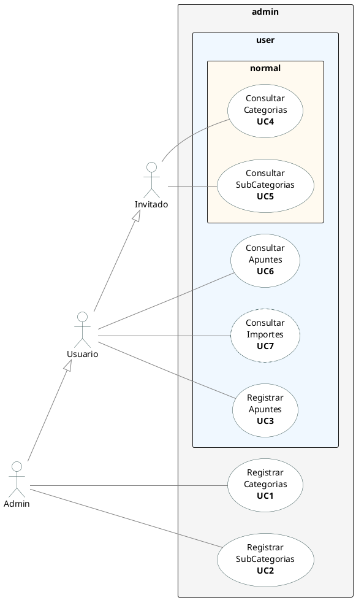

# Control de Apuntes (gastos)

## Enunciado

Especificación de Requisitos Funcionales; **RF**
Se nos pide que creemos un aplicativo que: 
- Permita crear apuntes clasificados por categorias y subcategoriás
- Los consultemos
- Veamos la lista de conceptos/categorías con más importes
- Habrá un Administrador que pueda administrar las categorías
- El usuario identificado puede registrar apuntes y ver la lista de los mayores importes
- Un usuario sin identificar sólo puede ver categorias y apuntes
  
Se indican los Requisitos NO Funcionales (**RNF**), tanto los lógicos **RL** (Reglas de Negocio) como los Técnicos **RT** en NOTAS dentro del diagrama de Casos de Uso.

Con esto ya podemos empezar a jugar.  

## Modelado de Negocio
N/A

## Caso de Uso y Requisitos (RF, RL, RT)

Code #0

