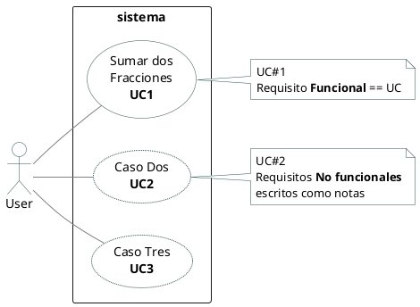
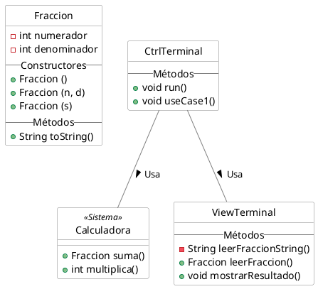
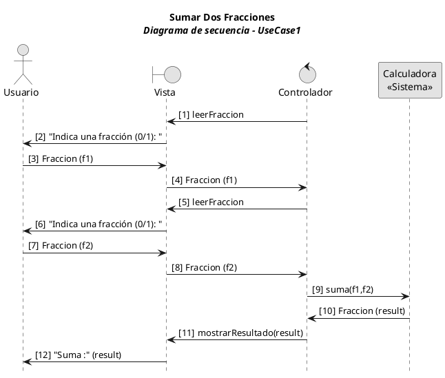
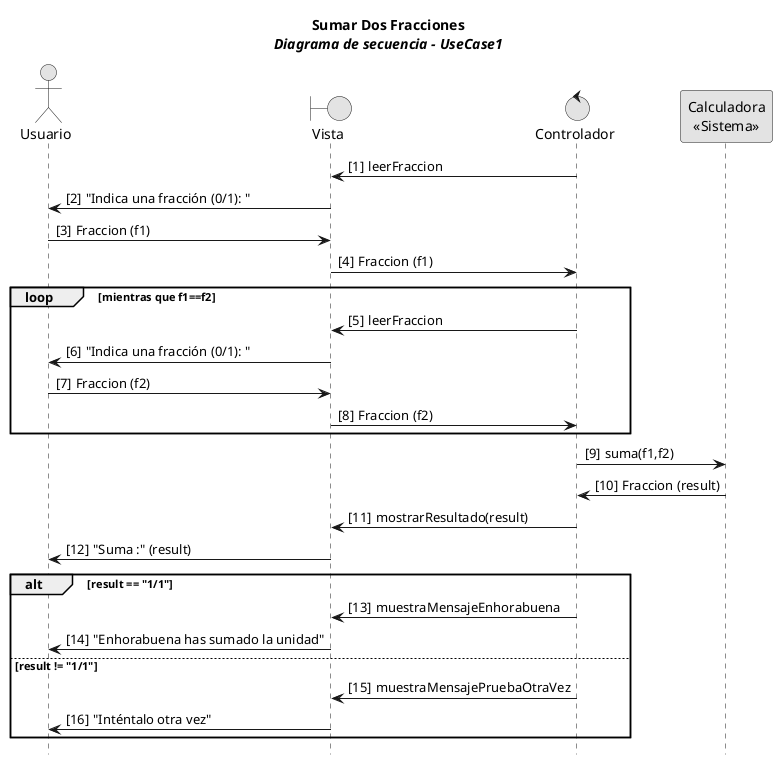

# Suma dos Fracciones


## Enunciado

Se nos pide que creemos un aplicativo que sume dos fraciones.

## Modelado de Negocio
N/A

## Caso de Uso y Requisitos

### Casos de uso de sistema

Mostramos tres posibles casos de uso, pero sólo nos enfocamos en **UC1**


<details><summary>Code #0</summary>


</details>

### Caso de Uso Completo

Use case 01: **Sumar Dos Fracciones**
1. El sistema pide una fracción
1. El usuario introduce f1
1. El sistema pide otra fracción
1. El usuario introduce f2
2. El sistema suma f1 y f2 y presenta el resultado
3. El sistema se acaba

> La descripción de un caso de uso **completo** narra un escenario en forma de diáloguo entre el _usuario_ y el _sistema_. Se concentra en el flujo principal aunque puede incluir escenarios alternativos, con el objetivo de describir una especificación general.


### Diagrama Conceptual del Dominio
N/A

### Diagrama de Clases

Se muestra _Fracción_ como Modelo principal del Dominio, pero también se muestra el `sistema` como clase _Calculadora_. Y a efectos pedagógicos se han introducido (no tienen porqué presentarse), dos clases de la arquitectura MVC.


<details><summary>Code #1</summary>


</details>

## Diagrama de secuencia

### Versión básica:  
> Mostramos el ejemplo más sencillo. Un escenario con un único flujo principal. Sin escenarios alternativos y que acabaremos desarrollando el código.


<details><summary>Code #2</summary>


</details>


El código en el controlador:
```java
  public void useCase1() {
      // Punto de Entrada al Caso de Uso #1 
      // Indicando el número de mensaje que se indica en el diagrama 
      Fraccion f1 = viewTerminal.leerFraccion(); // 1..4
      Fraccion f2 = viewTerminal.leerFraccion(); // 5..8
      Fraccion result = sistema.suma(f1, f2); // 9..10
      viewTerminal.mostrarResultado(result); // 11
  }
```


### Versión con una caja de `loop` y `alt` 
>Versión pedagócica para mostrar alternativas de cómo se puede modelar un diagrama de secuencia mostrando un ciclo de repetición, y las alternativas secuencias en caso de escenarios distintos. 


<details><summary>Code #3</summary>


</details>


## Código de la aplicación
[Código completo en GitHub](https://github.com/srlopez/javaPlantilla)