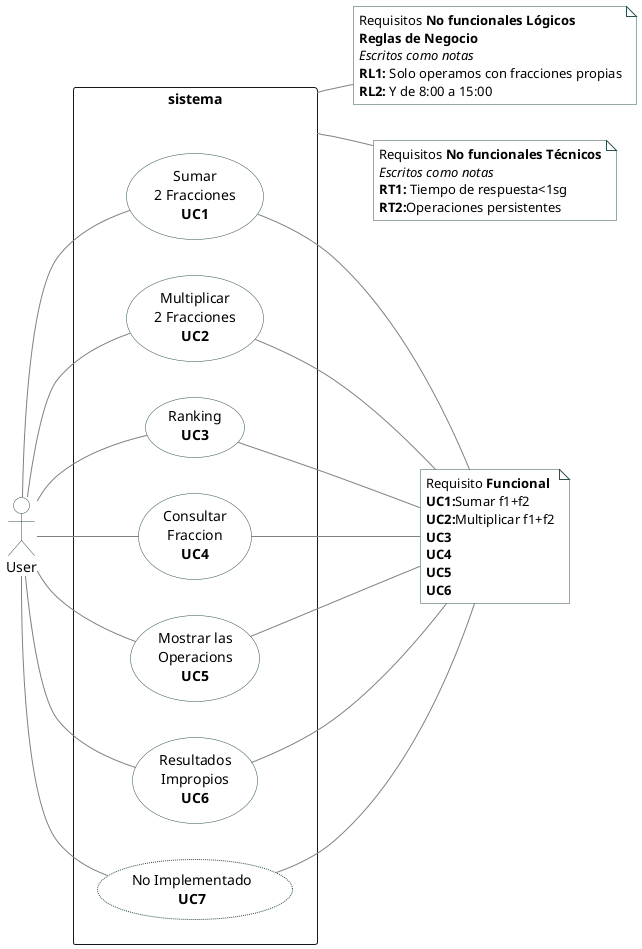
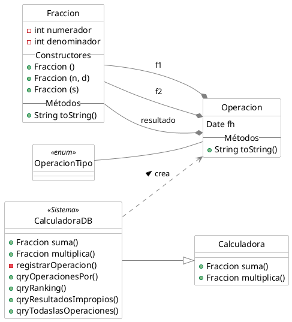
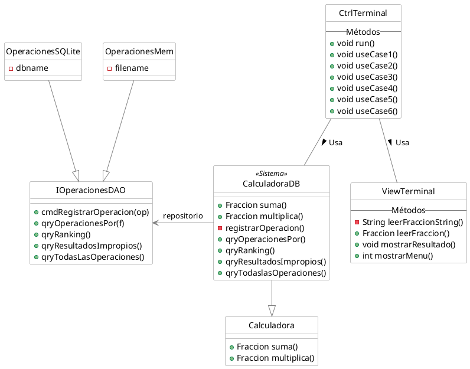
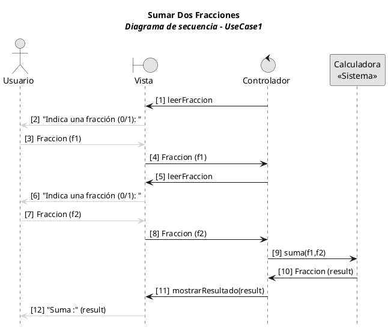
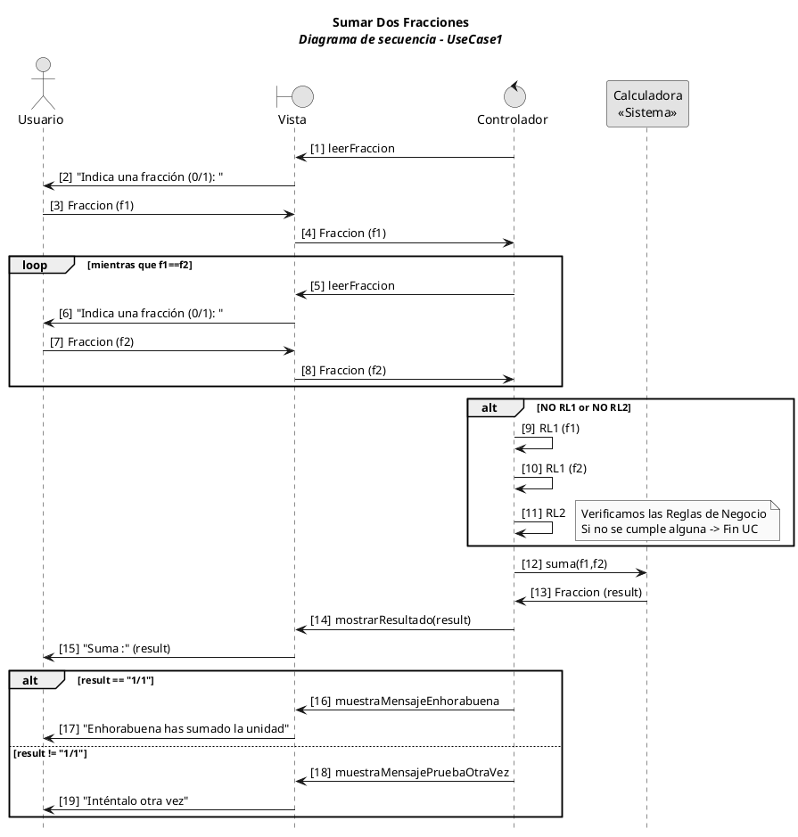

# Calculadora de Fracciones Persistentes


## Enunciado

Se nos pide que creemos un aplicativo que:
- Sume dos fraciones.
- Multiplique dos fracciones.
- Persistamos las operaciones y seamos capaces de:
  - Consultar todas las operaciones
  - Consultar las operaciones por fraccion
  - Consultar el ranking de fracciones
  - Consultar los resultados impropios

Con esto ya podemos empezar a jugar.  

## Modelado de Negocio
N/A

## Caso de Uso y Requisitos

### Casos de uso de sistema

Mostramos tres posibles casos de uso, pero sólo nos enfocamos en **UC1**


<details><summary>Code #0</summary>


</details>

### Caso de Uso Completo

**Documento de Requisitos**

| ID | Descripción requisito | Implementado en | Invocado desde | Estado |
| -- | -- | -- | -- | -- | 
| UC1 | Suma de Fracciones | | | | 
| UC2 | Multiplicación de Fracciones | | | | 
| UC3 | Ranking de apariciones  | | | | 
| UC4 | Consulta de Fracciones | | | | 
| UC5 | Todas las Operaciones | | | | 
| UC6 | Resultados Impropias | | | | 
| UC7 | N/A | | | N/A | 
| RL1 | Fracciones propias | | | | 
| RL2 | De 8:00 a 15:00 | | | | 
| RT1 | Tiempo de respuesta de operacion <1sg. | | | | 
| RT2 | Operaciones persistentes | | | | 
   
   

Use case 01: **Sumar Dos Fracciones**
1. El sistema pide una fracción
1. El usuario introduce f1
1. El sistema pide otra fracción
1. El usuario introduce f2
   1. Si RL1 f1 goto 6
   1. Si RL1 f2 goto 6
   1. Si RL2 goto 6
1. El sistema suma f1 y f2 y presenta el resultado
1. El sistema se acaba

> La descripción de un caso de uso **completo** narra un escenario en forma de diáloguo entre el _usuario_ y el _sistema_. Se concentra en el flujo principal aunque puede incluir escenarios alternativos, con el objetivo de describir una especificación general.


### Diagrama Conceptual del Dominio
N/A

### Diagrama de Clases

Se muestra _Fracción_ y _Operación_ como Modelo principal del Dominio, pero también se muestra el `sistema` como clase _Calculadora_. 


<details><summary>Code #1</summary>


</details>

Diagrama de Clases de Arquitectura de la aplicación.
Patrones MVC y Fachada (CalculadoraDB) al Sistema.
Y Clase de Acceso a Datos con Interface, mostrando dos implementaciones.


<details><summary>Code #2</summary>


</details>


## Diagrama de secuencia

### Versión básica:  
> Mostramos el ejemplo más sencillo. Un escenario con un único flujo principal. Sin escenarios alternativos y que acabaremos desarrollando el código.
> Tampoco se muestran la aplicación de las Reglas de Negocio.


<details><summary>Code #3</summary>


</details>


El código en el controlador:
```java
  public void useCase1() {
      // Punto de Entrada al Caso de Uso #1 
      // Indicando el número de mensaje en el diagrama 
      Fraccion f1 = viewTerminal.leerFraccion(); // 1..4
      Fraccion f2 = viewTerminal.leerFraccion(); // 5..8
      Fraccion result = sistema.suma(f1, f2); // 9..10
      viewTerminal.mostrarResultado(result); // 11
  }
```


### Versión con una caja de `loop` y `alt` 
>Versión pedagógica para mostrar alternativas de cómo se puede modelar un diagrama de secuencia mostrando un ciclo de repetición, y las alternativas secuencias en caso de escenarios distintos. 

`Loop` para indicar un ciclo. Se describe la condición de salida.
`Alt` para indicar una condición _IF_, y se describen las condiciones que escenifican las opciones.


<details><summary>Code #4</summary>


</details>


## Código de la aplicación
[Código de plantilla  en GitHub](https://github.com/srlopez/javaPlantilla)

[Código completo](https://github.com/srlopez/javaFraccionMVC) (Privado por ahora)