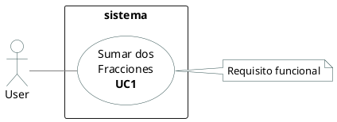
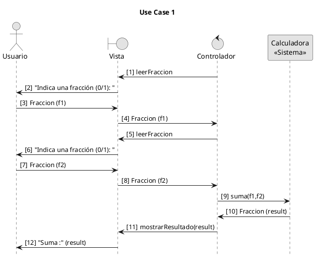

# Suma dos Fracciones


## Enunciado

Se nos pide que creemos un aplicativo que sume dos fraciones.

## Modelado de Negocio
N/A

## Caso de Uso y Requisitos

### Caso de uso del sistema


<details><summary>Code #0</summary>


</details>

### Diagrama Conceptual del Dominio
N/A

### Diagrama de Clases


<details><summary>Code #1</summary>


</details>

## Diagrama de secuencia


<details><summary>Code #2</summary>


</details>


El código en el controlador:
```java
    public void useCase1() {
        // Punto de Entrada al Caso de Uso #1
        Fraccion f1 = viewTerminal.leerFraccion();
        Fraccion f2 = viewTerminal.leerFraccion();
        Fraccion result = sistema.suma(f1, f2);
        viewTerminal.mostrarResultado(result);
    }
```