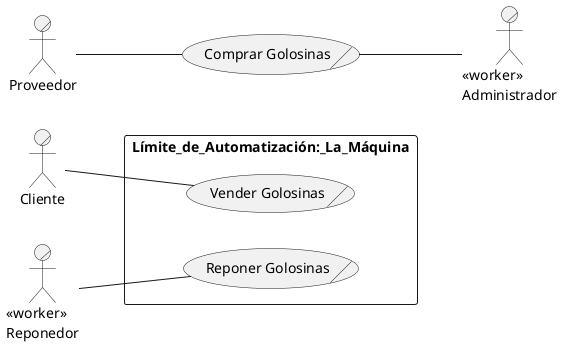
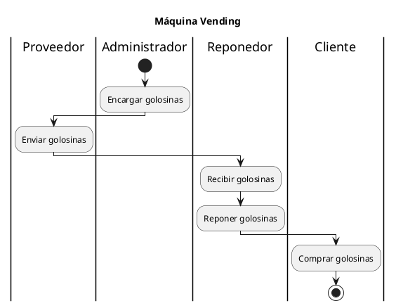
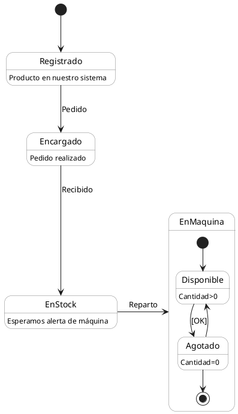

# Máquina Vending
<!--
Nomenclatura PlantUML
https://crashedmind.github.io/PlantUMLHitchhikersGuide/index.html

VSCODE settings.json
PlantUML Server:
https://www.plantuml.com/plantuml
-->
- [Máquina Vending](#máquina-vending)
  - [Modelado de Negocio](#modelado-de-negocio)
    - [Visión general del Sistema a desarrollar.](#visión-general-del-sistema-a-desarrollar)
    - [Diagrama de **Caso de uso de NEGOCIO**](#diagrama-de-caso-de-uso-de-negocio)
    - [Diagrama de **Actividad del NEGOCIO**](#diagrama-de-actividad-del-negocio)
    - [Diagrama de Estado de la Golosina](#diagrama-de-estado-de-la-golosina)
  - [Casos de Uso de Sistema y Requisitos](#casos-de-uso-de-sistema-y-requisitos)
  - [Casos de Uso Completos](#casos-de-uso-completos)
## Modelado de Negocio

### Visión general del Sistema a desarrollar.

Queremos que la interacción de las personas con nuestras máquinas sea fácil, eficiente y segura. De esta manera queremos que:
- El usuario (sea un cliente o un reponedor pueda ver la matriz de los productos) visualizando el nombre del producto y el precio. Se pedirá un PIN de acceso, en caso de ser válido se mostrará también la cantidad del producto
- Para adquirir un producto bastará indicar las coordenadas del producto e introducir el importe del pago.
- El reponedor repone la cantidad de productos hasta el máximo y tambien rellena la caja de cambios y retira el importe en el cajón.
- Debe existir la posibilidad de obtener un informe y de apagar la máquina.

Condicionantes/Reglas de negocio:
- Sólo manejamos monedas de 2,1,0.5,0.2 y 0.1 €uros.
- El cambio será con el mínimo numero de monedas posibles y no devolvemos moedas de 2€
- El pago será como máximo con 5 monedas

### Diagrama de **Caso de uso de NEGOCIO**

Presenta objetivos a largo plazo del Negocio.   
El caso de uso:
Un caso de uso de negocio `implica una relación entre la empresa y una entidad externa` (un cliente), `produciendo un resultado perceptible y consistente` para la empresa y el actor.

Code

  

### Diagrama de **Actividad del NEGOCIO**

Presenta las actividades principales de la empresa en relación con el producto `lifemotiv` del negocio.

Code

### Diagrama de Estado de la Golosina

Presenta las posibilidades en las que se puede encontrar el producto sobre el que gira nuestro negocio

Code

Modelando el negocio descubrimos a partir de los diagramas presentados, un poco más sobre el Dominio de nuestra aplicación.

## Casos de Uso de Sistema y Requisitos

## Casos de Uso Completos
