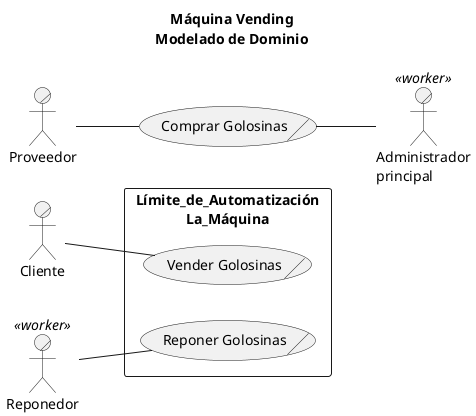
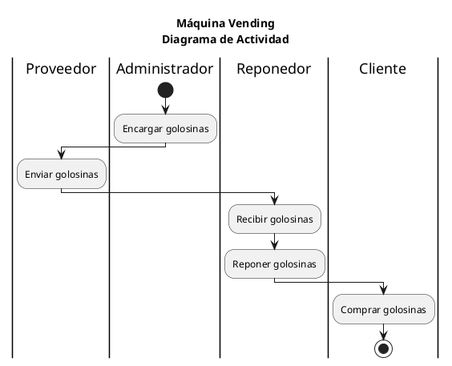
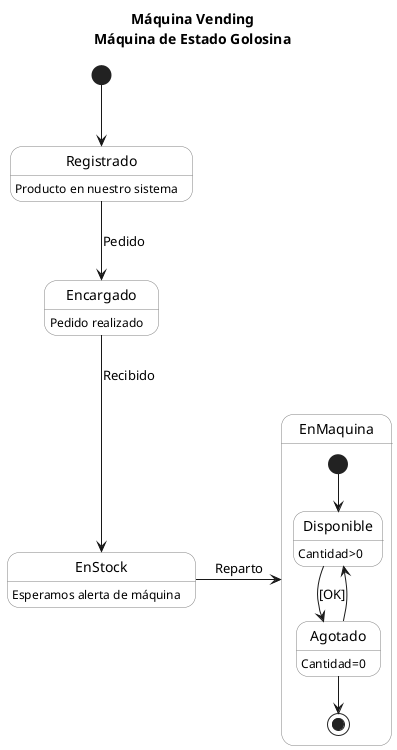
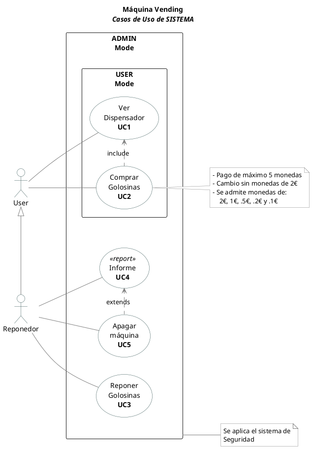
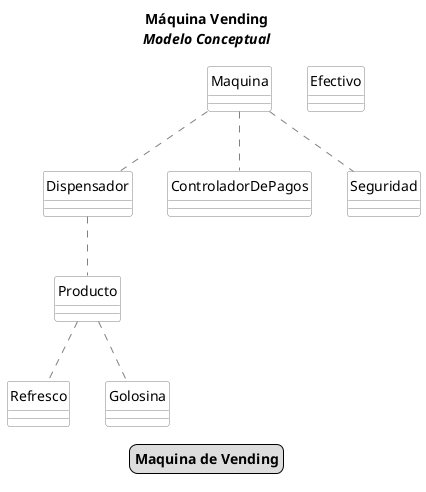
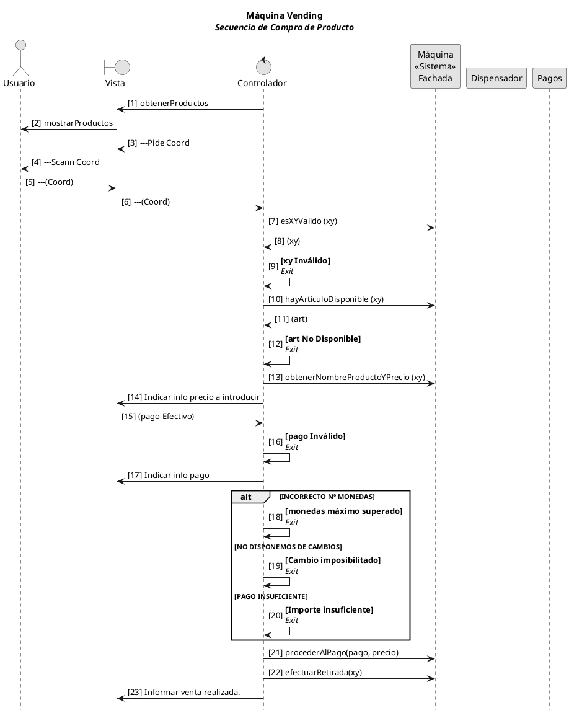

# Máquina Vending
<!--
Nomenclatura PlantUML
https://crashedmind.github.io/PlantUMLHitchhikersGuide/index.html

VSCODE settings.json
PlantUML Server:
https://www.plantuml.com/plantuml
-->
- [Máquina Vending](#máquina-vending)
  - [Enunciado](#enunciado)
  - [Plus](#plus)
  - [Modelado de Negocio](#modelado-de-negocio)
    - [Visión general del Sistema a desarrollar.](#visión-general-del-sistema-a-desarrollar)
    - [Diagrama de **Caso de uso de NEGOCIO**](#diagrama-de-caso-de-uso-de-negocio)
    - [Diagrama de **Actividad del NEGOCIO**](#diagrama-de-actividad-del-negocio)
    - [Diagrama de **Máquina de Estado** de la Golosina](#diagrama-de-máquina-de-estado-de-la-golosina)
  - [Casos de Uso de Sistema y Requisitos](#casos-de-uso-de-sistema-y-requisitos)
    - [Casos de uso de SISTEMA](#casos-de-uso-de-sistema)
    - [Diagrama Conceptual del Dominio](#diagrama-conceptual-del-dominio)
  - [Casos de Uso Completos](#casos-de-uso-completos)
  - [Diagrama de Secuencia UC](#diagrama-de-secuencia-uc)
  

## Enunciado 

Se han puesto en contacto con nosotros dos empresas propietarias de Maáquinas de Vending, A **"Golosinas Gómez"** y B **"Refrescos Mtz."**.
A nos piden que desarrollemos el software para su máquina expendedora de golosinas, en la que cada golosina tiene un nombre y un precio, en este momento lo que está comercializando en esta máquina son los productos 4x4 con los precios siguientes:  
| 0 | 1 | 2 | 3 |
|--|--|--|--|
| KitKat     | Chicles de fresa | Lacasitos  | Palotes    |  
|      1,10€ |      0,80€ |      1,50€ |      0,90€ |  
| Kinder Bueno | Bolsa Haribo | Chetoos    | Twix       |  
|      1,80€ |      1,00€ |      1,20€ |      1,00€ |  
| Maiz       | M&M’S      | Papa Delta | Chicles de menta|  
|      0,70€ |      1,30€ |      1,20€ |      0,80€ |  
| Gusanitos  | Crunch     | Milkybar   | Patatas fritas |  
|      1,50€ |      1,10€ |      1,10€ |      1,10€ |  

Y B, con exactamente la misma intención y operativa, pero actualmente vende  refrescos en una matriz de 4x2:
| 0 | 1 |
|--|--|
| Coca Zero | Fanta Naranja |
| 2.10€ | 1.80€ |
| Chus | Sprite Zero |
| 1.90€ | 2.80€ |

Ambas empresas operan así:  
Todos los días hacen la recaudación y rellenado de la máquina, es decir se retira el `cajón de monedas`, se rellena cada canal de `2€`/`1€`/`0,50€`/`0,20€`/`0,10€` de la `caja de cambios` hasta `10 monedas` (¡OJO! Se rellenan todos los canales salvo el de 2 €), y se completan los productos hasta `5 unidades`.

La máquina presenta un pequeño menú con las siguientes opciones:
 - Mostrar golosinas
 - Pedir golosina
 - Modo ADMIN
  
Para entrar en modo ADMIN se pide activa un sistema de seguridad, que para A es mediante PIN'es prefijados (distinto para cada trabajador que reponga), y en B mediante on PIN validado por algoritmo secreto.
En este modo se añaden las opciones:
 - Resposición y recaudación 
 - Informe
 - Apagar Maquina
 - Modo USER (sale de ADMIN)

**Pedir golosina:**
El cliente indicará la `posición/coordenadas` del producto que quiere, identificado por su fila y columna, que será lo que introduzca el usuario, por ejemplo si el usuario teclea «20» significa que está pidiendo la golosina/refresco que está en la fila «2» columna «0». Si no hay producto disponible en esta ubicación se le indicará al usuario mediante un mensaje, si hay golosinas mostrará al usuario el importe que deberá introducir.

A continuación el usuario deberá introducir su importe en monedas, en un máximo de 5 monedas. 

>LA INTRODUCCION DE MONDEDA POR CONSOLA -> Un String  
>LA INTRODUCCION DE MONEDAS EN MODO GRAFICO -> Botones

> Si tras introducir el máximo de 5 monedas y no ha llegado al importe total de la golosina se le devolverán estas, indicando con un mensaje está situación. 
> Cuando se alcance el importe total con las 5 o menos monedas, se expende la mercancía, indicando esta situación con un mensaje, si se ha superado el importe de la golosina, además se dará el `cambio` (para ello se utilizará el mínimo número de monedas)
> Para introducir el importe se le pedirá al usuario que introduzca el valor de la moneda que introduce (la máquina acepta monedas de `2€`/`1€`/`0,50€`/`0,20€`/`0,10€`) si la moneda no es reconocible se devolverá y se pedirá nueva moneda, si es reconocible se acumulará hasta obtener el valor de la golosina o valor superior (la máquina da cambio, indicando mediante un mensaje las monedas que devolverá).

Durante el pago, **no acepta otro tipo de monedas** que las indicadas anteriormente, se introducen y si tienen cabida en los canales de monedas  se introducirán automáticamente en estos canales, **si no tienen cabida por estar lleno o son monedas de 2 €, estas van a un cajón aparte** (deberás llevar control del importe que se va introduciendo en este cajón para hacer el cuadre de caja al final del día)
Para proporcionar `cambio`, **no devuelve monedas de 2€**, y el cambio será con el menor número de monedas posibles.

**Mostrar matriz de productos:** 
En modo USER mostrará la etiqueta y el precio.
En modo ADMIN, validando un PIN establecido al configurar el sistema de seguridad, añadirá las unidades disponibles de cada golosina.

**Reposición y recaudación:**
modo ADMIN 
>y a continuación pedirá las posiciones de las golosinas y cantidad que se va a reponer de cada.
RELLENAMOS TODOS LOS ARTICULOS y la CAJA de cambios.
Retiramos el cajón de monedas sobrantes.

**Informe:**
Nos mostrarnos el importe de las ventas totales del día.

**Apagar máquina:**
Nos permitirá apagar la máquina, pero antes deberá darnos la opción de mostrar **Informe**

## Plus

- Los dispensadores de artículos, de golosinas o bebidas exclusivamente, pueden ser de tamaño variable hasta 10x10. 
- Los Dispensadores salen preprogramados con las etiquetas de producto y precios establecidas
  > Nuestro programa debe valer para cualquier tamaño de dispensador, y para cualquier artículo?!
- Los Dispensadores de A y B son de dimensiones distintas
- La seguridad en A es por PIN, y en B es por algoritmo
- La máquina funcionará en modo USER o en modo ADMIN para las funciones de administración.
- Al mostrar refrescos deberá indicarse cuales tienen cero calorias.
- P.D.: Se oye hablar de fusión de empresas. OMG!
  > Es decir, la máquina que creemos podrá servir golosinas o bebidas (¿Al mismo tiempo?), cuando se muestren los productos, éste indicará al cliente si es bajo en azucar.
   
## Modelado de Negocio

### Visión general del Sistema a desarrollar.

La interacción de las personas con las máquinas será fácil, eficiente y segura. De esta manera queremos que:
- El usuario (sea un cliente o un reponedor pueda ver la matriz de los productos) visualizando el nombre del producto y el precio. 
- Para entrar en modo ADMIN se pedirá un PIN de acceso, en caso de ser válido se mostrará también la cantidad del producto en la matriz.
- Para adquirir un producto bastará indicar las coordenadas del producto e introducir el importe del pago.
- En modo ADMIN: 
  - El reponedor repone la cantidad de productos hasta el máximo y también rellena la caja de cambios y retira el importe en el cajón.
  - Existe la posibilidad de obtener un informe, que será recordada antes de apagar la máquina.

Requisitos/Reglas de negocio:
- Sólo manejamos monedas de 2€, 1€, .5€, .2€ y .1€ €uros.
- El cambio será con el mínimo numero de monedas posibles y no devolvemos moedas de 2€
- El pago será como máximo con 5 monedas

### Diagrama de **Caso de uso de NEGOCIO**

Presenta objetivos a largo plazo del Negocio (de nuestro cliente).   
El caso de uso:
Un caso de uso de negocio `implica una relación entre la empresa y una entidad externa` (un cliente), `produciendo un resultado perceptible y consistente` para la empresa y el actor.

Code #0

Aparece reflejada la Compra de Golosinas, pero no se incluye dentro del sistem a automatizar.

### Diagrama de **Actividad del NEGOCIO**

Presenta las actividades principales de la empresa en relación con el producto `lifemotiv` del negocio.

Code #1

Aparece el Proveedor y algunas actividades que nos ayudan a comprender mejor el Domnio de esta aplicación.

### Diagrama de **Máquina de Estado** de la Golosina

Presenta las posibilidades en las que se puede encontrar el producto sobre el que gira nuestro negocio

Code #2

Modelando el negocio descubrimos a partir de los diagramas presentados, un poco más sobre el Dominio de nuestra aplicación.

## Casos de Uso de Sistema y Requisitos

### Casos de uso de SISTEMA

Indicamos los Requisitos NO FUNCIONALES en Notas

Code #3

### Diagrama Conceptual del Dominio

Presenta las Clases sin detallar, y sin ser exhaustivo, que inicialmente compondran nuestro diagrama de Clases.

Code #4

## Casos de Uso Completos

## Diagrama de Secuencia UC

En progreso ....

Code #5

