# Máquina Vending
<!--
Nomenclatura PlantUML
https://crashedmind.github.io/PlantUMLHitchhikersGuide/index.html

VSCODE settings.json
PlantUML Server:
https://www.plantuml.com/plantuml
-->
- [Máquina Vending](#máquina-vending)
  - [Enunciado](#enunciado)
  - [Plus](#plus)
  - [Modelado de Negocio](#modelado-de-negocio)
    - [Visión general del Sistema a desarrollar.](#visión-general-del-sistema-a-desarrollar)
    - [Diagrama de **Caso de Uso de NEGOCIO**](#diagrama-de-caso-de-uso-de-negocio)
    - [Diagrama de **Actividad del NEGOCIO**](#diagrama-de-actividad-del-negocio)
    - [Diagrama de **Máquina de Estado** de la Golosina](#diagrama-de-máquina-de-estado-de-la-golosina)
  - [Casos de Uso de Sistema y Requisitos](#casos-de-uso-de-sistema-y-requisitos)
    - [Casos de uso de SISTEMA](#casos-de-uso-de-sistema)
    - [Diagrama Conceptual del Dominio](#diagrama-conceptual-del-dominio)
  - [Casos de Uso Completos](#casos-de-uso-completos)
  - [Diagrama de Secuencia UC](#diagrama-de-secuencia-uc)
    - [Diagrama de Clases](#diagrama-de-clases)
      - [Diagrama de clases del Dominio](#diagrama-de-clases-del-dominio)
      - [Diagrama de clases de Arquitectura de la Aplicación](#diagrama-de-clases-de-arquitectura-de-la-aplicación)
  - [Código de la aplicación](#código-de-la-aplicación)
  - [Ejemplo de Ejecución](#ejemplo-de-ejecución)
  

## Enunciado 

Se han puesto en contacto con nosotros dos empresas propietarias de Maáquinas de Vending, A **"Golosinas Gómez"** y B **"Refrescos Mtz."**.
A nos piden que desarrollemos el software para su máquina expendedora de golosinas, en la que cada golosina tiene un nombre y un precio, en este momento lo que está comercializando en esta máquina son los productos 4x4 con los precios siguientes:  
| 0 | 1 | 2 | 3 |
|--|--|--|--|
| KitKat     | Chicles de fresa | Lacasitos  | Palotes    |  
|      1,10€ |      0,80€ |      1,50€ |      0,90€ |  
| Kinder Bueno | Bolsa Haribo | Chetoos    | Twix       |  
|      1,80€ |      1,00€ |      1,20€ |      1,00€ |  
| Maiz       | M&M’S      | Papa Delta | Chicles de menta|  
|      0,70€ |      1,30€ |      1,20€ |      0,80€ |  
| Gusanitos  | Crunch     | Milkybar   | Patatas fritas |  
|      1,50€ |      1,10€ |      1,10€ |      1,10€ |  


Y B, con exactamente la misma intención y operativa, pero actualmente vende  refrescos en una matriz de 4x2:
| 0 | 1 |
|--|--|
| Coca Zero | Fanta Naranja |
| 2.10€ | 1.80€ |
| Chus | Sprite Zero |
| 1.90€ | 2.80€ |

Ambas empresas operan así:  
Todos los días hacen la recaudación y rellenado de la máquina, es decir se retira el `cajón de monedas`, se rellena cada canal de `2€`/`1€`/`0,50€`/`0,20€`/`0,10€` de la `caja de cambios` hasta `10 monedas` (¡OJO! Se rellenan todos los canales salvo el de 2 €), y se completan los productos hasta `5 unidades`.

La máquina presenta un pequeño menú con las siguientes opciones:
 - Mostrar golosinas
 - Pedir golosina
 - Modo ADMIN
  
Para entrar en modo ADMIN se pide activa un sistema de seguridad, que para A es mediante PIN'es prefijados (distinto para cada trabajador que reponga), y en B mediante on PIN validado por algoritmo secreto.
En este modo se añaden las opciones:
 - Resposición y recaudación 
 - Informe
 - Apagar Maquina
 - Modo USER (sale de ADMIN)

**Pedir golosina:**
El cliente indicará la `posición/coordenadas` del producto que quiere, identificado por su fila y columna, que será lo que introduzca el usuario, por ejemplo si el usuario teclea «20» significa que está pidiendo la golosina/refresco que está en la fila «2» columna «0». Si no hay producto disponible en esta ubicación se le indicará al usuario mediante un mensaje, si hay golosinas mostrará al usuario el importe que deberá introducir.

A continuación el usuario deberá introducir su importe en monedas, en un máximo de 5 monedas. 

>LA INTRODUCCION DE MONDEDA POR CONSOLA -> Un String  
>LA INTRODUCCION DE MONEDAS EN MODO GRAFICO -> Botones


> Si tras introducir el máximo de 5 monedas y no ha llegado al importe total de la golosina se le devolverán estas, indicando con un mensaje está situación. 
> Cuando se alcance el importe total con las 5 o menos monedas, se expende la mercancía, indicando esta situación con un mensaje, si se ha superado el importe de la golosina, además se dará el `cambio` (para ello se utilizará el mínimo número de monedas)
> Para introducir el importe se le pedirá al usuario que introduzca el valor de la moneda que introduce (la máquina acepta monedas de `2€`/`1€`/`0,50€`/`0,20€`/`0,10€`) si la moneda no es reconocible se devolverá y se pedirá nueva moneda, si es reconocible se acumulará hasta obtener el valor de la golosina o valor superior (la máquina da cambio, indicando mediante un mensaje las monedas que devolverá).


Durante el pago, **no acepta otro tipo de monedas** que las indicadas anteriormente, se introducen y si tienen cabida en los canales de monedas  se introducirán automáticamente en estos canales, **si no tienen cabida por estar lleno o son monedas de 2 €, estas van a un cajón aparte** (deberás llevar control del importe que se va introduciendo en este cajón para hacer el cuadre de caja al final del día)
Para proporcionar `cambio`, **no devuelve monedas de 2€**, y el cambio será con el menor número de monedas posibles.

**Mostrar matriz de productos:** 
En modo USER mostrará la etiqueta y el precio.
En modo ADMIN, validando un PIN establecido al configurar el sistema de seguridad, añadirá las unidades disponibles de cada golosina.

**Reposición y recaudación:**
modo ADMIN 
>y a continuación pedirá las posiciones de las golosinas y cantidad que se va a reponer de cada.
RELLENAMOS TODOS LOS ARTICULOS y la CAJA de cambios.
Retiramos el cajón de monedas sobrantes.

**Informe:**
Nos mostrarnos el importe de las ventas totales del día.

**Apagar máquina:**
Nos permitirá apagar la máquina, pero antes deberá darnos la opción de mostrar **Informe**


## Plus

- Los dispensadores de artículos, de golosinas o bebidas exclusivamente, pueden ser de tamaño variable hasta 10x10. 
- Los Dispensadores salen preprogramados con las etiquetas de producto y precios establecidas
  > Nuestro programa debe valer para cualquier tamaño de dispensador, y para cualquier artículo?!
- Los Dispensadores de A y B son de dimensiones distintas
- La seguridad en A es por PIN, y en B es por algoritmo
- La máquina funcionará en modo USER o en modo ADMIN para las funciones de administración.
- Al mostrar refrescos deberá indicarse cuales tienen cero calorias.
- P.D.: Se oye hablar de fusión de empresas. OMG!
  > Es decir, la máquina que creemos podrá servir golosinas o bebidas (¿Al mismo tiempo?), cuando se muestren los productos, éste indicará al cliente si es bajo en azucar.
   
## Modelado de Negocio

### Visión general del Sistema a desarrollar.

La interacción de las personas con las máquinas será fácil, eficiente y segura. De esta manera queremos que:
- El usuario (sea un cliente o un reponedor pueda ver la matriz de los productos) visualizando el nombre del producto y el precio. 
- Para entrar en modo ADMIN se pedirá un PIN de acceso, en caso de ser válido se mostrará también la cantidad del producto en la matriz.
- Para adquirir un producto bastará indicar las coordenadas del producto e introducir el importe del pago.
- En modo ADMIN: 
  - El reponedor repone la cantidad de productos hasta el máximo y también rellena la caja de cambios y retira el importe en el cajón.
  - Existe la posibilidad de obtener un informe, que será recordada antes de apagar la máquina.

Requisitos/Reglas de negocio:
- Sólo manejamos monedas de 2€, 1€, .5€, .2€ y .1€ €uros.
- El cambio será con el mínimo numero de monedas posibles y no devolvemos moedas de 2€
- El pago será como máximo con 5 monedas

### Diagrama de **Caso de Uso de NEGOCIO**

Presenta objetivos a largo plazo del Negocio (de nuestro cliente).   
El caso de uso:
Un **caso de uso de negocio** `implica una relación entre la empresa y una entidad externa` (un cliente), `produciendo un resultado perceptible y consistente` para la empresa y el actor.

```plantuml
@startuml
title == Máquina Vending ==\nModelado de Dominio
skinparam monochrome true

left to right direction
:Cliente:/ as cli
:Proveedor:/ as pro
:Administrador\nprincipal:/ as jefe <<worker>>
:Reponedor:/ as repo <<worker>>
(Comprar Golosinas)/ as comprar
rectangle Límite_de_Automatización\nLa_Máquina {
  (Vender Golosinas)/ as vender
  (Reponer Golosinas)/ as reponer
}
cli -- vender
repo -- reponer
pro -- comprar
comprar -- jefe
@enduml
```


<details><summary>Code #0</summary>


</details>

Aparece reflejada la `Compra de Golosinas`, pero no se incluye dentro del sistem a automatizar.

### Diagrama de **Actividad del NEGOCIO**

Presenta las **actividades principales de la empresa** en relación con el producto `lifemotiv` del negocio. En este caso el Prodcuto Golosina.


<details><summary>Code #1</summary>


</details>

Aparece el Proveedor y algunas `actividades` que nos ayudan a comprender mejor el Dominio de esta aplicación.

### Diagrama de **Máquina de Estado** de la Golosina

Presenta las posibilidades (posibles estados) en las que se puede encontrar el producto sobre el que gira nuestro negocio. Nos ayuda a no olvidar situaciones que deberemos presentar en los `Casos de Uso de Sistema`.

```plantuml
@startuml
title == Máquina Vending ==\nMáquina de Estado Golosina
skinparam state {
    ' StartColor PaleGreen
    ' EndColor Red
    BackgroundColor White
    ' BackgroundColor<<Junction>> GreenYellow  
    BorderColor Gray
    ' FontName Consolas
}
left to right direction
[*] -d-> Registrado
Registrado --> Encargado : Pedido
Encargado --> EnStock : Recibido 
EnStock -r-> EnMaquina : Reparto
state EnMaquina {    
  top to bottom direction
  [*] --> Disponible    
  Disponible --> Agotado : [OK]
  Agotado --> Disponible
  Agotado --> [*]
}

EnStock : Esperamos alerta de máquina
Registrado : Producto en nuestro sistema
Encargado: Pedido realizado
Disponible: Cantidad>0
Agotado: Cantidad=0
@enduml
```


<details><summary>Code #2</summary>


</details>

Modelando el negocio descubrimos a partir de los diagramas presentados ( elaborados a partir de conversaciones y reuniones con los *interesados*), un poco más sobre el Dominio de nuestra aplicación.


## Casos de Uso de Sistema y Requisitos

### Casos de uso de SISTEMA

Adoptamos el enfoque en el que los casos de uso DE SISTEMA (los normales) son REQUISITOS FUNCIONALES.
Indicamos los Requisitos NO FUNCIONALES en Notas

```plantuml
@startuml
title == Máquina Vending ==\n<i>Casos de Uso de SISTEMA</i>
'  skinparam handwritten true
skinparam usecase {
  BackgroundColor White
  BorderColor DarkSlateGray
  ArrowColor Grey
}
skinparam actor {
  BackgroundColor White
  BorderColor DarkSlateGray
  ArrowColor Grey
}
hide stereotype 
show <<report>> stereotype 
skinparam rectangle {
    shadowing<<nulo>> false
    FontColor<<nulo>> White
    Stereotype<<nulo>> White
    BorderColor<<nulo>> White
    RoundCorner<<nulo>> 25
}
skinparam note {
    BorderColor  Grey
}

left to right direction
:User: as cli
:Reponedor: as repo <<worker>>
rectangle ADMIN\nMode as admin  {
  rectangle nulo <<nulo>> {
    (Informe\n<b>UC4</b>) as infor <<report>>
    (Apagar\nmáquina\n<b>UC5</b>) as off
  }
  (Reponer\nGolosinas\n<b>UC3</b>) as reponer 
  rectangle USER\nMode {
    (Ver\nDispensador\n<b>UC1</b>) as ver 
    (Comprar\nGolosinas\n<b>UC2</b>) as vender 
  }
}
note "- Pago de máximo 5 monedas\n- Cambio sin monedas de 2€\n- Se admite monedas de:\n    2€, 1€, .5€, .2€ y .1€"  as N1  #white
note "Se aplica el sistema de\nSeguridad"  as N2  #white 

repo -l-|> cli
cli -- vender
cli -- ver
repo -- reponer
repo -- off
repo -- infor

admin -- N2
vender -- N1

vender .r.> ver: include
off .r.> infor: extends
@enduml
```


<details><summary>Code #3</summary>


</details>

En la medida de lo posible adoptaremos el siguiente criterio para mostrar un caso de uso; Un `Caso de Uso` es iniciado por un `Actor`, una `<<extensión>>` y una `<<inclusión>>` de caso de uso también son iniciadas por un usuario, la extensión es opcional, y la inclusión es necesaria para que el Caso de Uso produzca un resultado apreciable por el `Sistema` o el `Actor`. 

En el ejemplo un usuario puede iniciar cualquiera de los casos de uso reflejados, pero además para el caso de uso 2 (**UC2**) se incluye necesariamente realizar el **UC1**, y para el caso de **UC5** se permite opcionalmente realizar el **UC4**.

### Diagrama Conceptual del Dominio

Presenta las Clases sin detallar, y sin ser exhaustivo, que inicialmente compondran nuestro diagrama de Clases.

```plantuml
@startuml
' left to right direction
title == Máquina Vending ==\n<i>Modelo Conceptual</i>
skinparam class {
  skinparam monochrome true
  skinparam shadowing false
  BackgroundColor White
  BorderColor Gray
  ' FontName Consolas
  ArrowColor Gray
}
scale 1
legend center
    <b>Maquina de Vending</b>
endlegend
hide  circle

Maquina .. Dispensador 
Maquina .. ControladorDePagos
Maquina .. Seguridad
Dispensador .. Producto
Producto .. Refresco
Producto .. Golosina 
ControladorDePagos .. Efectivo 
@enduml
```


<details><summary>Code #4</summary>


</details>

## Casos de Uso Completos

## Diagrama de Secuencia UC

En progreso ....   
Fijarse en el `Controlador` que será el director de orquesta de todo el flujo presentado.
Se refleja exhaustivamente el intercambio de mensajes entre el `Actor Usuario` y la `Vista`, aunque no es necesario llegar a reflejarlo tan detalladamente, ya que esto implica, en este caso, una `Vista en modo terminal`, reflejando de la aplicación de `tipo consola`, esto implicaría un CASO DE USO **NO ESENCIAL**, aunque lo que queremos mostrar es un **CASO DE USO ESENCIAL** independiente de la tecnología en que se implemente la vista.

```plantuml
@startuml
skinparam monochrome true
' skinparam handwritten true
' skinparam defaultFontName Comic Sans MS
' skinparam classArrowFontName Arial

title <b>Máquina Vending</b>\n<i>Secuencia de Compra de Producto - UC2</i>
autonumber "[0]"
hide footbox

actor Usuario as u
boundary Vista as v
control Controlador as c 
participant "Máquina\n<<Sistema>>\nFachada" as s
participant Dispensador as d
participant Pagos as p

' entity 
' database 
' collections  

'group Comprar Producto
c -> s: obtenerProductos
c -> v: mostrarProductos
v -> u: ---print (la matriz de productos)
c -> v: ---print Pide Coord
v -> u: ---Scann Coord
u -> v: ---(Coord)
v -> c: ---(Coord)
alt VALIDACION DE COORDENAS
c -> s: esXYValido\n<i>Exit</i>
s -> d: esXYValido\n<i>Exit</i>
d -> s: (xy)
s -> c: (xy)
c -> c: <b>[xy Inválido]</b>\n<i>Exit</i>
else VALIDACION DE DISPONIBILIDAD
c -> s: hayArtículoDisponible (xy)
s -> d: hayArtículoDisponible (xy)
d -> s: (art)
s -> c: (art)
c -> c: <b>[art No Disponible]</b>\n<i>Exit</i>
end
c -> s: obtenerNombreProductoYPrecio (xy)
s -> c: (art,precio)
c -> v: Indicar info precio a introducir
c -> v: ---print Pide Importe de Pago
v -> u: ---Scann Pago
u -> v: ---(pago Efectivo)
v -> c: (pago Efectivo)
alt PAGO INVALIDO
c -> c: <b>[pago Inválido]</b>\n<i>Exit</i>
else  INCORRECTO Nº MONEDAS
c -> c: <b>[monedas máximo superado]</b>\n<i>Exit</i>
else NO DISPONEMOS DE CAMBIOS
s -> p: hayCambiosDisponibles (precio, pago)
p -> s: (cambios)
c -> c: <b>[Cambio imposibilitado]</b>\n<i>Exit</i>
else PAGO INSUFICIENTE
c -> c: <b>[Importe insuficiente]</b>\n<i>Exit</i>
end
c -> s: procederAlPago(pago, precio)
s -> p: ProcedecrAlPago (precio, pago)
p -> s: (cambios)
c -> s: efectuarRetirada(xy)
s -> d: efectuarRetirada(xy)
c -> v: Informar venta realizada (producto, cambio).
v -> u: Entregar (producto, cambio).
'end
@enduml
```


<details><summary>Code #5</summary>


</details>


### Diagrama de Clases

#### Diagrama de clases del Dominio

```plantuml
@startuml
title == Máquina Vending ==\n<i>Diagrama de Clases del Dominio</i>
skinparam class {
  skinparam monochrome true
  skinparam shadowing false
  BackgroundColor White
  BorderColor Gray
  ' FontName Consolas
  ArrowColor Gray
}
scale 1
hide  circle
left to right direction

package vending {
  package producto {
    class Producto {}
    class Golosina {}
    class Refresco {}
  }

  package hardware {
    class Maquina {
      +boolean esPinValido()
      +int esPagoValido()
      +Efectivo procederAlPago()
      +boolean esXYValido()
      +boolean hayProducto()
      +String efectuarRetirada()
      +double obtenerPrecio()
      +String obtenerNombreProducto()
      +String[][] mostrarProductos
      +String[][] mostrarProductosAdmin()
      +double rellenar()
      +String informe()
      +void apagar()
    }
    class MaquinaEstado<<Sistema>> {
      +void apagar()
    }
    package subsistemas {
      package pagos {
        class ControladorDePagos {
          +caja Efectivo
          +int cajon
          +esPagoValido()
          +calcularCambio()
          +procederAlPago()
          +informe()
        }
        class Efectivo{
          +cantidad
          +valor
          +esValido()
          +valor()
          +monedas()
        }
      }

      package seguridad {
        class ISeguridad { 
          +esValido()
        }
        class SeguridadFormula {
          +int VALOR
          +esValido()
        }
        class SeguridadPin {
          +String[] PIN
          +esValido()
        }
      }
      package productos {
        class Dispensador {
          +matriz
          +cantidad
        }
        class Coordenada{
          +int x
          +int y
        }
      }
    }
  }
}

MaquinaEstado ..|> Maquina
Maquina ..> ISeguridad : ctrlSeguridad
Maquina ..> Dispensador : matriz
Maquina ..> ControladorDePagos : ctrlPagos
Dispensador o.. Producto: matriz
Dispensador *.. Coordenada
Producto <|-- Refresco
Producto <|-- Golosina 
ControladorDePagos ..> Efectivo : caja
ISeguridad <|.. SeguridadFormula
ISeguridad <|.. SeguridadPin
@enduml
```


<details><summary>Code #6</summary>


</details>

#### Diagrama de clases de Arquitectura de la Aplicación

```plantuml
@startuml
title <b>Diagrama de Clases</b>\n<i>Arquitectura de la Aplicación</i>
left to right direction
skinparam class {
  skinparam monochrome true
  skinparam shadowing false
  BackgroundColor White
  BorderColor Gray
  ' FontName Consolas
  ArrowColor Gray
}
scale 1
hide circle

package vending {
  package hardware {
    class Maquina {
      +boolean esPinValido()
      +int esPagoValido()
      +Efectivo procederAlPago()
      +boolean esXYValido()
      +boolean hayProducto()
      +String efectuarRetirada()
      +double obtenerPrecio()
      +String obtenerNombreProducto()
      +String[][] mostrarProductos
      +String[][] mostrarProductosAdmin()
      +double rellenar()
      +String informe()
      +void apagar()
    }
    class MaquinaEstado<<Sistema>> {
      +void apagar()
    }
  }
  package persistencia {
    class RepositorioLite{ 
      -dbname 
    }
    class RepositorioFile{ 
      -filename 
    }

    class IRepositorio
    {
    +inicializar(String id);
    +cargarProductos(Dispensador dispensador);
    +guardarProductos(Dispensador dispensador);
    +cargarCaja(ControladorDePagos ctrl);
    +void guardarCaja(ControladorDePagos ctrl);
    }
  }
}
package ui {
  class Controlador{
  -- Métodos --
    +void run()
    +void useCase1()
    +void useCase2()
    +void useCase3()
    +void useCase4()
    +void useCase5()
    +void useCase6()
  }

  class Terminal{
  -- Métodos --
    +int mostrarMenu()
  }
}

IRepositorio <.. MaquinaEstado : repositorio
MaquinaEstado --|> Maquina
Controlador ..> MaquinaEstado: sistema 
Controlador ..> Terminal: vista
RepositorioLite --|> IRepositorio
RepositorioFile --|> IRepositorio
@enduml
```


<details><summary>Code #7</summary>


</details>


## Código de la aplicación
[Código completo en GitHub](https://github.com/srlopez/javaVendingMVC)


## Ejemplo de Ejecución

```bash
MVC Vending Consola ...

#1  Máquina de Golosinas

   === Golosinas Gómez ===
   === M)ENU           ===

   A.- V)er los productos 
   B.- Retirar P)roducto  

   Seleccione una opción: m
Introduzca PIN: 1234

   === Golosinas Gómez ===
   === M)ENU           ADM

   A.- V)er los productos
   B.- Retirar P)roducto
   C.- R)ellenar Productos y Monedas
   D.- I)nforme
   E.- Exit/F)IN

   Seleccione una opción: b

   === Golosinas Gómez ===
   === ARTICULOS       ADM

          0            1            2            3
   +------------+------------+------------+------------+
   | KitKat     | Chicles de | Lacasitos  | Palotes    |
 0 |      1,10€ |      0,80€ |      1,50€ |      0,90€ |
   +------------+------------+------------+------------+
   | Kinder Bue | Bolsa Hari | Chetoos    | Twix       |
 1 |      1,80€ |      1,00€ |      1,20€ |      1,00€ |
   +------------+------------+------------+------------+
   | Maiz       | M&M’S      | Papa Delta | Chicles de |
 2 |      0,70€ |      1,30€ |      1,20€ |      0,80€ |
   +------------+------------+------------+------------+
   | Gusanitos  | Crunch     | Milkybar   | Patatas fr |
 3 |      1,50€ |      1,10€ |      1,10€ |      1,10€ |
   +------------+------------+------------+------------+

Introduzca XY: 22
Ha seleccionado `Papa Delta`.

Introduzca 1,20€.

Indique el número de monedas de 2€,1€,0.5€,0.2€ y 0.1€ separadas por `,`: 1,1,1,1,1
Ha introducido 5 monedas por importe de 3,80€.

Su `Papa Delta` 1,20€. Gracias

Cambio 2,60€ [0, 2, 1, 0, 1]

Presione <Enter> para continuar 

   === Golosinas Gómez ===
   === M)ENU           ADM

   A.- V)er los productos
   B.- Retirar P)roducto
   C.- R)ellenar Productos y Monedas
   D.- I)nforme
   E.- Exit/F)IN

   Seleccione una opción: i

   === Golosinas Gómez ===
   === INFORME         ADM

Operaciones          1
      Cajón       4,40€
Caja de cambios
 |  2,00€ |   1,00€ |   0,50€ |   0,20€ |   0,10€ |
 |    0   |     3   |     5   |     5   |     5   |

Presione <Enter> para continuar

   === Golosinas Gómez ===
   === M)ENU           ADM

   A.- V)er los productos
   B.- Retirar P)roducto
   C.- R)ellenar Productos y Monedas
   D.- I)nforme
   E.- Exit/F)IN

   Seleccione una opción: f
¿Desea el informe (N)?n
apagando Golosinas Gómez ...


#2  Máquina de Refrescos

   === Refrescos Mtz.  ===
   === M)ENU           ===

   A.- V)er los productos
   B.- Retirar P)roducto

   Seleccione una opción: m
Introduzca PIN: 94

   === Refrescos Mtz.  ===
   === M)ENU           ADM

   A.- V)er los productos
   B.- Retirar P)roducto
   C.- R)ellenar Productos y Monedas
   D.- I)nforme
   E.- Exit/F)IN

   Seleccione una opción: v

   === Refrescos Mtz.  ===
   === ARTICULOS       ADM

          0            1
   +------------+------------+
   🧴Coca Zero  | Fanta Nara |
 0 |      2,10€ |      1,80€ |
   | 0          | 0          |
   +------------+------------+
   | Chus       🧴Sprite Zer |
 1 |      1,90€ |      2,80€ |
   | 0          | 0          |
   +------------+------------+

Presione <Enter> para continuar

   === Refrescos Mtz.  ===
   === M)ENU           ADM

   A.- V)er los productos
   B.- Retirar P)roducto
   C.- R)ellenar Productos y Monedas
   D.- I)nforme
   E.- Exit/F)IN

   Seleccione una opción: 2

   === Refrescos Mtz.  ===
   === ARTICULOS       ADM

          0            1
   +------------+------------+
   🧴Coca Zero  | Fanta Nara |
 0 |      2,10€ |      1,80€ |
   +------------+------------+
   | Chus       🧴Sprite Zer |
 1 |      1,90€ |      2,80€ |
   +------------+------------+

Introduzca XY: 11
Articulo no disponible
Presione <Enter> para continuar

   === Refrescos Mtz.  ===
   === M)ENU           ADM

   A.- V)er los productos
   B.- Retirar P)roducto
   C.- R)ellenar Productos y Monedas
   D.- I)nforme
   E.- Exit/F)IN

   Seleccione una opción: c
Introducidos 2,00€

Presione <Enter> para continuar

   === Refrescos Mtz.  ===
   === M)ENU           ADM

   A.- V)er los productos
   B.- Retirar P)roducto
   C.- R)ellenar Productos y Monedas
   D.- I)nforme
   E.- Exit/F)IN

   Seleccione una opción: 2

   === Refrescos Mtz.  ===
   === ARTICULOS       ADM

          0            1
   +------------+------------+
   🧴Coca Zero  | Fanta Nara |
 0 |      2,10€ |      1,80€ |
   +------------+------------+
   | Chus       🧴Sprite Zer |
 1 |      1,90€ |      2,80€ |
   +------------+------------+

Introduzca XY: 11
Ha seleccionado `Sprite Zero`.

Introduzca 2,80€.

Indique el número de monedas de 2€,1€,0.5€,0.2€ y 0.1€ separadas por `,`: 1,1,1,1,1
Ha introducido 5 monedas por importe de 3,80€.

Su `Sprite Zero` 2,80€. Gracias

Cambio 1,00€ [0, 1, 0, 0, 0]

Presione <Enter> para continuar

   === Refrescos Mtz.  ===
   === M)ENU           ADM

   A.- V)er los productos
   B.- Retirar P)roducto
   C.- R)ellenar Productos y Monedas
   D.- I)nforme
   E.- Exit/F)IN

   Seleccione una opción: f
¿Desea el informe (N)?s

   === Refrescos Mtz.  ===
   === INFORME         ADM

Operaciones          2
      Cajón       2,80€
Caja de cambios
 |  2,00€ |   1,00€ |   0,50€ |   0,20€ |   0,10€ |
 |    0   |     5   |     5   |     5   |     5   |

apagando Refrescos Mtz. ...


#3  Máquina de Refrescos y Golosinas
¿  ?

Fin de la aplicación
```